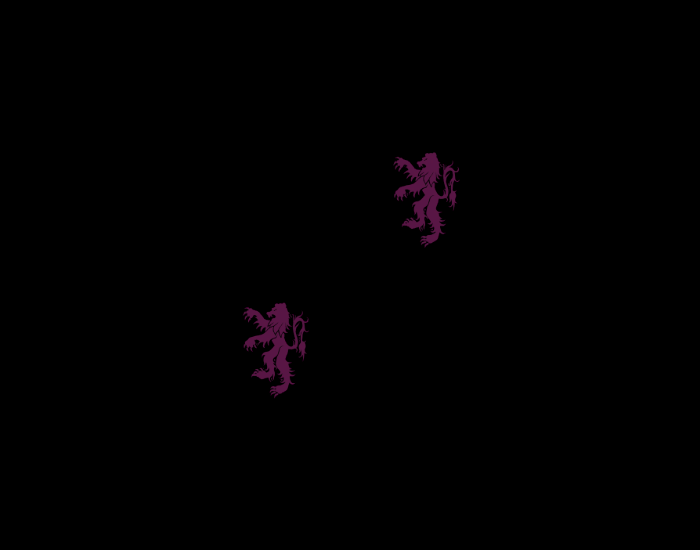
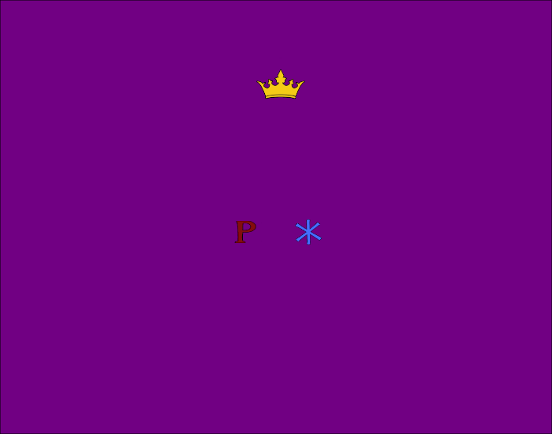
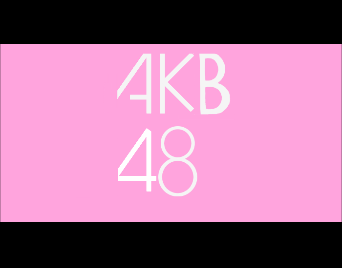
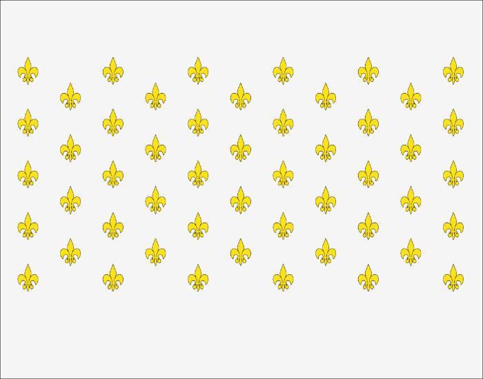
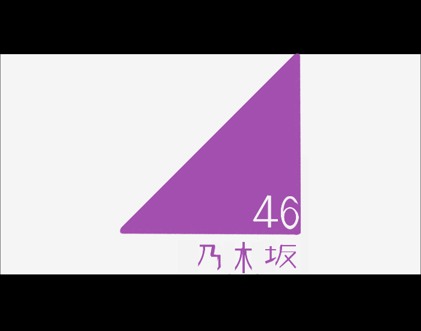
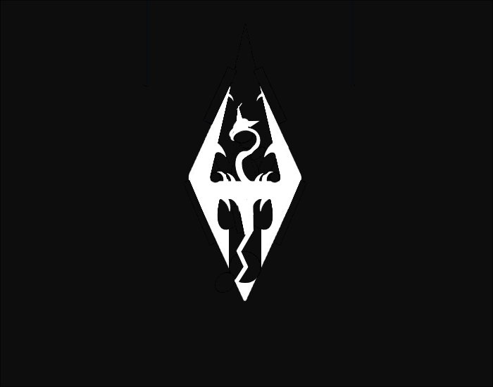

# Mount-Blade-II-Bannerlord-Banner-Collection

骑马与砍杀2:霸主旗帜收集

Mount &amp; Blade II: Bannerlord Banner Collection

# 旗帜制作工具

工具地址：[https://bannerlord.party/banner](https://bannerlord.party/banner)


使用方法：制作完旗帜复制下方的代码，按 `B` 打开旗帜编辑器后 `Ctrl + V` 粘贴即可


# 列表

## 龙

.png)

```
1.142.142.1423.1294.768.788.1.0.0.427.131.116.57.47.596.600.0.0.-238.122.131.116.118.342.658.511.0.0.-271.123.131.116.43.73.632.492.0.1.90.159.131.116.163.118.640.545.0.0.205.159.131.116.154.101.682.433.0.1.-146.207.131.116.151.163.712.471.0.0.100.154.131.116.221.367.642.662.0.1.157.154.131.116.634.705.836.798.0.0.76.506.142.116.404.280.666.824.0.0.131.506.142.116.1242.585.986.831.0.0.185.154.131.116.595.828.919.822.0.0.78.506.142.116.458.359.766.786.0.0.131.506.142.116.1006.883.1123.840.0.0.208.506.142.116.464.324.680.798.0.0.111.506.142.116.456.330.786.760.0.0.102.139.131.116.498.295.742.844.0.1.191.506.142.116.299.354.758.772.0.0.-70.506.142.116.342.354.696.772.0.0.-72.123.131.116.185.203.929.862.0.0.-100.112.131.116.127.166.1019.787.0.1.49.427.131.116.70.52.1019.706.0.0.266.154.131.116.148.184.898.571.0.0.171.506.142.116.184.185.834.638.0.0.-92.154.131.116.228.274.888.696.0.1.199.506.142.116.307.108.931.760.0.0.-124.154.131.116.157.250.852.824.0.0.143.506.142.116.152.138.756.821.0.0.-92.123.131.116.36.97.475.888.0.1.180.159.131.116.152.77.433.858.0.1.-72.123.131.116.43.114.601.987.0.1.-193.207.131.116.99.105.572.1031.0.1.56.159.131.116.76.69.798.1033.0.1.44.112.131.116.204.132.841.981.0.0.171.207.131.116.113.82.762.1057.0.1.-58.159.131.116.85.87.738.660.0.0.-62.434.131.116.242.300.578.804.0.1.166
```

## America

.png)
```
11.35.128.1836.1836.768.788.1.0.-30.510.83.128.1458.751.780.388.1.0.0.510.83.128.1568.400.766.526.1.0.0.510.83.128.1626.400.782.629.1.0.0.510.83.128.1546.435.790.739.1.0.0.510.83.128.1552.400.768.853.1.0.0.510.83.128.1560.400.762.964.1.0.0.510.83.128.1576.400.756.1072.1.0.0.505.12.12.1181.634.133.463.0.0.0.516.127.12.40.40.635.419.1.0.0.516.127.12.40.40.519.419.1.0.0.516.127.12.40.40.420.419.1.0.0.516.127.12.40.40.312.419.1.0.0.516.127.12.40.40.210.419.1.0.0.516.127.12.40.40.116.419.1.0.0.516.127.12.40.40.116.488.1.0.0.516.127.12.40.40.116.560.1.0.0.516.127.12.40.40.116.637.1.0.0.516.127.12.40.40.116.717.1.0.0.516.127.12.40.40.162.449.1.0.0.516.127.12.40.40.162.521.1.0.0.516.127.12.40.40.162.594.1.0.0.516.127.12.40.40.162.679.1.0.0.516.127.12.40.40.210.488.1.0.0.516.127.12.40.40.210.560.1.0.0.516.127.12.40.40.210.637.1.0.0.516.127.12.40.40.210.717.1.0.0.516.127.12.40.40.312.488.1.0.0.516.127.12.40.40.312.560.1.0.0.516.127.12.40.40.312.637.1.0.0.516.127.12.40.40.312.717.1.0.0.516.127.12.40.40.420.488.1.0.0.516.127.12.40.40.420.560.1.0.0.516.127.12.40.40.420.637.1.0.0.516.127.12.40.40.420.717.1.0.0.516.127.12.40.40.524.488.1.0.0.516.127.12.40.40.524.560.1.0.0.516.127.12.40.40.524.637.1.0.0.516.127.12.40.40.524.717.1.0.0.516.127.12.40.40.635.488.1.0.0.516.127.12.40.40.635.560.1.0.0.516.127.12.40.40.635.637.1.0.0.516.127.12.40.40.635.717.1.0.0.516.127.12.40.40.259.449.1.0.0.516.127.12.40.40.364.449.1.0.0.516.127.12.40.40.470.449.1.0.0.516.127.12.40.40.578.449.1.0.0.516.127.12.40.40.259.521.1.0.0.516.127.12.40.40.259.594.1.0.0.516.127.12.40.40.259.679.1.0.0.516.127.12.40.40.364.521.1.0.0.516.127.12.40.40.364.594.1.0.0.516.127.12.40.40.364.679.1.0.0.516.127.12.40.40.470.521.1.0.0.516.127.12.40.40.470.594.1.0.0.516.127.12.40.40.470.679.1.0.0.516.127.12.40.40.578.521.1.0.0.516.127.12.40.40.578.594.1.0.0.516.127.12.40.40.578.679.1.0.0
```


## 苏联

.png)
```
11.142.142.1836.1836.740.746.1.0.0.516.143.144.170.170.764.515.1.1.0.516.142.142.125.125.764.519.0.1.0.503.143.143.295.348.758.842.1.1.25.503.142.142.238.323.746.818.0.1.25.505.142.142.194.238.596.822.0.1.45.510.143.143.352.230.784.894.1.1.-45.505.143.143.144.60.674.781.1.1.45.505.142.142.110.63.718.714.0.1.-7.503.143.143.38.19.909.1018.1.1.45.505.143.144.20.20.640.943.1.1.45.503.143.144.100.37.600.982.1.1.45.504.143.144.35.108.611.971.1.1.-225
```

## England

.png)
```
27.12.128.1500.1500.768.733.1.0.0.510.12.12.2013.8000.768.768.1.0.0.510.128.128.2013.700.768.738.1.0.25.510.128.128.2013.700.768.738.1.0.335.510.142.142.1200.235.1351.447.1.0.25.510.142.142.1200.235.139.1046.1.0.25.510.142.142.1200.235.201.488.1.0.335.510.142.142.1200.235.1439.1032.1.0.335.510.128.128.1800.1200.768.738.1.0.0.510.128.128.1200.1200.768.738.1.0.90.510.142.142.1200.750.768.738.1.0.90.510.142.142.2013.750.768.738.1.0.0
```

## austrian

.png)
```
35.145.145.3629.1986.764.387.1.0.0.505.40.40.-1683.269.764.751.0.1.0.102.40.116.-493.427.764.768.1.1.0.102.116.116.-493.421.764.764.0.1.0.505.144.144.-22.86.610.844.1.1.3.427.144.144.-67.91.588.766.1.1.-97.427.144.144.-67.66.586.766.0.1.-97.503.144.116.-64.38.610.846.0.1.-145.510.144.149.-88.177.665.826.0.1.20.503.144.116.-64.38.918.846.0.1.145.510.144.144.-130.114.922.824.1.1.-91.505.144.144.-80.30.924.758.1.1.-1.510.144.149.-88.177.863.826.0.1.-20.316.145.145.-112.114.764.748.1.1.0.503.145.116.-85.56.764.786.0.1.0.510.22.22.-83.246.764.756.1.1.0.505.144.84.-45.16.762.574.1.1.0.505.144.84.-12.27.743.564.0.1.11.505.144.84.-13.27.762.564.0.1.0.505.144.84.-12.27.781.564.0.1.-11.340.116.116.-76.88.694.820.0.1.118.340.116.116.-76.88.834.820.0.1.-118.510.128.128.-39.158.704.634.1.1.0.510.145.145.-39.158.696.608.1.1.0.159.144.84.51.189.724.613.1.1.77.510.116.116.-83.73.764.694.1.1.0.503.144.144.-54.33.710.601.0.1.145.514.145.145.17.36.717.614.1.1.69.503.145.145.-39.26.706.610.0.1.163.503.22.22.-16.10.751.600.0.1.202.503.116.22.-10.10.751.596.0.1.0.505.156.156.34.36.651.832.0.1.202.505.156.156.34.36.877.832.0.1.-202.533.156.156.-62.67.648.868.1.1.-14.533.156.156.-62.67.662.916.1.1.47.533.156.156.-62.67.876.882.1.1.8.533.156.156.-62.67.876.938.1.1.-8
```

## Kunglig björn

.png)
```
11.146.146.1608.1341.824.834.1.0.0.505.144.146.202.1195.764.764.0.1.0.505.144.146.202.2426.764.764.0.1.-90.505.116.116.340.172.764.586.0.1.0.505.116.116.75.172.630.674.0.1.0.505.116.116.75.172.628.808.0.1.0.505.116.116.75.172.902.630.0.1.0.505.116.116.75.172.908.778.0.1.0.505.116.116.75.124.895.876.0.1.-16.505.116.116.31.124.890.954.0.1.-32.505.116.116.35.124.656.955.0.1.38.505.116.116.35.124.808.1021.0.1.-72.505.116.116.35.124.638.930.0.1.28.505.116.116.43.73.710.1019.0.1.60.505.116.116.21.66.636.950.0.1.28.505.116.116.43.39.744.1025.0.1.-1.505.116.116.43.39.676.991.0.1.-1.505.116.116.59.39.914.531.0.1.-1.505.116.116.59.39.616.561.0.1.-1.505.116.116.59.113.620.580.0.1.-1.316.116.116.500.616.764.758.0.1.0.316.145.146.488.596.764.764.0.1.0.138.125.146.481.393.746.809.0.1.0.340.144.146.179.196.779.607.0.1.3
```

## 中国


.png)

```
2.83.83.1840.1688.764.764.1.1.-30.516.15.15.114.114.225.371.1.0.0.516.15.15.50.50.346.291.1.0.-15.516.15.15.50.50.380.358.1.0.16.516.15.15.50.50.373.421.1.0.0.516.15.15.50.50.349.482.1.0.-27
```


```
11.142.142.3000.1500.764.764.1.0.0.505.83.83.253.138.766.655.1.0.0.503.83.145.430.462.762.684.1.0.0.320.84.148.120.97.716.758.1.1.90.320.84.145.120.97.812.758.1.0.-90.324.84.145.347.132.764.788.1.0.0.516.84.14.60.60.807.643.1.1.-44.516.84.14.-60.60.721.643.1.1.40.516.84.14.-60.60.665.589.1.1.14.516.84.14.60.60.863.589.1.1.-14.516.84.14.110.110.764.549.1.0.0.500.84.145.540.540.764.687.1.0.0.500.84.145.500.500.764.687.1.0.0.500.84.142.450.450.764.687.1.0.0.423.84.145.551.480.764.687.1.0.0.150.83.145.-130.184.703.969.1.0.0.150.83.145.130.184.825.969.1.0.0.322.144.145.-222.183.702.936.1.0.-67.322.144.145.-222.183.826.936.1.0.67.503.84.145.130.130.764.900.1.0.0.503.84.84.80.80.764.900.1.0.0.503.84.145.70.70.764.900.1.0.0.500.125.145.100.100.764.900.1.0.0.150.83.145.130.184.624.939.1.0.-98.150.83.145.130.184.604.924.1.0.-98.150.83.145.130.184.584.909.1.0.-98.150.83.145.130.184.564.894.1.0.-98.159.83.145.260.230.648.884.1.0.-21.150.83.145.-130.184.904.939.1.0.98.150.83.145.-130.184.924.924.1.0.98.150.83.145.-130.184.944.909.1.0.98.150.83.145.-130.184.964.894.1.0.98.159.83.145.-260.230.880.884.1.0.21.509.83.145.30.24.764.902.1.0.0
```


```
11.68.48.1836.1836.768.788.1.0.-30.527.84.84.339.364.784.784.1.1.-75.505.48.48.228.247.596.736.1.1.-64.503.84.84.73.70.608.896.1.1.-64.510.84.84.363.356.844.824.1.1.-48.510.84.84.109.488.694.692.1.1.42.510.84.84.99.245.746.672.1.1.42.510.84.84.65.205.734.636.1.1.15.510.84.84.50.194.768.642.1.1.133.505.84.84.50.100.726.668.1.1.133
```


```
11.68.48.1836.1836.768.788.1.0.-29.516.84.84.400.400.764.764.1.1.0.516.48.48.300.300.764.771.1.1.0.504.84.84.53.27.734.792.1.1.40.505.84.84.53.22.797.784.1.1.-72.505.84.84.20.22.789.759.1.1.-42.505.84.84.80.17.768.834.1.1.0.505.84.84.18.22.807.829.1.1.-42.505.84.84.53.22.762.759.1.1.0.504.84.84.18.20.727.830.1.1.-45.510.84.84.417.130.341.752.1.1.0.510.84.84.417.130.1187.752.1.1.0.510.84.84.489.130.377.884.1.1.0.510.84.84.155.120.140.817.1.1.90.510.84.84.489.130.1151.884.1.1.0.510.84.84.155.120.1388.817.1.1.90
```

### 朝代系列


```
11.116.116.1304.983.2667.622.1.0.0.511.142.116.-191.76.876.718.0.0.-69.511.142.116.-249.-112.762.578.0.0.180.510.142.116.-69.-194.760.618.0.0.180.510.142.116.-134.-137.762.714.0.0.90.510.142.116.-134.-137.760.792.0.0.90.510.142.116.-86.-139.757.698.0.0.90.510.142.116.-86.-197.762.567.0.0.90.511.142.116.-191.74.867.728.0.0.-70.511.142.116.-191.-65.662.718.0.0.249.427.142.116.-74.-88.762.718.0.0.179.427.142.116.-81.-96.684.654.0.0.146.427.142.116.-87.-88.839.658.0.0.221.427.142.116.-162.-158.760.806.0.0.0.510.142.116.-86.-197.884.800.0.0.90.510.142.116.-86.-197.638.804.0.0.90.511.142.116.-191.-65.650.716.0.0.249.510.142.116.-86.-185.760.842.0.0.90.510.142.116.-86.-185.760.756.0.0.90.510.142.116.-615.-309.770.1115.0.0.180.510.142.116.-615.-309.770.1041.0.0.180.510.142.116.-615.-309.768.959.0.0.180.510.142.116.-615.-309.768.425.0.0.180.510.142.116.-565.-309.487.700.0.0.90.510.142.116.-565.-309.1043.684.0.0.90.510.143.116.-565.-1875.2437.684.0.0.90
```


```
11.142.143.1428.1126.764.764.1.0.0.510.142.142.154.184.646.606.1.1.0.510.142.142.130.174.630.724.1.1.0.510.142.142.260.194.571.716.0.0.90.510.142.142.160.194.636.836.1.1.0.510.142.142.260.189.712.721.1.1.90.510.142.142.292.198.780.676.1.1.90.510.142.142.504.212.965.766.1.1.90.510.142.142.218.194.872.529.1.1.0.510.142.142.218.194.872.666.1.1.0.510.142.142.218.194.872.800.1.1.0.510.142.142.107.197.775.861.1.1.83.510.142.142.102.195.762.947.1.1.80.510.142.142.94.195.757.979.1.1.76
```


```
1.143.143.1829.730.764.764.1.0.0.159.3.116.240.118.574.602.1.1.13.159.3.116.183.225.766.666.0.1.140.159.3.116.422.225.884.818.0.1.186.159.3.116.240.225.764.764.0.1.202.155.146.116.1017.391.764.764.0.0.0.200.3.116.125.104.1238.756.1.0.-127.503.83.116.125.104.190.505.0.1.0.215.154.116.104.107.441.746.1.1.27.215.154.116.104.107.489.706.1.1.40.154.3.116.42.225.223.612.0.1.247.154.3.116.42.225.295.503.0.1.213.215.154.116.104.107.517.648.1.1.82.159.3.116.240.118.584.640.1.1.13.159.146.116.240.416.351.638.0.0.-14.159.83.116.240.118.337.702.0.1.-4.200.83.116.73.95.273.571.1.0.121.159.146.116.240.225.375.732.0.1.202.503.3.116.37.48.381.608.0.1.0.503.3.116.37.48.349.638.0.1.0.503.116.116.15.18.345.634.0.1.0.503.116.116.15.18.378.603.0.1.0.426.116.116.24.96.433.648.0.1.78.426.116.116.21.78.451.620.0.1.83.200.3.116.70.139.433.734.1.0.81.200.3.116.51.51.367.642.1.0.143.200.3.116.51.51.399.612.1.0.258.200.3.116.32.139.353.710.0.0.-78.200.3.116.42.139.313.752.0.1.-204.119.146.116.95.152.501.920.0.0.182.119.146.116.95.152.325.848.0.0.100.119.146.116.95.152.1011.899.0.0.189.119.146.116.95.152.832.902.0.0.136.212.146.116.95.152.786.949.0.0.51.212.146.116.95.152.1005.963.0.0.94.212.146.116.95.152.481.981.0.0.74.212.146.116.95.152.263.848.0.0.19.200.3.116.95.89.955.965.0.0.-47.200.3.116.95.89.744.916.0.0.-114.200.3.116.95.89.431.963.0.0.-66.200.3.116.95.65.237.798.0.0.-139.200.83.116.72.401.521.790.1.0.-82.200.83.116.52.197.600.698.1.0.-102.200.83.116.52.74.684.716.1.0.-204.213.154.116.70.102.914.874.1.1.292.200.83.116.72.169.411.860.1.0.65.200.83.116.62.278.660.892.1.0.77.200.83.116.56.169.920.848.1.1.-67.200.83.116.90.72.1191.826.1.1.-140.200.83.116.117.44.1119.862.1.1.-17.154.83.116.42.225.987.802.1.1.181.154.83.116.42.225.475.832.1.1.181.213.154.116.70.94.1047.876.1.1.326.213.154.116.70.141.569.950.1.1.294.213.154.116.70.113.333.904.1.1.198.426.3.116.35.52.1083.957.0.1.50.426.3.116.35.52.832.991.0.1.50.426.3.116.35.52.549.999.0.1.60.426.3.116.35.52.287.920.0.1.15
```

## 冰与火之歌


```
31.116.116.2780.3338.265.1799.1.0.0.145.110.116.-2187.1315.142.926.1.1.-7.217.110.116.431.494.448.604.0.1.-180.503.110.116.129.81.1099.714.0.1.6.503.116.116.129.81.1131.724.0.1.6.505.116.116.217.589.568.498.0.1.-58.505.116.116.97.203.768.523.0.1.-74.505.116.116.257.744.1197.1199.1.1.-70.217.110.110.504.989.547.965.0.1.-53.217.110.110.-562.798.462.441.0.1.-163.505.116.116.571.820.678.236.0.1.-72.505.116.116.571.820.686.297.0.1.-72.217.110.110.526.798.505.411.0.1.-165.505.116.116.217.589.706.455.0.1.-66.505.116.116.743.829.642.141.0.1.-65.217.110.116.676.798.595.361.0.1.-160.505.116.116.733.901.843.118.0.1.-66.217.110.110.442.798.598.339.0.1.-155.505.116.116.176.466.828.413.0.1.-65.217.110.110.442.798.666.309.0.1.-160.505.116.116.176.384.868.407.0.1.-70.505.116.116.176.384.937.472.0.1.-101.217.110.110.514.798.824.309.0.1.185.505.116.116.176.384.962.475.0.1.-97.505.116.116.743.1270.405.1321.1.1.-127.317.116.116.161.300.1071.832.1.1.-117.510.108.108.155.130.1063.772.1.1.-22.218.116.116.154.101.744.622.0.1.-354.218.116.116.183.289.796.658.0.1.-110.218.110.116.167.265.796.658.0.1.-111.505.110.110.119.89.890.692.0.1.-102.504.108.108.63.53.1015.760.1.1.-205.504.116.116.60.43.1123.818.1.1.-187.504.108.108.64.39.1053.778.1.1.-205.504.22.116.38.60.983.764.0.1.-216.504.22.116.29.35.1021.780.1.1.-192.504.22.116.30.25.1069.794.1.1.-203.504.22.116.45.42.1131.816.1.1.-192.504.22.116.22.79.1169.840.1.1.-231.504.22.116.17.104.1073.882.1.1.-69.504.22.116.26.27.960.808.0.1.-57.504.22.116.31.26.987.836.0.1.-34.504.22.116.30.32.1021.858.0.1.-34.504.22.116.15.35.1043.872.0.1.-34.503.116.116.91.89.1003.668.0.1.-34.503.40.116.91.89.998.666.0.1.-34.503.116.116.73.53.1021.624.0.1.-27.505.116.116.54.126.991.636.0.1.-97.505.116.116.51.142.971.682.0.1.-123.505.110.110.51.142.973.628.0.1.-95.505.110.110.51.142.956.680.0.1.-125.505.116.116.15.106.949.654.0.1.-94.505.116.116.18.131.954.694.0.1.-128.118.110.116.167.183.952.866.0.1.-84.118.110.116.151.179.928.850.0.1.-90.504.110.110.45.60.1257.764.0.1.-72.503.116.116.162.190.890.930.0.1.-38.505.116.116.5.147.952.846.0.1.-126.505.116.116.6.117.940.754.0.1.-58.503.116.116.106.190.1147.750.0.1.-112.503.110.110.96.190.1145.756.0.1.-112.503.116.116.80.146.1149.758.0.1.-112.503.110.110.72.171.1147.764.0.1.-112.503.110.110.34.141.1133.738.0.1.-109.503.116.110.31.141.1125.772.0.1.-121.503.110.110.31.123.1107.770.0.1.-121.503.110.110.37.98.1145.792.0.1.-107.503.110.110.37.98.1151.746.0.1.-107.503.110.110.45.104.953.592.0.1.-91.317.116.116.45.104.991.590.0.1.-91.504.110.110.29.112.966.589.0.1.-91.504.116.110.78.206.938.547.0.1.-122.504.116.110.78.195.1081.620.0.1.42.504.110.110.16.102.1091.694.0.1.-78.505.116.116.13.170.1063.702.0.1.-74.503.110.110.36.80.971.686.0.1.-130.503.116.116.-64.96.1011.634.0.1.-89.505.110.110.27.166.967.636.0.1.-90.317.110.110.60.120.989.626.0.1.-271.213.116.116.93.213.762.642.0.1.-286.213.110.110.79.208.758.648.0.1.-286.317.116.116.40.78.710.624.0.1.-105.317.110.116.32.78.712.624.0.1.-105.505.116.116.176.384.1079.523.0.1.-115.505.116.116.571.1256.174.427.0.1.-65.505.116.116.571.1256.413.331.0.1.-65.505.116.116.217.589.660.389.0.1.-101.439.116.116.186.407.488.730.0.1.-53.439.116.116.174.412.562.792.0.1.-53.439.116.116.161.404.646.846.0.1.-53.439.110.116.161.448.720.956.0.1.-41.439.116.116.161.442.720.923.0.1.-50.505.110.116.20.115.822.543.0.1.-84.505.110.116.30.126.916.563.0.1.-113.216.116.116.608.1111.957.387.0.1.-136.216.116.116.608.1111.977.399.0.1.-116.216.116.116.638.1176.1067.437.0.1.-115.206.116.116.1273.1744.1680.311.0.1.-76.427.116.116.57.43.874.674.0.1.-265.427.116.116.32.44.826.732.0.1.-325.427.116.116.48.22.840.716.0.1.-219.505.116.116.217.1410.345.938.0.1.53.505.116.116.217.1410.-299.435.0.1.53.505.116.116.119.204.1119.580.0.1.6.505.116.116.23.5.1051.674.0.1.-42.505.110.116.10.178.976.650.0.1.91.505.110.116.10.178.768.768.0.1.91
```


```
3.116.116.1477.1182.768.768.1.0.0.121.83.116.408.398.610.540.0.1.62.505.116.116.408.350.734.553.0.1.-3.121.83.116.408.398.728.463.0.1.38.505.116.116.408.251.844.511.0.1.-16.121.83.116.408.398.876.480.0.1.7.507.116.116.220.419.885.516.0.1.85.154.83.116.238.366.652.734.0.1.55.503.116.116.122.209.568.728.0.1.5.154.83.116.154.366.654.668.0.1.203.503.116.116.55.60.596.562.0.1.5.154.83.116.116.235.712.550.0.1.352.503.116.116.55.78.696.503.0.1.-22.503.83.116.96.239.712.778.0.1.33.218.116.116.259.251.642.850.1.1.36.159.83.83.202.239.733.730.1.1.-48.159.83.83.202.239.696.634.1.1.-93.159.83.83.151.164.706.584.1.1.-125.159.83.83.151.164.766.483.1.1.-284.159.83.83.228.164.662.551.1.0.112.159.83.83.138.164.563.596.1.1.170.159.83.83.138.164.642.618.1.0.143.159.116.116.83.121.630.576.1.1.143.159.116.116.176.197.694.834.1.0.153.159.83.83.300.164.718.878.1.1.330.514.116.116.170.197.806.937.1.0.176.218.83.83.100.140.592.770.1.1.207.504.83.83.45.108.599.806.1.1.182.159.83.83.66.94.556.732.1.0.202.159.83.83.66.94.565.712.1.0.167.506.83.83.46.108.584.756.1.1.207.506.116.116.69.77.567.778.1.1.207.217.83.83.104.180.477.776.1.1.197.217.83.83.104.180.533.894.1.1.224.217.83.83.104.180.608.961.1.1.243.217.83.83.104.180.712.1001.1.1.268.217.83.83.104.146.814.983.1.1.308.217.83.83.104.147.878.930.1.1.328.217.83.83.104.122.914.871.1.1.354.217.83.83.104.122.926.826.1.1.-2.509.83.83.65.168.493.789.1.1.-174.509.83.83.65.181.545.878.1.1.-136.509.83.83.65.181.626.956.1.1.-118.509.83.83.65.181.694.975.1.1.-104.509.83.83.65.181.830.932.1.1.-44.509.83.83.65.181.890.852.1.1.-18.503.116.116.54.187.515.788.1.1.16.503.116.116.74.209.582.890.1.1.44.503.116.116.74.210.690.954.1.1.78.503.116.116.82.200.820.904.1.1.147.423.83.83.127.102.535.840.1.1.134.503.83.83.89.89.533.842.1.1.134.503.116.116.64.63.537.840.1.1.134.159.83.83.89.93.503.838.1.1.247.159.83.83.141.93.804.860.1.1.298.159.83.83.114.115.842.856.1.1.249.504.83.83.196.175.828.788.1.1.303.159.83.83.152.115.780.934.1.1.15.159.83.83.152.115.688.930.1.0.-20.159.83.83.73.101.658.902.1.0.116.159.83.83.73.101.648.922.1.1.157.159.83.83.73.101.672.936.1.1.98.427.116.116.120.76.752.908.1.1.12.427.116.116.72.46.696.908.1.1.-42.427.83.83.81.65.816.864.1.1.-58.504.83.83.131.85.834.856.1.1.-58.218.83.83.314.321.984.983.0.1.133.218.83.83.314.321.1039.830.0.1.164.159.83.83.121.204.958.762.1.1.164.309.116.116.554.807.945.990.1.1.338.309.116.116.554.604.977.945.1.1.353.309.83.83.142.187.1003.810.1.0.141.309.116.116.462.353.1013.812.1.0.141.503.83.83.206.109.922.694.1.0.138.503.116.116.66.127.854.632.1.0.160.159.83.83.236.234.754.688.1.0.-15.159.83.83.181.234.828.620.1.0.64.159.83.83.133.191.830.574.1.1.156.505.83.83.114.59.844.594.1.0.54.505.83.83.191.124.832.754.1.0.3.505.116.116.146.178.1093.726.1.0.3.159.116.116.141.69.892.981.1.0.43.159.116.116.122.101.936.926.1.0.74.159.116.116.93.98.963.868.1.1.74.159.83.83.149.195.784.622.1.0.78.159.83.83.225.195.870.556.1.0.168.159.83.83.225.195.979.608.1.0.133.159.83.83.225.195.1045.716.1.1.97.159.83.83.300.177.1047.804.1.1.79.159.83.83.183.72.1009.928.1.1.51.503.116.116.83.60.762.596.1.0.78.117.116.116.1239.813.1205.869.1.1.-75.117.116.116.857.738.1089.506.1.1.-15.506.83.83.96.195.883.559.0.1.-104.506.83.83.96.152.864.547.0.1.-95.217.83.83.82.163.906.451.1.1.61.217.83.83.75.151.963.493.1.1.47.217.83.83.53.106.1025.556.1.1.34.217.83.83.53.106.1051.598.1.1.33.217.83.83.53.136.1063.626.1.1.25.509.83.83.31.137.904.449.1.1.241.509.83.83.20.137.983.509.1.1.225.509.83.83.19.137.1043.584.1.1.210.509.83.83.23.87.1071.638.1.1.199.504.83.83.31.176.1085.706.1.1.188.423.83.83.84.77.900.477.1.1.308.503.83.83.66.64.900.479.1.1.134.503.116.116.37.42.900.477.1.1.134.159.83.83.85.63.916.491.1.1.223.500.116.116.760.772.764.724.0.1.0.500.116.116.789.805.764.724.1.1.0.500.116.116.906.926.764.724.1.1.0.500.116.116.1016.1074.764.724.1.1.0.505.116.116.1431.292.774.1211.1.1.0.505.116.116.1431.292.754.235.1.1.0.505.116.116.1431.350.209.764.1.1.-90.505.116.116.1431.350.1323.782.1.1.-90
```

## 星球大战

.png)
```
11.116.116.1400.1100.764.764.1.0.0.503.128.128.600.600.764.764.0.1.0.503.116.116.550.550.764.764.1.1.0.503.128.128.475.475.764.764.1.1.0.503.128.128.450.450.764.764.1.1.0.503.128.128.400.400.764.764.1.1.0.504.128.128.150.475.854.816.0.1.60.504.128.128.150.475.764.874.0.1.0.504.116.116.100.274.764.889.0.1.0.504.128.128.150.475.764.656.0.1.180.504.116.116.100.284.764.639.0.1.180.504.128.128.150.393.656.686.0.1.-120.504.128.128.100.342.864.814.0.1.60.504.128.128.150.451.664.814.0.1.-60.504.116.116.100.327.664.814.0.1.-60.504.128.128.150.400.870.692.0.1.120.504.116.116.100.301.868.701.0.1.120.504.116.116.100.300.872.822.0.1.60.504.116.116.100.300.668.697.0.1.-120.500.128.128.466.440.764.764.1.1.0.510.128.128.88.100.553.886.1.1.30.510.128.128.85.100.973.888.1.1.150.510.128.128.100.100.764.1000.1.1.90.510.128.128.100.100.764.527.1.1.90.510.128.128.75.88.965.626.1.1.-150.510.128.128.75.100.567.618.1.1.150.503.116.116.200.200.764.764.1.1.60
```

## 奥日

.png)
```
11.146.19.1836.1836.768.788.1.0.-30.503.35.35.431.127.981.792.1.1.58.503.35.35.431.127.547.792.1.1.-58.506.35.35.738.82.686.646.1.1.-77.506.35.35.738.82.842.646.1.1.77.503.35.35.431.274.764.872.1.1.0.503.116.35.139.79.644.904.1.1.-39.503.116.35.139.79.884.904.1.1.39.503.149.35.88.47.762.959.1.1.1.503.127.127.35.35.864.899.1.1.-47.503.127.127.35.35.664.899.1.1.47
```

## 瓦坎达

.png)
```
11.116.149.1836.1836.768.788.0.0.90.505.128.127.500.500.760.864.1.0.0.503.128.127.262.320.631.944.1.0.0.503.128.127.262.320.897.944.1.0.0.503.149.127.378.362.495.1013.0.0.0.503.149.127.378.362.1033.1013.0.0.0.505.149.149.1104.362.790.1180.1.0.0.504.149.127.72.72.764.979.0.0.0.504.149.127.100.94.764.934.0.0.180.504.149.127.258.160.505.635.0.0.0.504.149.127.258.160.1039.635.0.0.0.503.149.127.80.80.646.786.0.0.0.503.128.127.50.50.648.786.0.0.0.427.149.127.203.-140.617.784.0.0.-11.506.128.127.146.111.555.788.1.0.0.511.149.127.249.-226.515.766.0.0.208.510.127.127.61.-200.573.777.0.0.168.510.127.127.160.-200.701.736.0.0.168.510.149.127.67.-142.666.736.0.0.50.503.149.127.30.30.648.788.0.0.0.503.149.127.80.80.882.786.0.0.0.503.128.127.50.50.880.786.0.0.0.427.149.127.-203.-140.911.784.0.0.11.505.128.127.86.109.968.783.1.0.0.511.149.127.-249.-226.1013.766.0.0.-208.510.127.127.61.-200.955.777.0.0.-168.510.127.127.160.-200.827.736.0.0.-168.510.149.127.67.-142.862.736.0.0.-50.503.149.127.30.30.880.788.0.0.0.505.149.127.1114.556.1329.764.0.0.-90.201.127.149.226.320.122.638.1.0.180.201.127.149.226.320.128.968.1.0.0.201.127.149.226.320.1400.968.1.0.0.201.127.149.226.320.1395.638.1.0.180.142.127.127.-211.-223.297.986.0.0.173.301.127.149.192.-278.385.878.1.0.204.306.127.149.-192.-278.353.910.1.0.221.206.127.149.-250.-260.1211.906.1.0.151.308.127.149.218.-261.1241.933.1.0.118.200.127.149.192.278.309.1035.1.0.90.125.127.149.183.-204.1283.1012.1.0.132.200.127.149.192.-278.1219.1035.1.0.90.427.127.149.202.-188.309.644.1.0.180.411.127.149.148.-150.309.563.1.0.180.427.127.149.122.-100.1308.531.1.0.-25.427.127.149.122.-100.1149.531.1.0.25.511.127.149.122.-100.1248.566.0.0.-25.511.127.149.122.-100.1213.566.0.0.25.503.149.149.20.20.1139.513.0.0.0.503.149.149.20.20.1312.509.0.0.0.510.127.127.219.140.1226.684.0.0.0.510.127.127.219.140.1226.644.0.0.0.510.127.127.40.146.1131.661.0.0.90.510.127.127.219.140.1224.724.0.0.0.510.127.127.40.146.1323.704.0.0.90.510.127.127.219.140.1224.764.0.0.0.510.127.127.40.146.1129.744.0.0.90
```

## [YES](https://www.reddit.com/r/mountandblade/comments/fvnmpf/yes/)

.png)
```
11.35.35.1900.1900.768.768.1.0.0.344.7.116.-459.421.764.722.1.1.0.528.116.116.-124.100.628.992.1.1.0.510.116.116.-100.82.628.1069.1.1.90.510.116.116.-100.82.722.1069.1.1.90.510.116.116.-100.82.722.990.1.1.90.510.116.116.-100.82.769.948.1.1.0.510.116.116.-100.82.769.1115.1.1.0.510.116.116.-100.82.769.1030.1.1.0.527.116.116.135.100.904.1069.1.1.0.527.116.116.135.100.898.983.1.1.180.503.35.116.119.56.975.1007.0.1.180.503.35.116.73.56.858.1053.0.1.180
```

## xxhub

.png)
```
11.116.116.598.1836.2075.999.1.0.-30.529.127.116.-127.100.519.756.1.1.0.503.127.116.-95.104.604.754.1.1.0.510.127.116.-113.74.672.758.1.1.88.427.127.127.-64.29.688.732.1.1.222.503.116.116.-67.80.604.754.1.1.0.505.128.128.-81.102.766.764.1.1.0.505.116.116.-59.130.766.788.1.1.0.505.38.116.-252.118.937.762.1.1.0.453.116.116.82.-102.856.760.1.1.180.527.116.116.108.-80.932.762.1.1.270.529.116.116.110.100.1007.760.1.1.180
```

## AK47

.png)
```
11.2.2.1741.1836.768.788.1.0.-29.510.14.14.359.154.1063.724.1.1.0.510.14.14.359.132.908.696.1.1.0.504.14.14.262.103.503.762.1.1.-173.504.14.14.130.180.439.792.1.1.-73.504.14.14.219.121.487.784.1.1.27.504.14.14.209.64.602.750.1.1.22.510.14.14.103.436.878.862.1.1.-75.510.14.14.103.444.862.790.1.1.-80.510.14.14.103.326.696.774.1.1.-104.510.14.14.103.436.852.738.1.1.-83.510.14.14.367.384.812.712.1.1.0.504.14.14.333.88.904.736.1.1.-182.510.14.14.101.140.750.776.1.1.-180.510.14.14.93.150.796.738.1.1.-94.510.14.14.70.203.634.716.1.1.-102.510.14.14.75.204.868.680.1.1.-182.510.14.14.80.132.1201.690.1.1.-90.510.14.14.48.132.1095.708.1.1.-90.510.14.14.117.170.662.732.1.1.-177.510.14.14.80.104.1193.702.1.1.-94
```


## Other

.png)
```
27.145.17.1722.1401.768.739.1.0.0.503.145.17.474.464.768.742.1.1.0.423.17.145.458.392.768.756.1.0.0.161.145.17.320.330.768.756.1.1.0.500.145.145.87.91.768.732.1.1.0.529.145.145.45.45.775.722.1.0.0.523.145.145.45.45.768.738.1.0.0.340.17.133.133.140.768.565.1.1.0
```


.png)
```
35.128.128.2400.2100.768.768.1.0.0.505.149.149.15.285.483.768.1.1.0.505.149.149.15.285.963.768.1.1.0.505.149.149.495.15.723.633.1.1.0.505.149.149.495.15.723.903.1.1.0.505.149.149.495.16.753.588.1.1.0.505.149.149.15.15.498.618.1.1.0.505.149.149.15.15.513.603.1.1.0.505.149.149.15.15.528.603.1.1.0.505.149.149.15.15.993.618.1.1.0.505.149.149.15.15.1008.618.1.1.0.505.149.149.15.15.1023.603.1.1.0.505.149.149.15.15.1038.588.1.1.0.505.149.149.15.285.1038.738.1.1.0.505.149.149.15.15.993.903.1.1.0.505.149.149.15.15.1008.888.1.1.0.505.149.149.15.15.1023.888.1.1.0.505.47.47.465.254.723.768.1.1.0.505.47.47.15.270.993.761.1.1.0.505.47.47.15.255.1008.753.1.1.0.505.47.47.15.270.1023.745.1.1.0.505.47.47.465.15.738.618.1.1.0.505.47.47.465.15.768.603.1.1.0.505.47.47.15.15.1008.603.1.1.0.505.116.116.45.15.528.768.1.1.0.505.116.116.45.15.528.738.1.1.0.505.116.116.45.15.528.798.1.1.0.505.116.116.15.45.513.768.1.1.0.505.116.116.15.15.558.753.1.1.0.505.116.116.15.15.558.783.1.1.0.505.116.116.15.60.588.761.1.1.0.505.116.116.15.60.623.761.1.1.0.505.116.116.30.15.606.798.1.1.0.505.116.116.15.75.683.768.1.1.0.505.116.116.75.15.683.738.1.1.0.505.116.116.75.15.768.738.1.1.0.505.116.116.15.75.768.768.1.1.0.505.116.116.15.75.828.768.1.1.0.505.116.116.45.15.843.768.1.1.0.505.116.116.45.15.843.738.1.1.0.505.116.116.45.15.843.798.1.1.0.505.116.116.15.75.888.768.1.1.0.505.116.116.45.15.903.738.1.1.0.505.116.116.15.15.933.753.1.1.0.505.116.116.15.15.933.798.1.1.0.505.116.116.45.15.903.768.1.1.0.505.116.116.15.15.918.783.1.1.0.505.116.116.15.15.978.903.1.1.0.505.149.149.15.15.978.618.1.1.0.505.47.47.15.270.978.761.1.1.0.505.149.149.40.15.1013.588.1.1.0
```


.png)
```
17.107.51.1836.1836.768.788.1.0.-30.503.143.143.481.487.764.764.0.0.0.527.128.149.249.269.670.762.1.1.-271.527.128.149.249.269.858.760.1.1.-271.505.143.143.78.253.764.764.0.0.0.506.143.143.166.213.582.780.0.0.4.506.143.143.166.213.948.778.0.0.-6.505.143.143.78.213.610.776.0.0.0.505.143.143.78.217.918.780.0.0.0.505.143.143.270.69.762.874.0.0.0.527.145.143.249.341.764.844.0.1.-90.505.143.143.174.409.764.786.0.0.-90.503.149.116.42.42.604.676.1.1.0.503.149.116.36.42.804.670.1.1.0.506.49.49.210.70.582.742.1.1.0.506.49.49.210.70.938.740.1.1.0.511.149.149.70.54.652.565.1.1.-13.511.149.149.70.54.874.559.1.1.7
```


.png)
```
3.116.116.1836.1836.774.752.1.0.-30.500.127.127.90.90.764.764.1.1.90.510.127.127.100.48.764.674.1.1.90.510.127.127.100.48.764.854.1.1.90.510.127.127.100.48.854.764.1.1.180.510.127.127.100.48.674.764.1.1.180.510.127.127.100.48.829.699.1.1.45.510.127.127.100.48.699.829.1.1.45.510.127.127.100.48.829.829.1.1.-45.510.127.127.100.48.699.699.1.1.-45.449.127.127.100.48.657.870.1.1.-45.449.127.127.100.48.874.869.1.1.45.449.127.127.100.48.764.614.1.1.180.500.127.127.411.443.764.764.1.1.180.530.127.127.68.71.924.563.1.1.137.531.127.127.68.71.961.620.1.1.120.532.127.127.68.71.993.668.1.1.-74.534.127.127.68.71.1008.720.1.1.-82.526.127.127.68.71.1019.788.1.1.-273.535.127.127.68.71.1005.852.1.1.-103.525.127.127.68.71.981.906.1.1.-126.526.127.127.68.71.515.748.1.1.-90.531.127.127.68.71.559.908.1.1.120.530.127.127.68.71.529.852.1.1.109.535.127.127.68.71.517.794.1.1.-260.525.127.127.68.71.600.963.1.1.-220.534.127.127.68.71.648.1001.1.1.-200.531.127.127.68.71.716.1027.1.1.-191.526.127.127.68.71.788.1031.1.1.-175.530.127.127.68.71.848.1011.1.1.-166.535.127.127.68.71.900.990.1.1.30.532.127.127.68.71.936.946.1.1.-135.526.127.127.68.71.588.575.1.1.-135.525.127.127.68.71.527.682.1.1.-106.533.127.127.68.71.553.618.1.1.-118.534.127.127.68.71.638.541.1.1.-141.531.127.127.68.71.766.505.1.1.-181.530.127.127.68.71.706.505.1.1.-160.532.127.127.68.71.874.527.1.1.-206.526.127.127.68.71.826.511.1.1.-189.500.127.127.681.713.768.768.1.1.-189.511.127.127.53.64.764.874.1.1.0.511.127.127.53.64.669.764.1.1.-90.510.127.127.40.40.764.849.1.1.0.503.127.127.15.15.689.749.1.1.0.503.127.127.15.15.689.779.1.1.0.510.127.127.40.40.764.839.1.1.0.511.127.127.53.64.859.764.1.1.90.503.127.127.15.15.839.779.1.1.0.503.127.127.15.15.839.749.1.1.0.427.127.127.43.48.899.764.1.1.-90.523.127.127.43.38.629.764.1.1.-90.535.127.127.53.64.680.664.1.1.-314.535.127.127.53.64.664.683.1.0.-315.531.127.127.53.64.690.690.1.1.-38.534.127.127.53.64.856.668.1.1.-43.534.127.127.53.64.864.672.1.0.-58.533.127.127.53.64.838.690.1.1.-318.111.127.127.117.160.176.289.0.1.-318
```


.png)
```
21.126.2.1507.1113.768.768.1.0.0.525.84.116.92.72.545.454.1.1.-90.534.84.116.60.72.605.447.1.0.2.510.84.116.41.49.615.471.1.0.2.510.84.116.57.59.709.455.1.0.-89.510.84.116.63.80.709.431.1.0.-176.528.84.116.73.71.770.457.1.0.4.529.84.116.78.65.820.451.1.0.4.510.84.116.51.63.823.465.1.0.-47.453.84.116.68.60.875.451.1.0.0.154.84.116.90.82.923.449.1.0.0.525.84.116.82.72.635.547.1.1.-90.510.84.116.55.54.681.555.1.0.-91.528.84.116.53.58.713.549.1.0.-179.528.84.116.59.56.744.553.1.0.-179.154.84.116.80.68.798.553.1.0.0.534.84.116.64.64.848.539.1.0.2.510.84.116.34.66.852.563.1.0.-3.510.84.116.57.58.888.533.1.0.-91.510.84.116.40.68.902.555.1.0.-1.534.84.116.66.70.937.527.1.0.2.510.84.116.67.58.547.969.1.0.-271.453.84.116.66.58.589.967.1.0.0.510.84.116.50.64.640.973.1.0.-89.510.84.116.44.64.640.951.1.0.0.423.84.116.52.54.690.973.1.0.0.529.84.116.58.48.643.1041.1.0.0.510.84.116.51.47.670.1039.1.0.-89.527.84.116.42.42.706.1037.1.0.2.526.84.116.69.51.746.1038.1.0.2.510.84.116.63.69.770.1034.1.0.-89.534.84.116.60.65.810.1031.1.0.2.510.84.116.45.48.820.1057.1.0.3.510.84.116.69.58.764.961.1.0.-111.510.84.116.55.55.776.969.1.0.-1.510.84.116.56.62.784.963.1.0.-68.159.129.116.361.193.776.772.1.0.-116.159.129.116.366.211.802.792.1.1.-302.159.129.116.344.183.818.798.1.1.-302.159.129.116.359.175.784.772.1.0.-124.159.129.116.211.199.750.880.1.0.-318.159.129.116.186.210.880.658.1.1.-293.159.129.116.214.175.852.674.1.1.-293.513.129.129.82.47.880.590.1.1.2.513.129.129.110.299.830.724.1.1.-26.503.150.116.33.21.862.626.1.1.-293.503.150.116.30.20.892.634.1.1.-293.511.115.116.47.30.884.608.1.1.-21.503.116.116.19.11.860.626.1.1.-293.503.116.116.18.9.890.634.1.1.-293.513.129.129.108.295.782.804.1.1.-213.513.129.129.79.229.746.862.1.1.128.427.108.116.34.31.866.662.1.0.-21.510.84.116.40.67.784.1058.1.0.3
```


.png)
```
34.3.3.1471.1271.756.824.1.0.1.510.116.116.30.25.798.624.1.1.-180.513.116.116.506.673.752.928.1.1.-181.513.116.116.290.276.708.652.1.1.-311.513.116.116.259.227.870.654.1.1.-63.503.116.116.375.315.774.723.1.1.-7.513.3.3.80.63.674.747.1.1.-295.513.3.3.79.66.684.753.1.1.240.513.3.3.84.66.838.771.1.1.285.513.3.3.83.66.826.775.1.1.108.513.3.3.79.30.754.825.1.1.-194.505.3.3.331.232.758.1157.1.1.-180.427.116.116.84.50.752.823.1.1.-191
```


.png)
```
3.2.129.1836.1836.738.748.1.0.-30.505.126.140.1634.1225.808.769.1.1.0.510.116.140.2500.958.701.764.1.1.0.510.140.116.2300.696.481.764.1.1.0.510.116.116.1700.387.756.764.1.1.0.510.116.140.2500.958.764.766.1.1.90.510.140.116.2300.696.764.764.1.1.90.510.116.116.1700.387.764.764.1.1.90.503.116.140.500.500.764.764.1.1.0.503.140.140.448.448.764.764.1.1.0.503.140.116.430.430.764.764.1.1.0.510.116.116.100.100.764.764.1.1.90.510.116.116.100.100.804.764.1.1.90.510.116.116.100.100.724.764.1.1.90.510.116.116.120.120.764.679.1.1.0.511.116.116.120.120.764.649.1.1.180.510.116.116.120.120.849.764.1.1.90.511.116.116.120.120.879.764.1.1.90.510.116.116.120.120.764.849.1.1.0.511.116.116.120.120.764.879.1.1.0.510.116.116.120.120.679.764.1.1.90.511.116.116.120.120.649.764.1.1.-90.513.116.116.130.140.199.549.1.1.-30.513.116.116.130.140.314.549.1.1.50.513.116.116.140.130.314.434.1.1.150.513.116.116.140.130.199.434.1.1.-120.513.140.116.120.120.199.434.1.1.-120.513.140.116.120.120.314.434.1.1.150.513.140.116.120.120.314.549.1.1.50.513.140.116.120.120.199.549.1.1.-30.513.126.126.120.120.134.395.1.1.-120.513.126.126.120.120.352.371.1.1.150.513.126.126.120.120.162.615.1.1.-30.514.126.126.64.75.351.580.1.1.230
```

.png)
```
2.116.14.2852.1504.764.764.1.0.0.501.15.15.-164.180.135.291.1.1.-90.510.15.15.-1281.220.70.806.1.1.-90.501.15.15.-164.180.135.439.1.1.-90.501.15.15.-164.180.135.586.1.1.-90.501.15.15.-164.180.135.728.1.1.-90.501.15.15.-164.180.135.872.1.1.-90.501.15.15.-164.180.135.1011.1.1.-90.501.15.15.-164.180.135.1151.1.1.-90.501.15.15.-164.180.135.1293.1.1.-90.510.14.14.-1281.228.1463.764.1.1.-90.510.15.15.-1281.557.1390.794.1.1.-90.501.14.14.-164.180.1393.291.1.1.90.501.14.14.-164.180.1393.439.1.1.90.501.14.14.-164.180.1393.586.1.1.90.501.14.14.-164.180.1393.728.1.1.90.501.14.14.-164.180.1393.872.1.1.90.501.14.14.-164.180.1393.1011.1.1.90.501.14.14.-164.180.1393.1151.1.1.90.501.14.14.-164.180.1393.1293.1.1.90.316.145.15.-537.577.764.764.1.1.0.510.35.35.-405.295.764.777.1.1.90.510.35.35.-297.295.764.719.1.1.0.510.116.116.-492.295.764.502.1.1.0.510.15.15.-392.78.764.531.1.1.0.510.14.14.-1174.78.1339.742.1.1.-90.503.14.15.-135.135.1191.624.1.1.-90.503.14.15.-135.135.1191.904.1.1.-90.522.15.15.-80.80.1191.904.1.1.-90.522.15.15.-80.80.1191.624.1.1.-90
```


## 来自贴吧 <https://tieba.baidu.com/p/6599233099?pn=1>


```
11.148.148.2311.1257.778.762.1.0.0.504.142.142.276.360.762.812.1.1.0.501.142.142.626.814.764.764.1.0.0
```


```
17.136.142.1500.1500.764.764.1.0.0.503.142.142.500.500.764.764.1.1.0.152.136.142.300.300.764.764.1.1.0.514.142.142.40.30.706.740.1.1.-128.510.142.142.57.110.682.724.1.1.-35.510.135.135.57.110.698.772.1.1.-35
```


```
11.68.119.1836.1836.768.788.1.0.-30.512.83.83.918.248.764.764.1.1.90.512.83.83.918.248.764.764.1.1.180.512.83.83.792.293.764.764.1.1.60.512.83.83.792.293.764.764.1.1.120.512.83.83.792.293.764.764.1.1.210.512.83.83.792.293.764.764.1.1.-210.503.83.83.350.350.764.764.1.1.90.503.84.84.300.300.764.764.1.1.90
```


```
17.51.142.1836.1836.768.788.1.0.-30.503.143.143.481.487.764.764.0.0.0.527.128.149.249.269.670.762.1.1.-271.527.128.149.249.269.858.760.1.1.-271.505.143.143.78.253.764.764.0.0.0.506.143.143.166.213.582.780.0.0.4.506.143.143.166.213.948.778.0.0.-6.505.143.143.78.213.610.776.0.0.0.505.143.143.78.217.918.780.0.0.0.505.143.143.270.69.762.874.0.0.0.527.145.143.249.341.764.844.0.1.-90.505.143.143.174.409.764.786.0.0.-90.503.149.116.42.42.604.676.1.1.0.503.149.116.36.42.804.670.1.1.0.506.49.49.210.70.582.742.1.1.0.506.49.49.210.70.938.740.1.1.0.511.149.149.70.54.652.565.1.1.-13.511.149.149.70.54.874.559.1.1.7
```


```
11.13.40.1536.1536.768.768.1.0.0.503.138.40.740.740.768.768.0.0.0.505.40.40.2000.150.768.768.0.0.40.505.40.40.2000.150.768.768.0.0.135.505.40.40.1536.25.768.708.0.0.0.505.40.40.1536.25.828.768.0.0.90.505.40.40.1536.25.768.828.0.0.0.505.40.40.1536.25.708.768.0.0.90.505.83.40.1536.100.768.768.0.0.90.505.83.40.1536.100.768.768.0.0.0
```


```
27.12.128.1500.1500.768.733.1.0.0.510.12.12.2013.8000.768.768.1.0.0.510.128.128.2013.700.768.738.1.0.25.510.128.128.2013.700.768.738.1.0.335.510.142.142.1200.235.1351.447.1.0.25.510.142.142.1200.235.139.1046.1.0.25.510.142.142.1200.235.201.488.1.0.335.510.142.142.1200.235.1439.1032.1.0.335.510.128.128.1800.1200.768.738.1.0.0.510.128.128.1200.1200.768.738.1.0.90.510.142.142.1200.750.768.738.1.0.90.510.142.142.2013.750.768.738.1.0.0
```


```
11.35.128.1836.1836.768.788.1.0.-30.510.83.128.1458.751.780.388.1.0.0.510.83.128.1568.400.766.526.1.0.0.510.83.128.1626.400.782.629.1.0.0.510.83.128.1546.435.790.739.1.0.0.510.83.128.1552.400.768.853.1.0.0.510.83.128.1560.400.762.964.1.0.0.510.83.128.1576.400.756.1072.1.0.0.505.12.12.1129.616.133.463.1.0.0.516.127.12.40.40.635.419.1.0.0.516.127.12.40.40.519.419.1.0.0.516.127.12.40.40.420.419.1.0.0.516.127.12.40.40.312.419.1.0.0.516.127.12.40.40.210.419.1.0.0.516.127.12.40.40.116.419.1.0.0.516.127.12.40.40.116.488.1.0.0.516.127.12.40.40.116.560.1.0.0.516.127.12.40.40.116.637.1.0.0.516.127.12.40.40.116.717.1.0.0.516.127.12.40.40.162.449.1.0.0.516.127.12.40.40.162.521.1.0.0.516.127.12.40.40.162.594.1.0.0.516.127.12.40.40.162.679.1.0.0.516.127.12.40.40.210.488.1.0.0.516.127.12.40.40.210.560.1.0.0.516.127.12.40.40.210.637.1.0.0.516.127.12.40.40.210.717.1.0.0.516.127.12.40.40.312.488.1.0.0.516.127.12.40.40.312.560.1.0.0.516.127.12.40.40.312.637.1.0.0.516.127.12.40.40.312.717.1.0.0.516.127.12.40.40.420.488.1.0.0.516.127.12.40.40.420.560.1.0.0.516.127.12.40.40.420.637.1.0.0.516.127.12.40.40.420.717.1.0.0.516.127.12.40.40.524.488.1.0.0.516.127.12.40.40.524.560.1.0.0.516.127.12.40.40.524.637.1.0.0.516.127.12.40.40.524.717.1.0.0.516.127.12.40.40.635.488.1.0.0.516.127.12.40.40.635.560.1.0.0.516.127.12.40.40.635.637.1.0.0.516.127.12.40.40.635.717.1.0.0.516.127.12.40.40.259.449.1.0.0.516.127.12.40.40.364.449.1.0.0.516.127.12.40.40.470.449.1.0.0.516.127.12.40.40.578.449.1.0.0.516.127.12.40.40.259.521.1.0.0.516.127.12.40.40.259.594.1.0.0.516.127.12.40.40.259.679.1.0.0.516.127.12.40.40.364.521.1.0.0.516.127.12.40.40.364.594.1.0.0.516.127.12.40.40.364.679.1.0.0.516.127.12.40.40.470.521.1.0.0.516.127.12.40.40.470.594.1.0.0.516.127.12.40.40.470.679.1.0.0.516.127.12.40.40.578.521.1.0.0.516.127.12.40.40.578.594.1.0.0.516.127.12.40.40.578.679.1.0.0
```


```
29.142.0.2200.2200.768.768.1.0.90.510.0.0.200.200.729.650.0.0.90
```


```
11.22.22.1836.1836.768.788.1.0.-30.510.116.116.2511.4747.297.293.1.1.0.510.83.83.2511.4023.792.1239.1.1.0
```


```
11.0.0.2200.2200.768.768.1.0.0.503.47.84.75.75.828.616.1.0.0.503.47.84.75.75.708.616.1.0.0.101.116.7.400.400.768.768.0.0.0
```



```
3.142.127.2200.2200.768.768.1.0.0.140.8.7.200.200.918.618.0.0.0.140.8.7.200.200.618.918.0.0.0.327.132.142.200.200.618.618.1.0.0.327.132.145.200.200.918.918.1.0.0
```


```
11.127.128.2052.1836.764.764.1.1.-30.510.143.143.500.300.764.764.1.0.0.510.143.143.500.300.764.764.1.0.-90.510.143.143.300.300.514.762.1.0.-90.510.143.143.300.300.1014.764.1.0.-90.510.143.143.300.300.764.514.1.0.0.510.143.143.300.300.764.1014.1.0.0.510.143.143.150.300.654.644.1.0.0.510.143.143.150.300.874.644.1.0.0.510.143.143.150.300.874.884.1.0.0.510.143.143.150.300.654.884.1.0.0.510.143.143.150.300.874.644.1.0.90.510.143.143.150.300.654.644.1.0.90.510.143.143.150.300.874.884.1.0.90.510.143.143.150.300.654.884.1.0.90
```


```
11.7.7.1836.1836.768.768.1.0.90.306.24.157.238.237.890.603.1.0.-58.510.91.91.74.81.627.766.1.0.31.138.149.116.360.360.768.768.1.0.0.510.91.91.257.81.792.664.1.0.31
```


```
29.145.40.1958.3704.776.768.1.0.-180.138.123.116.800.800.818.768.1.0.0.306.20.116.473.509.567.561.1.0.13.510.116.116.360.170.609.748.1.0.-77.510.92.116.375.125.608.740.1.0.-77.503.123.123.53.73.610.708.1.0.10.510.116.116.39.39.603.677.1.0.13.510.116.116.40.45.618.744.1.0.-4
```


```
11.116.116.3411.3289.758.798.1.0.127.112.140.116.372.297.1012.593.1.0.-136.112.140.116.372.297.507.593.1.1.-226.462.140.140.509.504.759.720.1.1.0.340.140.116.257.226.758.981.1.1.0.431.140.116.216.192.759.999.1.1.-180.347.140.116.493.502.764.694.1.1.0.510.116.116.132.95.748.943.1.0.0.447.116.140.112.131.761.670.1.0.0.518.116.116.20.21.759.898.1.0.0.533.116.116.84.159.858.620.1.1.-47.533.116.116.84.159.654.620.1.0.-133
```


```
11.145.145.1536.1536.768.768.1.0.90.316.12.116.528.534.768.828.0.0.0.340.144.116.342.272.768.488.0.0.0.327.40.116.258.290.771.862.0.1.0.203.146.128.112.100.774.834.0.0.0.516.40.116.35.35.768.648.0.0.0.516.40.116.35.35.818.662.0.0.0.516.40.116.35.35.863.697.0.0.0.516.40.116.35.35.893.738.0.0.0.516.40.116.35.35.643.738.0.0.0.516.40.116.35.35.673.697.0.0.0.516.40.116.35.35.718.663.0.0.0
```


```
3.148.12.1500.1450.768.743.1.1.0.424.7.116.120.120.568.518.1.0.0.424.7.116.120.120.628.648.1.0.0.424.7.116.120.120.708.518.1.1.0.141.7.116.260.150.623.1018.1.0.0.141.7.116.260.150.623.918.1.0.0.141.7.116.260.150.623.818.1.0.0.424.7.116.120.120.828.818.1.0.0.424.7.116.120.120.893.938.1.0.0.424.7.116.120.120.968.818.1.0.0.141.7.116.260.150.913.493.1.0.0.141.7.116.260.150.913.593.1.0.0.141.7.116.260.150.913.693.1.0.0.510.7.7.1500.300.768.368.1.0.0.510.7.7.1500.300.768.1098.1.0.0.505.148.148.1500.300.768.218.1.0.0.505.146.12.1500.360.768.1278.1.0.0
```


```
27.71.71.1500.1500.788.766.1.0.0.510.131.71.1500.1200.768.768.0.0.90.510.131.71.1500.1200.768.768.0.0.0.503.131.71.600.600.768.768.0.0.0.503.71.71.500.500.768.768.0.0.0.423.131.71.430.360.768.728.1.0.0.100.131.71.320.280.768.748.1.0.0.510.131.71.300.700.768.968.0.0.0.510.71.71.280.580.768.968.0.0.0.340.131.71.100.100.768.568.1.0.0.503.71.71.85.85.768.723.0.0.0.503.131.71.80.80.768.723.0.0.0.523.71.71.50.38.768.729.0.0.0.529.71.71.30.35.773.715.0.0.0.503.131.71.55.40.676.951.0.0.0.503.131.71.55.40.675.979.0.0.0.529.131.71.75.70.737.966.0.0.0.503.71.71.40.22.676.950.0.0.10.503.71.71.37.22.675.980.0.0.10.505.71.71.20.20.658.976.0.0.-10.505.71.71.20.20.693.954.0.0.-14.503.131.71.47.66.798.961.0.0.0.510.131.71.25.55.816.995.0.0.-26.503.71.71.35.54.798.961.0.0.0.529.131.71.75.70.861.966.0.0.0.510.131.71.40.65.870.979.0.0.127.504.131.71.20.20.884.994.0.0.0.512.131.71.20.20.711.988.0.0.0.512.131.71.20.20.835.988.0.0.0.512.131.71.20.20.895.988.0.0.0.512.131.71.20.20.759.988.0.0.0.512.131.71.20.20.768.768.0.0.0
```


```
14.2.116.1833.1826.768.768.1.0.-33.306.9.116.544.521.836.640.1.1.-20.138.9.116.544.523.626.823.1.1.0
```


```
12.116.82.1536.1536.606.764.1.0.-9.516.82.86.450.450.650.699.0.0.0.504.116.116.128.270.517.685.0.0.71.504.116.116.120.283.649.572.0.0.0.504.116.116.120.283.672.684.0.0.-72.504.116.116.120.283.602.732.0.0.144
```


```
28.149.127.696.1211.768.806.1.0.0.454.145.14.751.956.750.820.1.0.-180.506.127.127.234.182.768.1055.1.0.-180.213.127.127.164.200.772.1119.1.0.-180.341.127.116.178.206.606.1211.1.0.-180.341.127.116.178.206.946.1211.1.1.182.503.116.116.17.12.612.1171.1.1.180.503.116.116.11.18.930.1183.1.1.180
```


```
1.142.116.1722.1401.768.739.1.0.0.505.142.142.1517.1210.768.768.0.1.0.104.116.40.537.550.768.794.1.1.0.505.142.142.510.238.778.997.0.1.0.505.142.142.169.292.768.553.0.1.0.503.142.142.133.133.768.884.0.1.0.504.142.142.239.940.768.768.1.1.0.504.143.133.133.521.766.679.0.1.0.503.143.142.133.133.766.850.0.1.0.505.142.142.173.292.597.963.0.1.57.505.142.142.173.292.1007.1005.0.0.57.505.142.142.71.123.882.920.0.0.57.505.142.142.71.49.670.901.0.1.30.427.40.142.109.101.766.866.0.1.0
```


```
29.39.116.1722.1401.751.739.1.0.0.506.38.116.160.216.680.621.1.1.30.506.38.116.161.216.846.616.1.1.-30.503.27.27.434.430.768.768.1.1.0.503.38.38.432.414.766.758.1.1.0.503.116.116.380.430.768.768.1.1.0.503.38.38.338.346.766.726.1.1.0.504.40.40.37.119.734.946.1.1.8.504.40.40.30.119.812.944.1.1.-9.503.39.39.320.312.766.708.1.1.0.503.27.39.95.91.718.852.1.1.22.503.27.39.95.91.818.852.1.1.22.503.27.39.148.63.772.971.1.1.0.506.39.39.369.155.766.782.1.1.3.506.84.84.78.91.822.713.1.1.90.504.116.116.180.83.768.858.1.1.180.510.136.136.87.26.650.894.1.1.220.510.136.136.87.26.676.908.1.1.220.510.136.136.87.26.660.904.1.1.220.510.136.136.87.26.860.918.1.1.135.510.136.136.87.26.870.908.1.1.135.510.136.136.87.26.874.892.1.1.136.506.84.84.78.91.712.714.1.1.90.512.116.116.36.51.714.714.1.1.0.512.116.116.32.47.824.712.1.1.0.506.116.116.86.88.864.768.1.1.-62.506.39.39.84.111.852.756.1.1.-70.506.116.116.86.111.672.766.1.1.58.506.39.39.84.143.686.758.1.1.70.505.39.39.57.95.718.676.1.1.77.505.39.39.57.95.812.678.1.1.-77.511.116.116.106.45.760.596.1.1.0.511.116.116.214.45.762.656.1.1.0.511.116.116.178.45.760.628.1.1.0
```


```
31.145.145.1776.1670.768.768.1.0.-45.302.144.116.500.919.751.768.1.0.45.302.144.116.500.919.751.768.1.0.-45.106.121.116.635.619.751.768.1.0.0.511.116.116.46.95.767.967.1.0.180.510.116.116.56.54.723.965.1.0.-90
```


```
4.116.140.1714.1238.768.770.1.0.0.503.116.116.412.399.756.798.1.0.-1.503.145.145.376.374.756.798.1.0.-1.512.116.116.129.139.688.706.1.0.129.512.116.116.129.161.694.700.1.0.134.512.116.116.118.133.746.696.1.0.119.512.116.116.140.126.822.722.1.0.200.512.116.116.130.118.792.756.1.0.243.512.116.116.130.118.690.742.1.0.282.512.116.116.129.161.768.678.1.0.78.505.116.116.210.118.746.782.1.0.270.504.145.145.104.150.710.874.1.0.-7.504.145.145.66.138.752.878.1.0.-3.504.145.145.66.92.788.890.1.0.8.504.145.145.32.78.796.732.1.0.97.504.145.145.31.80.696.724.1.0.-106.504.145.145.28.42.744.770.1.0.-4.504.116.116.56.167.659.838.1.0.-7.504.116.116.58.69.706.878.1.0.-7.504.116.116.46.81.750.890.1.0.-3.504.116.116.44.69.788.902.1.0.6.504.116.116.56.205.830.872.1.0.8.512.116.116.96.185.770.939.1.0.92.512.116.116.84.143.688.918.1.0.64.512.116.116.64.115.726.913.1.0.64
```


```
11.22.22.1802.1791.768.788.1.0.-30.500.116.116.496.442.768.628.1.1.180.505.22.22.548.323.762.858.1.1.180.505.116.116.56.490.766.671.1.0.90.504.116.116.193.130.638.750.1.0.180.504.116.116.193.98.882.740.1.0.180.505.22.22.201.74.662.780.1.0.201.505.22.22.201.74.858.784.1.1.156.511.116.116.201.152.762.876.1.1.0.506.116.116.260.34.706.892.1.1.-155.506.116.116.260.34.824.892.1.1.-211.506.116.116.45.94.497.756.1.1.-180.506.116.116.45.94.1033.748.1.1.-180.505.116.116.21.50.477.760.1.1.-180.505.116.116.29.50.1047.750.1.1.-180.505.116.116.155.28.517.760.1.1.-89.505.116.116.155.28.1011.760.1.1.-89.505.116.116.141.24.493.886.1.1.-297.505.116.116.112.24.487.987.1.1.-237.503.116.116.255.186.632.1065.1.1.-180.503.22.22.255.186.646.1049.1.1.-180.505.116.116.112.24.1049.981.1.1.-298.503.116.116.255.186.922.1065.1.1.-180.503.22.22.255.186.910.1051.1.1.-180.503.116.116.127.104.636.1083.1.1.-180.505.22.22.112.59.431.948.1.1.-266.503.116.116.127.104.898.1083.1.1.-180.503.116.116.181.152.766.1047.1.1.-180.503.22.22.141.80.658.1081.1.1.-180.503.22.22.141.80.878.1081.1.1.-180.503.116.116.71.80.638.1073.1.1.-180.503.116.116.71.80.898.1075.1.1.-180.505.116.116.141.24.1043.892.1.1.-243.503.22.22.181.152.768.1061.1.1.-180.503.116.116.111.142.766.1071.1.1.-180.503.116.116.151.72.766.1089.1.1.-180.505.116.116.93.19.561.860.1.1.-219.505.116.116.93.20.975.870.1.1.-135.202.116.116.252.153.505.936.1.1.-210.202.116.116.243.126.1015.936.1.0.-142.505.22.22.112.81.1101.890.1.1.-65.505.22.22.112.81.431.888.1.1.62
```


```
11.142.142.1836.1836.768.788.1.0.-30.422.144.116.687.687.764.764.1.1.22.423.96.116.191.175.760.764.1.1.0.347.144.116.169.157.764.764.1.1.0.126.38.116.101.103.622.766.1.1.0.126.38.116.-93.99.894.766.1.1.0.445.38.116.-119.97.764.630.1.1.0.319.38.116.-73.81.762.910.1.1.0
```


```
11.22.22.1802.1791.768.788.1.0.-30.510.116.116.2500.2365.397.277.1.1.180.510.116.116.2500.2365.742.1217.1.1.180.102.116.143.461.398.768.768.1.1.0.340.142.143.147.182.772.555.1.1.0
```


```
22.83.83.1836.1836.764.774.1.0.-30.510.144.83.758.760.758.756.1.0.0.510.144.144.758.760.770.764.1.0.90.505.144.144.203.84.583.513.1.0.90.428.144.144.124.148.529.461.1.0.263.428.144.144.124.176.543.560.1.0.294.503.83.83.87.65.547.465.1.0.260.503.83.83.87.73.543.549.1.0.260.427.83.83.159.158.464.581.1.0.237.427.83.83.159.158.479.481.1.0.324.505.144.144.203.84.584.1001.1.0.90.428.144.144.124.176.539.1041.1.0.294.503.83.83.87.73.543.961.1.0.260.427.83.83.159.158.473.1057.1.0.258.427.83.83.159.158.477.1065.1.0.234.428.144.144.124.148.539.954.1.0.263.503.83.83.87.67.543.1035.1.0.260.427.83.83.159.158.485.970.1.0.320.505.144.144.203.84.953.505.1.0.90.428.144.144.124.148.1002.453.1.0.92.428.144.144.124.176.995.550.1.0.66.427.83.83.159.158.1065.575.1.0.102.427.83.83.159.158.1089.457.1.0.58.503.83.83.95.73.993.539.1.0.260.503.83.83.99.65.995.455.1.0.260.505.144.144.203.84.954.997.1.0.90.428.144.144.124.148.1001.948.1.0.92.428.144.144.124.176.1001.1037.1.0.66.503.83.83.95.73.993.950.1.0.260.503.83.83.95.73.987.1031.1.0.271.427.83.83.159.158.1073.946.1.0.58.427.83.83.159.158.1081.1073.1.0.102
```


```
17.84.83.2000.2000.764.764.1.1.0.503.144.116.500.500.764.764.0.0.0.427.82.116.445.480.764.814.0.0.0.427.144.116.430.480.764.799.0.0.0.507.144.116.163.285.620.726.0.0.-16.507.144.116.163.285.908.726.0.0.16.427.40.116.223.127.634.704.0.0.-180.427.40.116.223.127.634.684.0.0.-180.427.144.116.60.60.549.740.0.0.-111.503.116.116.48.48.537.705.0.0.0.427.40.116.223.127.894.684.0.0.-180.427.40.116.223.127.894.704.0.0.-180.427.144.116.50.50.732.716.0.0.35.427.144.116.90.90.816.724.0.0.-13.503.116.116.48.48.799.705.0.0.0.427.144.116.90.90.726.722.0.0.40.427.144.116.50.50.983.720.0.0.26.427.144.116.181.84.970.708.0.0.-260.503.40.116.42.81.967.684.0.0.-324
```


```
11.116.142.2153.1751.752.748.0.0.0.520.116.116.610.652.768.762.0.1.0.503.146.116.349.349.762.758.0.0.0.503.143.116.193.193.836.756.0.0.0
```


```
12.83.116.2399.869.764.733.1.0.0.159.40.116.-240.240.835.650.1.1.72.159.40.116.240.240.693.650.1.1.-72.134.40.116.240.240.764.764.1.1.0.449.40.116.-548.106.764.964.1.1.0.202.40.116.-260.260.874.849.1.1.63.202.40.116.-260.-260.654.849.1.1.117.426.40.116.-200.-200.764.923.1.1.90
```


```
11.100.145.1500.1000.764.764.1.0.0.522.100.140.1600.900.764.764.1.1.0.516.140.140.80.80.764.764.1.1.0.516.140.140.80.80.914.674.1.1.0.516.140.140.80.80.614.674.1.1.0.516.140.140.80.80.914.844.1.1.0.516.140.140.80.80.614.844.1.1.0.516.140.140.80.80.1064.584.1.1.0.516.140.140.80.80.1064.934.1.1.0.516.140.140.80.80.464.584.1.1.0.516.140.140.80.80.464.934.1.1.0.516.140.140.80.80.1214.504.1.1.0.516.140.140.80.80.1214.1014.1.1.0.516.140.140.80.80.314.504.1.1.0.516.140.140.80.80.314.1014.1.1.0
```


```
11.116.116.3071.2259.838.1008.1.0.-30.512.145.142.474.498.776.655.0.0.0.504.145.142.268.208.776.914.0.0.0.426.145.142.132.276.774.973.0.0.-90.426.142.142.-76.306.922.766.0.0.130.503.145.142.52.174.772.1027.0.0.-90.426.142.142.-76.306.635.764.0.0.-313.505.145.142.177.323.571.818.0.0.-135.503.116.116.-611.256.503.942.0.0.-90.503.142.142.31.115.646.768.0.0.-133.505.145.142.177.323.983.822.0.0.-46.503.116.116.-611.256.1053.934.0.0.-90.503.142.142.31.115.910.774.0.0.-227
```


```
11.71.71.3465.2046.772.734.0.0.0.510.145.142.1773.2083.769.397.0.1.0.510.143.116.1773.1156.778.631.0.1.0.510.12.116.1773.1109.772.760.0.1.0.510.127.116.1773.1067.784.910.0.1.0.510.149.116.1773.2028.794.1129.0.1.0
```


```
11.35.127.1450.1175.756.754.1.0.0.500.7.7.500.500.764.764.1.1.0.500.126.126.480.480.764.764.1.1.0.514.126.7.250.180.764.668.1.1.0.514.126.7.250.180.848.806.1.1.240.514.129.7.250.180.678.804.1.1.120.219.126.7.214.168.872.822.1.1.60.219.126.7.214.168.662.812.1.1.-60.219.126.7.214.168.766.642.1.1.180
```


```
11.14.14.2052.1836.758.796.1.1.-30.520.116.14.599.661.762.739.1.0.-20.503.141.116.422.458.784.740.1.0.0.503.131.141.266.283.852.740.1.1.0
```


```
3.0.142.1160.948.764.764.1.0.0.344.7.116.123.114.666.959.1.0.23.305.116.0.255.149.607.797.1.0.205.138.35.0.613.554.764.764.1.0.0.306.116.0.354.358.501.565.1.0.24.346.116.0.242.232.682.529.1.0.25
```


```
11.1.35.1536.1536.756.758.1.0.0.512.116.116.426.420.764.564.1.0.-90.512.116.116.426.420.764.964.1.0.-90.512.116.116.426.420.1004.764.1.0.-90.512.116.116.426.420.524.764.1.0.-90
```


```
11.35.9.1311.1942.797.780.0.0.-90.520.116.90.600.600.764.764.0.0.0.503.137.137.365.365.770.764.0.0.0.503.15.15.220.220.836.764.0.0.0.503.9.9.112.212.1005.854.0.0.-188.503.9.9.130.251.1025.700.0.0.-170
```



```
11.15.71.1947.1886.783.765.0.0.-30.510.0.116.602.137.766.808.1.1.0.510.0.116.744.137.768.766.1.1.-90.524.0.116.123.137.1015.1068.1.1.0.106.0.116.614.652.768.598.1.1.0.336.0.116.155.88.892.922.1.1.-180.524.0.116.123.137.515.1073.1.1.0.524.0.116.123.137.527.714.1.1.0.524.0.116.123.137.1001.720.1.1.0.337.0.116.137.98.639.921.1.1.0.529.142.116.-88.56.688.806.1.1.0.523.119.116.67.64.850.806.1.1.1.300.0.116.175.142.768.985.1.1.-180.459.127.116.67.64.766.804.1.1.0.340.143.116.123.137.780.433.1.1.0.424.0.116.87.101.1023.459.1.1.0.401.0.116.87.101.523.467.1.1.0.443.0.116.156.119.700.1055.1.1.1.443.0.116.-147.123.834.1055.1.1.0
```


```
2.83.19.2539.1337.358.826.1.0.0.503.116.22.207.207.764.764.0.0.0.504.116.22.70.372.764.554.0.0.0.503.144.22.60.60.764.445.0.0.0.504.116.22.70.372.626.604.0.0.40.503.144.22.60.60.552.514.0.0.0.504.116.22.70.372.553.730.0.0.80.503.144.22.60.60.439.708.0.0.0.504.116.22.70.372.578.870.0.0.120.503.144.22.60.60.477.928.0.0.0.504.116.22.70.372.688.961.0.0.160.503.144.22.60.60.648.1069.0.0.0.504.116.22.70.372.834.963.0.0.200.503.144.22.60.60.872.1069.0.0.0.504.116.22.70.372.948.870.0.0.240.503.144.22.60.60.1049.927.0.0.0.504.116.22.70.372.975.728.0.0.280.503.144.22.60.60.1087.706.0.0.0.504.116.22.70.372.902.604.0.0.320.503.144.22.60.60.973.517.0.0.0.503.144.22.40.40.739.687.0.0.0.503.144.22.40.40.691.724.0.0.0.503.144.22.40.40.681.782.0.0.0.503.144.22.40.40.705.827.0.0.0.503.144.22.40.40.760.846.0.0.0.503.144.22.40.40.813.829.0.0.0.503.144.22.40.40.848.778.0.0.0.503.144.22.40.40.836.719.0.0.0.503.144.22.40.40.794.690.0.0.0
```


```
11.14.14.1836.1836.768.788.1.0.-30.529.132.149.-327.452.812.684.1.1.0.523.132.149.-327.452.772.860.1.1.0.505.132.132.-36.143.774.648.0.0.0.505.132.132.-28.83.804.668.0.0.89
```


```
11.35.71.1407.1138.768.788.1.0.0.101.84.83.322.322.764.750.1.0.0.340.84.83.110.106.760.573.1.0.0.423.84.83.611.524.762.744.1.0.0.219.84.83.94.88.760.495.1.0.0.305.84.83.94.88.858.852.1.0.-41.306.84.83.94.88.666.852.1.0.48.302.83.83.139.150.760.738.1.0.0.133.84.83.94.88.760.963.1.0.0
```


```
11.71.71.1859.1801.698.792.1.0.-30.514.94.94.374.327.850.682.1.1.0.506.71.71.356.401.798.762.1.1.-227.505.71.71.377.401.676.588.1.1.-103.504.94.94.157.638.773.722.1.1.-180.505.94.94.115.296.601.674.1.1.-170.505.94.94.62.96.573.554.1.1.-271.505.71.71.111.526.565.726.1.1.-149.505.71.71.94.401.445.493.1.1.-90.505.94.94.22.2414.786.1004.1.1.-90.505.94.94.22.2414.744.1041.1.1.-90
```


```
11.68.48.2209.1227.774.744.1.0.-1.527.84.84.348.360.784.786.1.1.-75.503.84.84.439.365.762.724.0.0.-60.506.48.48.756.299.736.698.0.1.-58.505.48.48.228.247.596.736.1.1.-64.510.84.84.363.295.812.838.1.1.-42.503.84.84.54.96.554.950.1.1.134.510.84.48.195.458.668.688.0.0.227.510.48.48.237.361.712.609.0.0.177.516.84.84.126.126.764.458.1.1.0.516.48.84.70.70.764.458.1.1.0.503.84.84.48.50.621.882.1.1.134.503.84.84.44.159.582.924.1.1.125.510.48.48.141.280.549.900.0.0.216.510.48.48.124.280.608.957.1.0.230.503.84.84.54.59.624.884.1.1.151.510.48.48.69.283.596.840.0.0.220.510.48.48.69.283.664.818.1.0.220.503.84.84.45.48.947.956.1.0.49.510.48.48.69.283.634.820.0.0.220.527.84.84.-98.-118.570.1044.1.1.0.527.84.84.-98.-118.700.1044.1.1.0.527.84.84.-98.-118.838.1044.1.1.0.529.84.84.-124.118.964.1044.1.1.0.503.84.84.-24.-24.638.1083.1.1.0.503.84.84.-24.24.774.1083.1.1.0.503.84.84.-24.-24.904.1083.1.1.0
```


```
11.100.100.1836.1836.768.788.1.0.-30.503.7.7.484.520.764.754.1.0.0.503.11.11.450.498.764.750.1.0.0.401.11.7.482.456.764.734.1.1.0.428.7.67.364.346.764.753.1.1.0.423.67.7.590.532.764.764.1.0.0.443.7.67.460.438.754.772.1.1.0
```


```
11.83.83.2311.1257.1057.820.1.1.0.516.34.22.605.618.764.764.0.0.0.427.116.116.132.121.803.808.0.0.46.505.116.116.102.38.739.748.0.0.44.505.116.116.168.30.810.820.0.0.-45.505.116.116.79.32.707.845.0.0.44.505.22.22.79.61.760.696.0.0.0
```



```
1.85.85.1829.730.764.764.1.0.0.510.35.35.279.118.590.550.1.1.55.510.85.85.143.230.531.591.1.1.90.510.35.35.246.118.678.561.1.1.90.510.35.35.246.118.734.561.1.1.90.510.35.35.70.118.636.618.1.1.0.510.35.35.170.118.796.501.1.1.45.510.35.35.170.118.796.610.1.1.135.529.35.35.224.264.918.567.0.0.0.510.40.40.279.118.597.864.1.0.55.510.40.40.248.118.585.950.1.0.0.510.40.40.246.118.678.880.1.0.90.510.85.85.236.670.499.904.1.0.90.510.85.85.236.369.409.912.1.0.90.500.35.35.130.130.796.806.1.0.90.500.35.35.160.160.796.944.1.0.90.510.85.85.123.206.511.620.1.1.89.529.35.35.270.264.924.557.0.1.-180.510.85.85.267.136.876.563.1.1.91.510.85.85.231.136.913.698.1.1.180.510.85.85.37.64.868.682.1.1.180.500.35.35.140.140.796.806.1.0.90.500.35.35.150.150.796.944.1.0.90.510.85.85.1039.118.618.430.1.1.0
```


```
11.116.142.2153.1751.752.748.0.0.0.122.116.116.320.233.654.726.0.1.9.500.116.116.614.610.764.764.1.0.0.159.116.116.381.335.830.796.0.0.-4.154.116.116.159.204.864.746.0.1.-191.103.116.116.135.179.660.730.0.0.-51.103.116.116.132.155.814.808.0.0.3.202.116.116.106.150.969.760.1.0.-289.503.116.116.85.81.772.671.1.0.-289
```


```
11.142.142.2311.1257.1057.820.1.1.0.516.83.121.579.604.764.764.1.0.0.516.121.121.513.520.768.830.0.0.180.503.22.121.325.334.766.788.1.0.180.503.142.121.319.324.764.788.1.0.180.427.121.83.150.121.803.804.1.0.46.505.121.83.102.38.739.748.1.0.44.505.121.142.168.30.810.820.0.0.-45.505.121.83.79.32.709.851.0.0.44.505.142.142.79.61.760.696.0.0.0
```


```
1.141.141.1836.1836.768.788.1.0.-30.309.116.116.592.719.780.792.1.1.-145.301.116.116.628.809.774.652.1.1.-179.503.116.116.598.595.774.780.1.1.0.503.119.116.572.561.772.776.1.1.0.110.116.116.469.233.768.888.1.1.0.504.116.116.239.225.672.730.1.1.-7.504.116.116.205.153.886.750.1.1.-7.510.116.116.218.59.872.782.1.1.-107.510.116.116.253.50.666.772.1.1.-107.510.116.116.196.59.636.712.1.1.-134.510.116.116.111.205.932.842.1.1.-180.510.116.116.126.21.544.794.1.1.-137.510.116.116.157.24.740.826.1.1.39.510.119.119.223.382.768.942.1.1.0.510.116.116.87.21.523.851.1.1.-28
```


```
3.131.22.2000.2000.764.764.0.0.0.512.83.116.154.160.554.884.0.0.0.512.83.116.154.160.684.884.0.0.0.512.83.116.154.160.619.1009.0.0.0.102.116.22.255.299.624.584.0.0.0.102.116.22.255.299.904.944.0.0.0.512.83.116.154.160.909.644.0.0.0.512.83.116.154.160.844.519.0.0.0.512.83.116.154.160.974.519.0.0.0
```


```
11.83.140.2000.2000.764.764.0.0.0.505.83.83.1500.500.764.344.1.1.0.505.141.141.1500.500.764.1184.1.1.0.316.140.83.500.500.764.848.1.1.0.340.141.83.500.300.764.504.1.1.0.505.144.144.82.83.641.707.1.1.0.505.144.144.82.83.725.790.1.1.0.505.144.144.82.83.806.873.1.1.0.505.144.144.82.83.888.790.1.1.0.505.144.144.82.83.806.707.1.1.0.505.144.144.82.83.641.873.1.1.0.505.144.144.58.83.876.956.1.1.0.505.144.144.82.83.725.956.1.1.0.505.144.144.82.60.806.1023.1.1.0.505.144.144.72.20.801.1049.1.1.0.505.144.144.42.50.786.1044.1.1.0.506.144.144.94.74.810.1040.1.1.-66.505.144.144.20.28.775.1062.1.1.0.505.144.144.20.28.788.1060.1.1.0.505.144.144.82.26.888.927.1.1.0.506.144.144.94.61.890.966.1.1.-27.506.144.144.94.40.898.940.1.1.-27.505.144.144.82.54.644.1022.1.1.0.506.140.140.174.46.617.1028.1.1.-50.506.140.140.20.23.658.1050.1.1.42.510.83.83.56.42.658.1060.1.1.-35.510.83.83.42.38.622.1028.1.1.-50.510.83.83.46.41.602.996.1.1.-65.510.83.83.42.38.630.1006.1.1.-55.510.83.83.42.38.666.1044.1.1.-36.510.83.83.27.38.644.1026.1.1.-47.510.141.141.119.104.581.1064.1.1.0.510.141.141.119.104.599.1074.1.1.0.510.141.141.95.104.678.1089.1.1.-35.510.141.141.111.85.592.1062.1.1.0.510.141.141.173.151.643.1075.1.1.-47.510.141.141.91.151.610.1043.1.1.-60.510.141.141.79.151.598.1027.1.1.-67
```


```
11.83.140.2000.2000.764.764.0.0.0.505.83.83.1500.500.764.344.1.1.0.505.141.141.1500.500.764.1184.1.1.0.316.140.83.500.500.764.848.1.1.0.340.141.83.500.300.764.504.1.1.0.505.83.83.82.83.641.705.1.1.0.505.83.83.82.83.725.790.1.1.0.505.83.83.82.83.806.873.1.1.0.505.83.83.82.83.890.790.1.1.0.505.83.83.82.83.806.705.1.1.0.505.83.83.82.83.641.873.1.1.0.505.83.83.58.83.876.956.1.1.0.505.83.83.82.83.725.956.1.1.0.505.83.83.82.60.806.1023.1.1.0.505.83.83.72.20.801.1049.1.1.0.505.83.83.42.50.786.1044.1.1.0.506.83.83.94.74.810.1040.1.1.-66.505.83.83.20.28.775.1062.1.1.0.505.83.83.20.28.788.1060.1.1.0.505.83.83.82.26.888.927.1.1.0.506.83.83.94.61.890.966.1.1.-27.506.83.83.94.40.898.940.1.1.-27.505.83.83.82.54.644.1022.1.1.0.506.140.140.174.46.617.1028.1.1.-50.506.140.140.20.23.658.1050.1.1.42.510.83.83.56.42.658.1060.1.1.-35.510.83.83.42.38.622.1028.1.1.-50.510.83.83.46.41.602.996.1.1.-65.510.83.83.42.38.630.1006.1.1.-55.510.83.83.42.38.666.1044.1.1.-36.510.83.83.27.38.644.1026.1.1.-47.510.141.141.119.104.581.1064.1.1.0.510.141.141.119.104.599.1074.1.1.0.510.141.141.95.104.678.1089.1.1.-35.510.141.141.111.85.592.1062.1.1.0.510.141.141.173.151.643.1075.1.1.-47.510.141.141.91.151.610.1043.1.1.-60.510.141.141.79.151.598.1027.1.1.-67.506.83.83.94.83.804.1045.1.1.-69.506.83.83.94.60.820.1041.1.1.-124.505.83.83.42.50.786.1052.1.1.0.506.83.83.117.58.900.952.1.1.-124.505.83.83.20.20.924.924.1.1.0.505.83.83.20.20.903.982.1.1.0.505.83.83.20.20.899.987.1.1.0
```


```
11.145.145.1836.1836.776.764.1.0.-30.518.116.116.678.780.762.734.1.1.-29.518.116.116.697.780.764.738.1.1.0.503.119.119.436.442.766.728.1.1.45.503.84.84.226.223.660.728.1.1.45
```


```
11.116.119.1836.1836.776.764.1.0.-30.518.142.145.678.761.764.734.1.1.-29.518.142.145.695.772.764.734.1.1.0.503.128.128.438.447.766.734.1.1.45.503.145.145.337.336.710.730.1.1.44.503.84.84.315.318.704.730.1.1.44
```


```
34.125.22.1836.1836.776.764.1.0.-30.505.18.18.734.331.1072.572.1.1.0.505.83.83.667.331.441.573.1.1.0.505.116.116.673.333.1104.902.1.1.0.505.22.22.663.333.442.902.1.1.0.503.121.121.360.359.774.736.1.1.0
```


```
11.32.29.1536.1536.764.764.1.1.0.505.40.40.317.221.758.770.1.0.0.505.40.40.60.38.870.642.1.0.0.505.40.40.65.40.646.641.1.0.0.505.116.116.20.20.630.610.1.0.0.505.40.40.241.40.760.900.1.0.0.505.116.116.20.20.650.610.1.0.0.505.116.116.20.20.670.630.1.0.0.505.116.116.20.20.690.650.1.0.0.505.116.116.20.20.710.670.1.0.0.505.116.116.20.20.730.670.1.0.0.505.116.116.20.20.750.670.1.0.0.505.116.116.20.20.770.670.1.0.0.505.116.116.20.20.790.670.1.0.0.505.116.116.20.20.810.670.1.0.0.505.116.116.20.20.830.650.1.0.0.505.116.116.20.20.850.630.1.0.0.505.116.116.20.20.870.610.1.0.0.505.116.116.20.20.890.610.1.0.0.505.116.116.20.20.910.630.1.0.0.505.116.116.20.20.910.650.1.0.0.505.116.116.20.20.910.670.1.0.0.505.116.116.20.20.910.690.1.0.0.505.116.116.20.20.910.710.1.0.0.505.116.116.20.20.910.730.1.0.0.505.116.116.20.20.930.750.1.0.0.505.116.116.20.20.930.770.1.0.0.505.116.116.20.20.930.790.1.0.0.505.116.116.20.20.930.810.1.0.0.505.116.116.20.20.930.830.1.0.0.505.116.116.20.20.930.850.1.0.0.505.116.116.20.20.610.630.1.0.0.505.116.116.20.20.610.650.1.0.0.505.116.116.20.20.610.670.1.0.0.505.116.116.20.20.610.690.1.0.0.505.116.116.20.20.610.710.1.0.0.505.116.116.20.20.610.730.1.0.0.505.116.116.20.20.590.750.1.0.0.505.116.116.20.20.590.770.1.0.0.505.116.116.20.20.590.790.1.0.0.505.116.116.20.20.590.810.1.0.0.505.116.116.20.20.590.830.1.0.0.505.116.116.20.20.590.850.1.0.0.505.116.116.20.20.610.870.1.0.0.505.116.116.20.20.630.890.1.0.0.505.116.116.20.20.650.910.1.0.0.505.116.116.20.20.670.910.1.0.0.505.116.116.20.20.690.930.1.0.0.505.116.116.20.20.710.930.1.0.0.505.116.116.20.20.730.930.1.0.0.505.116.116.20.20.750.930.1.0.0.505.116.116.20.20.770.930.1.0.0.505.116.116.20.20.790.930.1.0.0.505.116.116.20.20.810.930.1.0.0.505.116.116.20.20.830.930.1.0.0.505.116.116.20.20.850.910.1.0.0.505.116.116.20.20.870.910.1.0.0.505.116.116.20.20.890.890.1.0.0.505.116.116.20.20.910.870.1.0.0.505.116.116.22.22.670.770.1.0.0.505.116.116.22.22.690.770.1.0.0.505.116.116.22.22.690.790.1.0.0.505.116.116.22.22.670.790.1.0.0.505.116.116.22.22.670.770.1.0.0.505.116.116.22.22.690.770.1.0.0.505.116.116.22.22.690.790.1.0.0.505.116.116.22.22.670.790.1.0.0.505.116.116.20.20.830.770.1.0.0.505.116.116.22.20.850.770.1.0.0.505.116.116.22.20.850.790.1.0.0.505.116.116.20.20.830.790.1.0.0.505.84.84.20.20.810.790.1.0.0.505.84.84.20.20.810.770.1.0.0.505.84.84.20.20.830.750.1.0.0.505.84.84.20.20.850.750.1.0.0.505.84.84.20.20.870.750.1.0.0.505.84.84.20.20.870.770.1.0.0.505.84.84.20.20.890.770.1.0.0.505.84.84.20.20.870.790.1.0.0.505.84.84.20.20.890.790.1.0.0.505.84.84.20.20.870.810.1.0.0.505.84.84.20.20.850.810.1.0.0.505.84.84.20.20.830.810.1.0.0.505.151.151.20.20.870.830.1.0.0.505.151.151.20.20.890.830.1.0.0.505.84.84.20.20.710.770.1.0.0.505.84.84.20.20.710.790.1.0.0.505.84.84.20.20.690.750.1.0.0.505.84.84.20.20.670.750.1.0.0.505.84.84.20.20.650.750.1.0.0.505.84.84.20.20.650.770.1.0.0.505.84.84.20.20.630.770.1.0.0.505.84.84.20.20.630.790.1.0.0.505.84.84.20.20.650.790.1.0.0.505.84.84.20.20.650.810.1.0.0.505.84.84.20.20.670.810.1.0.0.505.84.84.20.20.690.810.1.0.0.505.151.151.20.20.650.830.1.0.0.505.151.151.20.20.630.830.1.0.0.505.83.83.20.20.770.830.1.0.0.505.116.116.20.20.770.850.1.0.0.505.116.116.20.20.730.850.1.0.0.505.116.116.20.20.810.850.1.0.0.505.116.116.20.20.750.870.1.0.0.505.116.116.20.20.790.870.1.0.0
```


```
11.0.145.1843.1836.756.784.1.0.-30.505.40.22.1595.206.764.764.0.0.0.505.40.22.1595.204.764.764.0.0.90.503.40.22.650.650.764.764.0.0.90.505.116.40.150.519.264.764.0.0.90.505.116.40.150.701.1364.764.0.0.90.505.116.40.150.579.764.224.0.0.0.505.116.40.150.579.764.1304.0.0.0.503.40.116.570.570.764.764.1.1.0.505.40.40.130.495.264.764.0.0.90.505.40.40.130.495.1264.764.0.0.90.505.40.40.130.570.764.1304.0.0.0.505.40.40.130.570.764.224.0.0.0.505.116.40.110.545.764.244.0.0.0.505.116.40.110.545.244.764.0.0.90.505.116.40.110.545.1284.764.0.0.90.505.116.40.110.570.766.1284.0.0.0.503.40.116.570.570.764.764.0.0.0.503.116.116.370.308.762.719.0.0.0.503.40.116.270.270.764.719.0.0.0.504.116.116.-40.250.762.572.0.0.0.504.116.116.239.179.764.782.0.0.180.504.40.40.253.87.764.754.1.1.180.504.116.116.115.109.764.1001.0.0.-180.504.40.116.115.47.764.981.0.0.-180.510.116.116.389.148.764.823.0.0.90.503.116.116.39.75.762.666.0.0.0.504.116.116.37.185.900.600.0.0.-40.504.116.116.37.185.634.604.0.0.40.504.116.116.170.66.708.684.0.0.-40.504.116.116.170.66.820.684.0.0.40.506.116.116.170.36.844.654.0.0.40.506.116.116.170.38.684.654.0.0.-40.506.40.116.207.20.706.714.0.0.-40.506.40.116.207.20.822.714.0.0.40.504.116.116.47.219.574.752.0.0.56.504.116.116.44.219.954.752.0.0.-56.504.116.116.47.279.688.890.0.0.61.504.116.116.47.279.840.890.0.0.-61
```


```
11.3.16.1843.1836.756.784.0.0.-30.505.40.22.1595.200.764.764.0.0.0.505.40.22.1595.200.764.764.0.0.90.503.40.22.700.700.764.764.0.0.90.505.6.40.160.519.264.764.0.0.90.505.6.40.160.701.1364.764.0.0.90.505.6.40.160.579.764.224.0.0.0.505.6.40.160.579.764.1304.0.0.0.503.6.116.640.640.764.764.0.0.0.505.40.40.110.495.264.764.0.0.90.505.40.40.110.495.1264.764.0.0.90.505.40.40.110.570.764.1304.0.0.0.505.40.40.110.570.764.224.0.0.0.505.6.40.90.545.764.244.0.0.0.505.6.40.90.545.244.764.0.0.90.505.6.40.90.545.1284.764.0.0.90.505.6.71.90.570.764.1284.0.0.0.503.40.119.570.570.764.764.0.0.0.503.6.119.530.530.764.764.0.0.0.503.40.119.490.490.764.764.0.0.0.505.6.6.123.182.820.866.0.0.25.505.6.6.123.182.708.866.0.0.-25.505.6.6.155.182.684.744.0.0.90.505.6.6.155.182.844.744.0.0.90.505.6.6.149.182.764.662.0.0.0.505.3.119.140.256.764.698.0.0.0.505.3.119.150.358.764.744.0.0.-90.505.3.119.115.188.706.868.0.0.-25.505.3.6.115.182.822.868.0.0.25.505.6.119.77.158.764.652.0.0.0.505.6.119.83.356.764.746.0.0.90.505.6.119.63.215.712.860.0.0.153.505.6.119.68.215.816.860.0.0.-153.503.40.119.48.52.884.942.0.0.-239.503.40.119.48.52.846.946.0.0.-239.503.40.119.55.52.810.949.0.0.-239.503.40.119.48.52.644.942.0.0.-239.503.40.119.48.52.682.946.0.0.-239.503.40.119.55.52.718.949.0.0.-239.503.40.119.57.52.586.798.0.0.-239.503.40.119.55.52.586.752.0.0.-239.503.40.119.55.52.590.688.0.0.-239.503.40.119.55.52.588.718.0.0.-239.503.40.119.55.52.938.688.0.0.-239.503.40.119.57.52.942.798.0.0.-239.503.40.119.55.52.942.752.0.0.-239.503.40.119.55.52.940.718.0.0.-239.503.40.119.55.52.714.566.0.0.-239.503.40.119.55.52.754.566.0.0.-239.503.40.119.55.52.794.566.0.0.-239.503.40.119.55.52.834.566.0.0.-239.505.40.119.39.61.692.702.0.0.90.505.40.119.43.61.692.748.0.0.90.505.40.119.45.57.696.798.0.0.105.505.40.119.33.110.800.698.0.0.90.505.40.119.33.124.800.744.0.0.90.505.40.119.33.98.800.694.0.0.0.505.40.119.27.90.750.674.0.0.0.505.40.119.27.92.776.794.0.0.0.505.40.119.-26.70.754.824.0.0.90.505.40.119.-26.102.824.792.0.0.0.505.40.119.-29.48.852.821.0.0.-67
```


```
11.142.142.3000.1500.764.764.1.0.0.505.83.83.253.138.766.655.1.0.0.503.83.145.430.462.762.684.1.0.0.320.84.148.120.97.716.758.1.1.90.320.84.145.120.97.812.758.1.0.-90.324.84.145.347.132.764.788.1.0.0.516.84.14.60.60.807.643.1.1.-44.516.84.14.-60.60.721.643.1.1.40.516.84.14.-60.60.665.589.1.1.14.516.84.14.60.60.863.589.1.1.-14.516.84.14.110.110.764.549.1.0.0.500.84.145.540.540.764.687.1.0.0.500.84.145.500.500.764.687.1.0.0.500.84.142.450.450.764.687.1.0.0.423.84.145.551.480.764.687.1.0.0.150.83.145.-130.184.703.969.1.0.0.150.83.145.130.184.825.969.1.0.0.322.144.145.-222.183.702.936.1.0.-67.322.144.145.-222.183.826.936.1.0.67.503.84.145.130.130.764.900.1.0.0.50
```


```
2.2.2.3000.1500.858.758.1.0.0.202.121.121.500.425.649.800.0.1.-59.202.121.121.500.425.879.802.0.0.59.504.22.22.381.308.764.782.0.0.180.504.2.22.402.395.764.714.0.0.180.518.22.22.134.135.768.674.0.0.180.500.22.22.142.137.770.674.1.0.180.503.2.2.60.55.768.674.1.0.180.510.2.2.117.30.610.693.1.0.180.510.2.2.114.30.620.708.1.0.180.510.2.2.131.30.630.723.1.0.180.510.2.2.124.30.640.738.1.0.180.510.2.2.153.30.650.753.1.0.180.510.2.2.117.30.918.693.1.0.180.510.2.2.114.30.908.708.1.0.180.510.2.2.131.30.898.723.1.0.180.510.2.2.124.30.888.738.1.0.180.510.2.2.153.30.878.753.1.0.180.516.121.121.247.247.764.501.0.0.0.516.83.83.200.200.764.501.0.0.0.510.121.121.61.74.785.498.1.0.-54.510.121.121.61.74.743.498.1.0.55.510.121.121.61.74.764.540.1.0.0
```


```
11.47.40.1836.1836.768.788.1.0.0.505.35.116.20.20.764.849.1.1.0.434.119.144.180.212.894.494.1.1.-103.503.116.116.160.160.854.644.1.0.0.503.121.116.150.150.854.644.1.1.0.434.119.144.180.212.634.494.1.0.103.503.116.116.160.160.674.644.1.1.0.503.121.116.150.150.674.644.1.1.0.503.91.91.120.120.900.986.1.1.0.101.116.143.669.573.764.844.1.1.0.305.91.91.386.202.922.934.1.1.-29.301.128.116.294.459.572.830.1.1.18.505.116.116.65.20.630.996.1.1.108.505.116.116.42.24.888.979.1.1.-29.503.142.144.208.152.764.384.1.1.0.340.84.144.294.459.764.384.1.1.0.340.84.144.104.170.849.559.1.1.0.340.84.144.104.170.679.559.1.1.0.316.84.14.200.200.764.844.1.1.0.140.142.116.64.140.724.844.1.0.0.505.145.116.30.129.790.833.1.1.24.505.145.116.30.162.764.849.1.1.0.105.35.116.30.30.780.812.1.1.24.505.35.116.30.30.764.849.1.1.0.504.145.142.30.30.814.892.1.1.55.505.145.116.7.49.804.886.1.1.24.105.35.116.30.30.804.862.1.1.24.105.35.116.30.30.790.834.1.1.24.423.93.132.230.306.764.844.1.1.0
```


```
3.84.84.80.80.764.900.1.0.0.503.84.145.70.70.764.900.1.0.0.500.125.145.100.100.764.900.1.0.0.150.83.145.130.184.624.939.1.0.-98.150.83.145.130.184.604.924.1.0.-98.150.83.145.130.184.584.909.1.0.-98.150.83.145.130.184.564.894.1.0.-98.159.83.145.260.230.648.884.1.0.-21.150.83.145.-130.184.904.939.1.0.98.150.83.145.-130.184.924.924.1.0.98.150.83.145.-130.184.944.909.1.0.98.150.83.145.-130.184.964.894.1.0.98.159.83.145.-260.230.880.884.1.0.21.509.83.145.30.24.764.902.1.0.0
```


```
11.22.22.1624.1367.776.800.1.0.0.427.0.0.157.56.882.704.1.0.-74.427.0.0.157.56.722.702.1.0.-74.529.0.0.153.225.682.656.1.0.-1.529.0.0.153.225.844.660.1.0.-1.202.2.0.751.263.598.754.1.1.-54.202.2.0.703.263.944.756.1.0.57.510.2.2.1347.2693.160.830.1.0.90.510.142.142.1347.2693.1380.786.1.0.90.427.23.23.589.87.776.1041.1.0.-1.427.23.23.53.87.1031.1002.1.0.-116.427.23.23.53.87.529.1001.1.0.-245.510.23.23.53.118.1053.987.1.0.-180.510.23.23.53.118.509.985.1.0.-180.427.23.23.36.62.491.979.1.0.-67.427.23.23.36.62.1067.981.1.1.66.510.95.95.208.156.189.461.1.1.48.510.95.95.208.156.195.453.1.1.25.510.95.95.208.156.191.1069.1.1.-47.510.95.95.208.156.195.1077.1.1.-73.510.95.95.208.156.1351.453.1.1.-63.510.95.95.208.156.1343.441.1.1.-28.510.95.95.208.156.1353.1089.1.1.-125.510.95.95.208.156.1359.1085.1.1.-150
```


```
3.33.142.1500.1200.764.764.1.0.0.316.39.149.550.488.764.785.1.0.0.316.33.149.504.443.764.789.0.0.0.438.39.149.460.504.766.520.1.0.-180.102.149.25.320.320.764.804.1.0.0.319.39.149.90.90.764.814.1.0.0.419.149.149.60.60.765.806.0.0.0.340.39.116.60.60.762.654.1.0.0.306.39.116.180.180.670.812.1.0.25.302.39.116.180.180.858.812.1.0.155
```


```
27.4.143.2231.1571.764.714.1.0.0.503.143.143.550.550.768.714.1.0.0.503.4.4.500.500.764.714.1.0.0.106.143.116.695.604.764.684.1.0.0.340.143.116.156.138.764.514.1.0.0.523.143.116.150.150.1264.534.0.0.0.523.143.116.150.150.278.534.0.0.0.529.143.116.130.130.1280.477.0.0.0.529.143.116.130.130.294.477.0.0.0.523.143.116.150.150.278.962.0.0.0.523.143.116.150.150.1264.964.0.0.0.529.143.116.130.130.1280.909.0.0.0.529.143.116.130.130.294.909.0.0.0
```


```
2.48.150.-4011.3090.771.768.0.0.0.506.143.144.74.161.596.904.1.0.-48.527.143.144.306.354.798.770.1.0.-194.503.48.48.292.302.770.746.1.0.-194.510.144.144.427.207.796.816.0.0.-222.510.144.144.167.379.670.668.1.0.-134.503.144.144.65.52.632.870.1.0.-194.505.48.48.74.121.724.599.1.0.-91.516.143.144.167.167.758.517.1.0.-215.516.143.144.120.122.583.582.1.0.-215.516.143.144.120.122.936.583.1.0.-215.516.143.144.120.122.636.1011.1.0.-215.516.143.144.120.122.884.1011.1.0.-215
```


```
1.140.140.1006.1235.1026.778.1.0.0.505.140.140.-1872.-1402.764.764.1.0.180.505.116.116.-1545.-178.764.764.1.0.180.505.116.116.-1545.-178.764.764.1.0.90.319.116.116.-436.-419.764.764.1.0.180.319.143.143.-332.-311.764.764.1.0.180.510.143.143.-1698.-280.776.752.1.0.180.510.143.143.-1070.-235.764.764.1.0.90.102.116.143.-238.-243.764.764.1.0.180
```


```
35.116.19.1960.1653.818.1401.1.0.5.504.145.116.150.312.772.625.1.1.180.504.145.116.150.312.774.848.1.1.1.504.145.116.150.312.661.738.1.1.-89.504.145.116.150.312.887.738.1.1.89.504.40.116.150.312.854.656.1.1.135.504.40.116.150.312.692.816.1.1.315.504.40.116.150.312.690.656.1.1.225.504.40.116.150.312.856.816.1.1.45.503.116.116.225.93.597.562.1.1.45.503.116.116.225.93.948.910.1.1.44.503.116.116.225.93.599.910.1.1.-45.503.116.116.225.93.527.742.1.1.-90.503.116.116.225.93.1017.750.1.1.-90.503.116.116.225.93.778.493.1.1.1.503.116.116.225.93.948.562.1.1.-45
```


```
11.35.116.1836.1836.768.820.1.0.-30.347.140.140.282.184.778.712.1.1.0.503.140.140.139.163.700.714.1.1.294.503.116.116.71.41.726.760.1.1.-7.503.116.116.51.45.830.766.1.1.13.503.116.116.50.48.726.800.1.1.-7.510.116.116.227.93.758.874.1.1.57.510.140.140.42.175.762.794.1.1.49.504.140.140.182.120.786.882.1.1.181.510.116.116.102.247.702.858.1.1.101.510.116.116.186.247.752.904.1.1.175.510.116.116.186.247.776.972.1.1.263.510.116.116.186.159.738.634.1.1.284.510.140.140.127.189.860.802.1.1.250.510.140.140.78.189.810.838.1.1.181.510.140.140.58.189.842.834.1.1.255.510.140.140.44.189.852.812.1.1.309.510.116.116.159.231.870.856.1.1.239.510.116.116.40.107.774.824.1.1.239.510.140.140.52.165.716.852.1.1.294.510.140.140.133.128.680.903.1.1.337.510.140.140.186.128.690.977.1.1.18.510.140.140.129.128.908.906.1.1.18.510.140.140.129.128.882.989.1.1.-22.504.140.140.31.205.672.909.1.1.-108.504.140.140.31.205.668.997.1.1.-67.504.140.140.32.98.760.937.1.1.-41.504.116.116.64.142.770.955.1.1.-24.504.128.128.45.186.905.898.1.1.110.504.128.128.31.246.872.975.1.1.72.504.128.128.54.246.868.983.1.1.69.504.116.116.132.166.967.979.1.1.69.504.116.116.43.157.746.670.1.1.23.504.116.116.112.157.730.624.1.1.196.527.22.22.92.130.519.643.1.1.218.505.22.22.24.134.732.525.1.1.181.527.22.22.-73.69.1001.681.1.1.139.510.22.22.-60.116.756.465.1.1.181.510.22.22.-74.120.758.585.1.1.181.510.22.22.-62.132.756.521.1.1.181.510.22.22.-143.111.998.639.1.1.224.510.22.22.-37.79.1041.581.1.1.-43.510.22.22.-128.-101.576.583.1.1.-59.510.22.22.-122.-106.668.537.1.1.-63.510.22.22.-106.-87.599.571.1.1.-35.510.22.22.-126.-122.644.553.1.1.88.510.22.22.-143.-126.840.535.1.1.68.527.22.22.-78.-85.880.531.1.1.153.527.22.22.-98.-103.878.529.1.1.156.510.22.22.-77.-130.977.537.1.1.146.510.22.22.-118.-140.939.594.1.1.237
```


```
1.149.149.1836.1836.768.788.0.0.-30.510.42.121.688.608.764.764.0.0.-60.510.42.121.688.608.764.764.0.0.-120.510.149.121.688.608.758.1081.0.0.0.510.149.121.688.608.760.455.0.0.0.506.142.116.58.73.826.888.1.0.35.506.142.116.58.73.716.890.1.0.-27.506.142.116.54.134.878.550.1.0.155.506.142.116.54.140.654.548.1.0.209.506.142.116.95.155.712.664.1.0.204.506.142.116.97.144.822.660.1.0.152.506.142.116.50.69.770.708.1.0.90.506.142.116.50.183.730.800.1.0.0.506.142.116.50.199.808.808.1.0.0.506.142.116.50.69.770.904.1.0.90.505.142.116.97.209.770.806.0.0.180.506.142.116.68.131.852.930.1.0.227.506.142.116.68.131.686.928.1.0.-227.506.142.116.58.95.912.1005.1.0.-152.341.41.116.101.99.928.1061.0.0.192.506.142.116.58.95.626.1003.1.0.152.341.41.116.-101.99.612.1061.0.0.-192.347.41.116.94.87.770.957.1.0.180.506.41.116.46.55.620.477.1.0.197.506.41.116.20.38.620.453.1.0.-166.506.42.116.15.30.612.459.1.0.-166.506.41.116.15.30.607.464.1.0.-166.506.41.116.46.55.908.477.1.0.-197.506.41.116.20.38.908.453.1.0.166.506.41.116.15.30.916.459.1.0.166.506.41.116.15.30.921.464.1.0.166.510.116.116.100.15.789.786.1.0.94.510.116.116.100.15.745.786.1.0.85.202.116.116.93.37.771.738.1.0.180.527.116.116.15.55.767.776.0.0.90.527.116.116.15.55.767.796.0.0.90.527.116.116.15.55.767.816.0.0.90.510.116.116.100.15.767.814.1.0.90.202.116.116.111.27.840.928.1.0.-44.202.116.116.111.27.862.930.1.0.141.202.116.116.69.21.918.999.1.0.113.202.116.116.69.21.898.997.1.0.302.202.116.116.111.27.686.940.1.0.44.202.116.116.111.27.682.922.1.0.-136.202.116.116.69.21.622.995.1.0.-113.202.116.116.69.21.632.1005.1.0.-302.202.116.116.92.24.886.547.1.0.-294.202.116.116.92.24.872.549.1.0.249.202.116.116.92.24.646.545.1.0.294.202.116.116.92.24.664.555.1.0.-249.202.116.116.92.24.710.674.1.0.-226.202.116.116.92.24.822.672.1.0.226.202.116.116.70.24.826.642.1.0.-271.202.116.116.64.24.712.638.1.0.271.202.116.116.64.30.746.866.1.0.180.202.116.116.-64.30.788.866.1.0.180.201.116.116.19.-42.768.884.1.0.0.533.116.116.33.34.784.874.1.0.312.533.116.116.33.34.747.874.1.0.-312.202.116.116.-64.30.792.712.1.0.138.202.116.116.-64.30.736.720.1.0.-132.200.116.116.-81.56.730.826.0.0.-301.200.116.116.81.56.810.826.0.0.301.202.116.116.-43.24.736.750.1.0.45.202.116.116.43.24.800.750.1.0.-45
```


```
34.116.116.-1466.1191.764.764.1.0.0.510.127.116.81.29.779.814.0.0.-68.510.127.116.81.29.779.814.0.0.-68.510.127.116.345.200.806.624.0.0.-75.510.127.116.345.200.722.624.0.0.75.515.127.116.150.150.660.823.0.0.149.504.127.116.63.165.764.464.0.0.0.515.127.116.150.150.868.824.0.0.-150.427.127.116.185.90.764.854.0.0.0.506.116.127.300.155.764.804.0.0.90.427.127.116.300.40.764.924.0.0.0.504.127.116.76.72.764.914.0.0.0.503.116.116.40.60.734.904.0.0.-33.503.116.116.40.60.794.904.0.0.-328.503.40.116.130.130.764.814.0.0.-328.503.116.116.120.120.764.814.0.0.-328.510.127.116.67.29.734.813.0.0.270.510.127.116.60.29.764.834.0.0.0.510.127.116.67.29.794.814.0.0.270.510.127.116.81.29.750.815.0.0.294.510.127.116.81.29.778.816.0.0.-292.510.127.116.81.29.749.813.0.0.-292.510.127.116.81.29.779.814.0.0.-68
```


```
1.12.40.1207.1433.766.718.1.0.270.516.40.146.125.125.774.974.1.1.0.516.40.146.125.125.989.844.1.1.0.516.40.146.125.125.539.844.1.1.0.516.146.146.125.125.539.604.1.1.0.516.146.146.125.125.989.604.1.1.0.516.146.146.125.125.772.474.1.1.0.516.146.146.40.40.1041.554.1.1.0
```


```
34.83.40.2268.2154.764.764.1.0.-30.510.116.116.243.402.704.579.1.0.45.510.116.116.421.402.764.764.1.0.-45.510.116.116.421.402.764.764.1.0.45.510.116.116.243.402.826.954.1.0.45.510.116.116.243.402.570.832.1.0.-45.510.116.116.243.402.950.704.1.0.-45
```


```
13.83.121.1500.3000.764.829.1.0.180.510.116.116.310.190.764.674.1.1.-90.510.116.116.165.159.553.754.1.1.-90.510.116.116.165.159.830.690.1.1.-90.510.116.116.165.159.698.690.1.1.-90.510.116.116.175.285.902.804.1.1.325.510.116.116.175.285.626.804.1.1.35.510.116.116.165.159.975.754.1.1.-90.510.116.116.177.285.691.862.1.1.-325.510.116.116.177.285.837.862.1.1.-35.510.116.116.165.159.912.973.1.1.-90.510.116.116.165.159.616.973.1.1.-90.510.116.116.125.159.863.1074.1.1.-335.510.116.116.125.159.665.1074.1.1.335.510.116.116.165.159.712.1010.1.1.-90.510.116.116.165.159.816.1010.1.1.-90.504.116.116.65.73.702.1085.1.1.90.504.116.116.65.73.827.1086.1.1.-90.510.116.116.280.346.952.552.1.1.35.510.116.116.280.346.576.552.1.1.-35.504.116.116.84.66.690.647.1.1.90.504.116.116.84.66.838.647.1.1.-90.504.116.116.87.68.467.451.1.1.-90.504.116.116.87.68.1061.451.1.1.90
```


```
1.35.83.1280.1584.774.902.1.0.90.505.116.35.1448.531.770.370.0.0.180.427.35.116.406.-99.718.764.1.0.270.427.35.116.406.-105.828.766.1.0.91.427.35.116.406.-99.776.712.1.0.-180.427.35.116.406.-99.776.820.1.0.0.427.116.116.411.99.723.764.0.0.90.427.116.116.411.99.823.766.0.0.-89.427.116.116.411.99.776.716.0.0.0.427.116.116.411.99.776.816.0.0.180.510.116.116.406.362.774.752.0.0.90.510.116.116.406.362.776.764.0.0.180.510.35.116.135.174.588.760.1.0.90.510.35.116.137.246.776.948.1.0.180.510.35.116.133.224.960.762.1.0.270.510.35.116.133.242.772.584.1.0.0.510.116.116.137.178.592.760.0.0.-90.510.116.116.135.196.957.762.0.0.-90.510.116.116.135.222.772.584.0.0.-180.510.116.116.141.224.776.945.0.0.-180.510.116.116.80.327.629.766.1.0.-270.510.116.116.80.327.932.766.1.0.-270.510.116.116.80.555.776.910.0.0.-270.510.116.116.91.242.776.618.0.0.0
```


```
28.128.128.2000.2000.813.510.0.0.90.505.83.127.1514.401.782.385.1.0.0.505.83.127.1514.515.784.1153.1.0.0.505.83.127.307.132.491.644.1.0.0.505.83.127.307.144.497.862.1.0.0.502.155.116.321.387.493.750.1.0.0.505.88.88.790.423.1157.1115.1.0.0.505.83.127.175.40.1052.604.1.0.0.505.83.127.175.40.1051.668.1.0.0.505.83.127.175.44.1059.746.1.0.0.505.83.83.143.339.1181.744.1.0.0.505.83.83.175.40.1055.832.1.0.0.525.127.127.135.194.1181.716.1.0.0.414.88.88.199.194.1159.894.1.0.0.414.88.88.219.214.1201.918.1.0.0.340.143.116.101.78.1175.832.1.0.0.502.155.116.321.387.1105.746.1.0.0.340.143.142.315.244.491.497.1.0.0.340.143.142.315.244.1103.493.1.0.0
```


```
11.12.12.1207.1433.764.744.1.0.270.503.144.12.339.430.768.682.1.1.-90.503.12.12.271.478.762.620.1.0.-270.503.12.12.271.446.766.672.1.0.-270.504.144.144.44.320.764.568.1.1.0.504.12.12.56.280.764.818.1.1.-180.504.144.144.44.320.764.776.1.1.-180.504.144.144.44.300.882.670.1.1.-90.504.144.144.44.300.648.670.1.1.90.510.40.40.135.130.523.989.1.1.-90.510.40.40.135.130.682.989.1.1.-90.510.40.40.135.130.940.985.1.1.-90.459.40.40.151.176.798.991.1.1.-90.505.12.12.151.102.746.987.1.1.-90.510.40.40.69.130.576.933.1.1.0.510.40.40.69.130.576.985.1.1.0.510.40.40.69.130.576.1047.1.1.0.510.40.40.39.130.636.1037.1.1.-90.510.40.40.65.130.995.929.1.1.0.510.40.40.59.130.993.985.1.1.0.510.40.40.35.130.1037.1037.1.1.-90.510.40.40.102.149.838.989.1.1.-39.503.12.12.25.25.849.1018.1.1.-31.510.12.12.42.121.802.1011.1.1.-151.427.12.12.109.119.808.954.1.1.-98.503.12.12.33.36.839.964.1.1.-1.427.12.12.107.75.878.1027.1.1.-274.510.12.12.51.159.882.965.1.1.-161.510.40.40.35.130.904.1037.1.1.-90.510.40.40.65.130.738.933.1.1.0.510.40.40.35.130.778.1037.1.1.-90.510.40.40.59.130.734.981.1.1.0.510.12.12.59.82.840.930.1.1.-90.510.12.12.59.82.842.1047.1.1.-90
```


```
2.35.70.2007.3000.938.764.1.0.0.510.116.116.136.190.764.584.1.1.-90.510.116.116.594.190.714.763.1.1.-90.510.116.116.594.190.814.763.1.1.-90.510.116.116.603.190.664.698.1.1.-90.510.116.116.603.190.864.698.1.1.-90.510.116.116.370.190.914.732.1.1.-90.510.116.116.370.190.614.732.1.1.-90.510.116.116.298.190.564.767.1.1.-90.510.116.116.298.190.964.767.1.1.-90.510.116.116.298.100.514.767.1.1.-90.510.116.116.298.156.464.764.1.1.-90.510.116.116.298.298.414.764.1.1.-90.510.116.116.298.120.364.764.1.1.-90.510.116.116.298.210.314.764.1.1.-90.510.116.116.298.230.1014.767.1.1.-90.510.116.116.298.154.1064.767.1.1.-90.510.116.116.298.154.1114.767.1.1.-90.510.116.116.298.196.1164.767.1.1.-90.510.116.116.298.278.1214.767.1.1.-90.503.35.35.75.254.952.768.1.1.0.504.35.35.265.280.858.772.1.1.90.503.35.35.75.254.576.768.1.1.0.504.35.35.265.280.670.772.1.1.-90.510.116.116.366.190.764.877.1.1.-90.504.116.116.112.46.865.997.1.1.-90.504.116.116.112.46.665.997.1.1.90.510.35.35.170.190.664.692.1.1.-209.510.35.35.170.190.864.692.1.1.209.510.35.35.170.190.666.838.1.1.217.510.35.35.170.190.862.838.1.1.-217
```



```
34.35.35.2712.1158.1043.778.1.0.0.424.84.116.80.80.1384.424.1.1.0.424.84.116.80.80.1138.424.1.1.0.424.84.116.80.80.892.424.1.1.0.424.84.116.80.80.646.424.1.1.0.424.84.116.80.80.400.424.1.1.0.424.84.116.80.80.154.424.1.1.0.424.84.116.80.80.1261.499.1.1.0.424.84.116.80.80.1015.499.1.1.0.424.84.116.80.80.769.499.1.1.0.424.84.116.80.80.523.499.1.1.0.424.84.116.80.80.277.499.1.1.0.424.84.116.80.80.1384.574.1.1.0.424.84.116.80.80.1138.574.1.1.0.424.84.116.80.80.892.574.1.1.0.424.84.116.80.80.646.574.1.1.0.424.84.116.80.80.400.574.1.1.0.424.84.116.80.80.154.574.1.1.0.424.84.116.80.80.1261.649.1.1.0.424.84.116.80.80.1015.649.1.1.0.424.84.116.80.80.769.649.1.1.0.424.84.116.80.80.523.649.1.1.0.424.84.116.80.80.277.649.1.1.0.424.84.116.80.80.1384.724.1.1.0.424.84.116.80.80.1138.724.1.1.0.424.84.116.80.80.892.724.1.1.0.424.84.116.80.80.646.724.1.1.0.424.84.116.80.80.400.724.1.1.0.424.84.116.80.80.154.724.1.1.0.424.84.116.80.80.1261.799.1.1.0.424.84.116.80.80.1015.799.1.1.0.424.84.116.80.80.769.799.1.1.0.424.84.116.80.80.523.799.1.1.0.424.84.116.80.80.277.799.1.1.0.424.84.116.80.80.1384.874.1.1.0.424.84.116.80.80.1138.874.1.1.0.424.84.116.80.80.892.874.1.1.0.424.84.116.80.80.646.874.1.1.0.424.84.116.80.80.400.874.1.1.0.424.84.116.80.80.154.874.1.1.0.424.84.116.80.80.1261.949.1.1.0.424.84.116.80.80.1015.949.1.1.0.424.84.116.80.80.769.949.1.1.0.424.84.116.80.80.523.949.1.1.0.424.84.116.80.80.277.949.1.1.0.424.84.116.80.80.1384.1024.1.1.0.424.84.116.80.80.1138.1024.1.1.0.424.84.116.80.80.892.1024.1.1.0.424.84.116.80.80.646.1024.1.1.0.424.84.116.80.80.400.1024.1.1.0.424.84.116.80.80.154.1024.1.1.0
```


```
2.35.35.1280.1584.778.760.1.0.90.508.83.35.70.290.764.689.0.0.0.508.83.35.70.290.725.749.0.0.120.508.83.35.70.290.799.747.0.0.240.508.35.35.127.108.764.726.0.0.240.510.35.35.127.358.678.676.0.0.324.510.35.35.127.358.842.680.0.0.209.510.35.35.127.358.764.784.0.0.269.503.83.35.94.94.764.726.0.0.269.310.116.35.216.215.465.956.0.0.334.310.35.35.216.215.457.952.0.0.334.505.35.35.216.215.413.926.0.0.334.510.116.35.64.59.564.977.0.0.270.331.116.35.114.83.608.971.0.0.180.331.35.35.110.89.603.964.0.0.180.505.35.35.40.77.594.981.0.0.180.505.35.35.40.77.611.954.0.0.180.510.116.35.58.41.635.962.0.0.90.510.116.35.50.41.608.961.0.0.90.510.116.35.34.41.680.961.0.0.0.510.116.35.44.41.696.979.0.0.83.510.116.35.56.41.686.1003.0.0.0.310.116.35.181.190.772.971.0.0.-47.310.35.35.181.190.768.965.0.0.-47.505.35.35.95.222.772.968.0.0.-8.505.35.35.95.108.738.1061.0.0.2.510.116.35.49.41.692.1003.0.0.0.510.116.35.49.41.762.975.0.0.0.510.116.35.22.41.814.966.0.0.-31.510.116.35.22.41.824.952.0.0.-31.510.116.35.10.21.860.960.0.0.-45.510.116.35.10.21.868.954.0.0.-45.310.116.35.173.183.930.983.0.0.-45.310.35.35.173.183.924.977.0.0.-45.505.35.35.105.220.929.981.0.0.-22.510.116.35.14.41.982.972.0.0.-41.510.116.35.41.41.922.964.0.0.0.510.116.35.41.41.922.984.0.0.0.510.116.35.41.41.922.1005.0.0.0.510.116.35.53.39.944.987.0.0.-90.500.116.35.444.474.764.722.0.0.-90.510.35.35.83.97.762.505.0.0.-90.510.35.35.83.97.957.632.0.0.-157.510.35.35.83.97.580.634.0.0.-215.510.35.35.83.97.656.898.0.0.-128.510.35.35.83.97.888.894.0.0.-49
```


```
1.31.72.3195.3000.764.764.0.0.90.516.72.116.125.125.764.539.1.1.0.516.40.116.125.125.764.989.1.1.0.516.72.116.125.125.964.664.1.1.0.516.72.116.125.125.564.664.1.1.0.516.40.116.125.125.964.864.1.1.0.516.40.116.125.125.564.864.1.1.0.516.72.116.40.40.1039.589.1.1.0
```


```
34.40.40.2755.3989.619.1014.1.0.-93.506.135.116.714.1923.981.598.0.0.181.506.135.116.714.1923.561.632.0.0.181.506.116.116.252.227.461.975.0.0.204.506.116.116.261.381.469.1050.0.1.194.506.116.116.501.1018.584.1399.0.1.17.506.116.116.252.227.455.953.0.0.204.506.116.116.252.397.573.890.0.0.271.506.116.116.320.663.562.1175.0.0.175.506.116.116.263.668.624.1205.0.0.159.506.116.116.108.275.718.997.0.0.164.506.116.116.296.525.660.1153.0.0.177.527.40.40.195.499.565.957.0.0.271.514.151.151.928.129.788.603.0.0.-1.506.116.116.202.290.680.1103.0.0.159.506.116.116.110.275.429.1129.0.0.194.506.116.116.256.761.907.1227.0.0.191.506.116.116.224.761.960.1241.0.0.186.506.116.116.224.761.1023.1209.0.0.186.527.40.40.186.465.565.1011.0.0.273.506.116.116.224.761.1035.1253.0.0.174.506.116.116.231.388.1000.882.0.0.270.506.116.116.179.645.1115.1179.0.0.173.506.116.116.129.217.1071.1004.0.0.175.506.116.116.109.164.1151.979.0.0.168.506.116.116.109.164.838.972.0.0.184.506.116.116.109.164.836.938.0.0.184.506.116.116.51.164.822.950.0.0.187.510.12.116.953.728.321.130.0.0.260.510.141.116.953.728.387.136.0.0.265.510.12.116.953.728.479.125.0.0.267.510.141.116.953.728.528.147.0.0.274.510.12.116.953.728.628.158.0.0.275.510.141.116.953.728.734.165.0.0.274.510.12.116.953.728.830.162.0.0.275.510.141.116.953.728.929.163.0.0.276.510.12.116.953.728.1021.169.0.0.278.510.141.116.953.728.1117.168.0.0.278.510.12.116.953.728.1191.161.0.0.282.506.116.116.135.268.710.1109.0.0.172.527.40.40.215.-395.995.948.0.0.270.527.40.40.215.-395.1089.959.0.0.251.527.116.116.254.-340.1011.989.0.0.289.527.116.116.243.-284.1037.989.0.0.251.527.116.116.243.-284.1011.991.0.0.251.527.116.116.164.-242.1073.949.0.0.247.527.116.116.254.-340.983.991.0.0.289.527.116.116.254.-340.977.987.0.0.289.527.116.116.254.-289.944.995.0.0.289.506.116.116.135.268.934.1047.0.0.172.506.116.116.135.268.1101.1081.0.0.172.506.116.116.135.268.1143.1045.0.0.179.506.116.116.135.268.1139.1051.0.0.169.527.116.116.164.-228.1079.955.0.0.277.506.116.116.135.137.858
```


```
34.71.71.1551.1273.774.776.1.0.0.510.144.144.1500.550.764.764.1.1.0.510.144.144.1500.550.764.764.1.1.90.503.144.144.550.600.764.764.1.1.0.503.71.71.480.530.764.764.1.1.0.423.144.71.400.400.764.774.1.1.0.161.71.71.400.510.764.809.1.1.0.161.71.71.400.500.764.796.1.1.0.161.71.71.420.510.764.811.1.1.0.161.144.144.400.500.764.804.1.1.0.340.144.71.150.120.764.534.1.1.0.503.71.71.185.185.764.797.1.1.0.503.144.144.160.160.764.797.1.1.0.405.71.71.230.230.765.795.1.1.0.529.71.71.-90.75.769.761.1.1.0.528.71.71.-25.25.709.795.1.1.180.510.71.71.-15.25.709.799.1.1.180.528.71.71.-25.25.824.798.1.1.0.528.71.71.-25.25.814.798.1.1.0.510.144.144.200.400.1114.554.1.1.90.503.144.144.50.50.1134.554.1.1.0.503.144.144.130.100.1179.493.1.1.0.503.144.144.130.100.1179.615.1.1.0.503.71.71.50.60.1159.499.1.1.-40.503.71.71.50.60.1159.599.1.1.40.427.71.71.80.80.1160.524.1.1.-65.427.71.71.80.80.1160.574.1.1.-130.510.144.144.200.400.414.554.1.1.90.503.144.144.50.50.394.554.1.1.0.503.144.144.130.100.349.493.1.1.0.503.144.144.130.100.349.615.1.1.0.503.71.71.50.60.369.499.1.1.40.503.71.71.50.60.369.599.1.1.-40.427.71.71.80.80.368.574.1.1.130.427.71.71.80.80.368.524.1.1.65.510.144.144.200.400.414.974.1.1.90.510.144.144.200.400.1114.974.1.1.90.503.144.144.50.50.394.974.1.1.0.503.144.144.50.50.1134.974.1.1.0.503.144.144.130.100.349.1035.1.1.0.503.144.144.130.100.1179.1035.1.1.0.503.144.144.130.100.349.913.1.1.0.503.144.144.130.100.1179.913.1.1.0.503.71.71.50.60.1159.1029.1.1.40.503.71.71.50.60.369.1029.1.1.-40.503.71.71.50.60.369.929.1.1.40.503.71.71.50.60.1159.929.1.1.-40.427.71.71.80.80.1160.952.1.1.-60.427.71.71.80.80.368.952.1.1.60.427.71.71.80.80.1160.1002.1.1.-120.427.71.71.80.80.368.1002.1.1.120.340.144.71.60.50.854.566.1.1.-30.340.144.71.60.50.674.564.1.1.30
```


```
11.138.138.4384.4000.774.766.1.0.0.504.128.150.252.143.615.634.1.1.-73.504.128.150.252.143.935.640.1.1.-289.509.19.128.80.181.626.762.1.1.0.509.19.128.80.181.918.760.1.1.0.503.128.128.310.241.776.702.1.1.0.506.88.149.80.181.922.760.1.1.0.506.88.149.80.181.620.766.1.1.0.505.127.127.294.256.772.798.1.1.0.507.149.149.154.235.772.812.1.1.0.505.149.149.254.85.772.760.1.1.0.511.127.127.138.65.772.806.1.1.-180.509.128.127.100.121.772.860.1.1.-180.508.88.88.83.27.706.756.1.1.-19.508.88.88.89.27.838.754.1.1.26.509.128.128.66.103.770.852.1.1.0.509.83.142.52.73.772.918.1.1.0.507.88.149.98.67.772.688.1.1.-180.505.150.128.63.129.672.652.1.1.23.505.150.128.63.129.874.652.1.1.-19.510.22.150.317.259.644.670.1.1.-209.510.22.150.323.259.906.670.1.1.-330.504.150.150.278.109.772.746.1.1.-180.504.22.22.180.93.772.736.1.1.-178.505.128.22.56.23.654.802.1.1.-206.504.128.128.135.97.772.602.1.1.0.504.127.128.164.129.772.565.1.1.0.510.115.120.88.203.706.636.1.1.-68.510.115.120.88.203.832.636.1.1.-108.505.128.22.55.23.888.806.1.1.-151.505.128.150.87.51.724.658.1.1.-121.505.128.150.87.51.820.656.1.1.-238.509.128.150.135.97.650.866.1.1.-91.505.128.128.106.41.772.822.1.1.0.509.128.150.135.97.892.866.1.1.-91.510.143.150.80.154.664.844.1.1.-189.510.143.150.80.147.664.890.1.1.-189.510.128.150.116.181.696.874.1.1.-256.510.128.150.80.143.622.862.1.1.-270.510.143.150.80.155.882.848.1.1.-346.510.143.150.80.153.886.890.1.1.-346.510.128.150.80.143.920.858.1.1.-270.510.128.150.122.181.848.876.1.1.-282.510.128.128.43.145.720.816.1.1.-240.510.128.128.43.145.826.818.1.1.-304.510.128.128.100.150.650.758.1.1.-264.510.128.128.100.150.896.758.1.1.-275.510.138.138.129.211.1037.606.1.1.-307.510.138.138.129.211.517.614.1.1.-51.510.150.127.109.211.772.624.1.1.-1.511.150.127.109.82.774.714.1.1.-180.510.150.150.93.135.870.800.1.1.-314.510.150.150.93.135.674.800.1.1.-43.510.128.127.93.163.642.750.1.1.-90.510.128.127.93.163.900.752.1.1.-90
```


```
11.14.14.1536.1536.764.764.1.0.0.401.143.143.520.520.764.764.0.0.14.503.143.14.280.280.764.764.1.1.0
```


```
31.83.83.1536.1536.772.760.1.0.0.516.84.84.140.140.764.494.0.1.0.516.83.83.115.115.764.494.0.1.0.503.84.84.380.380.714.790.1.1.0.503.83.83.350.350.684.768.1.1.0.505.83.83.133.70.581.904.1.1.-45.510.84.84.105.207.612.989.1.1.-135.510.84.84.367.224.816.910.1.1.-45.510.84.84.71.232.661.782.1.1.-135.504.84.84.50.50.696.760.1.1.-180
```


```
11.143.12.4000.4000.768.758.1.0.0.503.127.127.581.579.768.790.0.1.0.427.12.12.1232.1040.490.833.0.0.-6.503.83.148.261.461.654.690.0.1.-43.427.83.83.531.232.712.740.0.1.47.506.127.128.152.167.958.690.0.1.-32.506.127.128.146.390.842.800.0.1.-54.309.12.12.405.412.1028.876.1.1.46.506.127.128.152.148.940.664.0.1.-32.500.127.127.602.606.768.790.0.1.0.503.127.127.111.103.527.1191.1.0.0.510.127.127.117.85.477.1235.1.0.89.503.12.127.87.85.531.1193.1.0.0.510.127.127.117.85.716.1229.1.0.89.503.127.127.111.103.764.1187.1.0.0.503.12.127.87.81.766.1189.1.0.0.503.127.127.111.103.646.1189.1.0.0.503.12.127.85.85.646.1189.1.0.0.510.12.12.77.85.670.1203.1.0.0.510.127.127.91.89.646.1189.1.0.0.510.127.127.98.85.977.1195.1.0.90.503.127.127.22.-23.977.1127.1.0.88.527.127.127.111.67.888.1169.1.0.0.527.127.127.111.67.886.1213.1.1.0.503.12.12.87.53.884.1213.1.0.0.510.12.12.53.71.850.1197.1.0.-32.510.12.12.53.71.928.1187.1.0.-32.500.127.127.41.35.1034.1234.0.1.0.529.127.127.19.29.1033.1233.0.0.0.510.127.127.-25.21.1035.1235.1.0.143
```


```
11.140.116.4000.4000.768.758.1.0.0.503.140.140.250.85.764.504.0.0.-180.503.140.140.250.85.514.681.0.0.-108.503.140.140.250.85.1014.681.0.0.108.503.140.140.250.85.606.974.0.0.-36.503.140.140.250.85.922.974.0.0.36.514.140.140.320.200.764.570.0.0.0.514.140.140.320.200.577.701.0.0.72.514.140.140.320.200.951.701.0.0.-72.514.140.140.320.200.646.922.0.0.144.514.140.140.320.200.882.922.0.0.-144.503.116.116.435.435.764.764.0.1.90.504.140.140.135.142.794.808.0.1.36.504.140.140.135.142.734.806.0.1.-36.504.140.140.135.142.813.749.0.1.108.504.140.140.135.142.715.749.0.1.-108.504.140.140.135.142.764.714.0.1.180.514.140.140.132.100.764.684.0.1.0.514.140.140.132.100.844.739.0.0.-72.514.140.140.132.100.684.739.0.0.72.514.140.140.132.100.716.830.0.0.144.514.140.140.132.100.812.830.0.0.-144.503.140.140.55.55.764.636.0.1.90.503.140.140.55.55.888.723.0.1.90.503.140.140.55.55.640.723.0.1.90.503.140.140.55.55.843.868.0.1.90.503.140.140.55.55.685.868.0.1.90.505.116.140.9.150.764.764.0.0.-144.505.116.140.9.150.764.764.0.0.144.505.116.140.9.150.764.764.0.0.72.505.116.140.9.150.764.764.0.0.-72.505.116.140.9.150.764.764.0.1.0.503.116.116.70.70.764.764.0.1.90.503.140.140.55.55.764.764.0.1.90.427.140.140.190.65.764.583.0.0.-180.427.140.140.190.65.592.706.0.0.-108.427.140.140.190.65.936.706.0.0.108.427.140.140.190.65.656.912.0.0.-36.427.140.140.190.65.872.912.0.0.36.503.140.140.40.40.792.946.0.0.0.503.140.140.40.40.927.846.0.0.0.503.140.140.40.40.889.630.0.0.0.503.140.140.40.40.946.792.0.0.0.503.140.140.40.40.680.602.0.0.0.503.140.140.40.40.847.599.0.0.0.503.140.140.40.40.636.628.0.0.0.503.140.140.40.40.583.794.0.0.0.503.140.140.40.40.600.850.0.0.0.503.140.140.40.40.734.946.0.0.0
```


```
11.149.149.1836.1836.768.788.1.0.-30.505.111.111.1456.1146.764.764.0.1.0.505.7.111.1423.1112.768.768.0.1.0.505.111.111.1405.1094.768.768.0.1.0.505.149.111.1387.1076.768.768.0.1.0.503.7.111.600.600.764.764.0.1.0.503.149.111.580.580.764.764.0.1.0.503.7.111.520.520.764.764.0.1.0.503.12.111.500.500.764.764.0.1.0.427.126.111.358.256.762.916.0.1.0.427.126.111.358.256.762.856.0.1.0.427.126.111.358.256.668.882.0.1.-38.427.126.111.358.256.860.882.0.1.38.429.126.111.500.390.760.724.0.1.0.314.111.111.472.450.764.633.0.1.0.219.7.111.338.230.764.953.0.1.0.219.111.111.310.190.764.962.0.1.0
```


```
1.38.38.1836.1836.764.764.1.0.-30.505.38.38.3000.3000.764.764.1.0.0.503.149.149.620.620.764.764.1.0.0.503.127.127.530.530.764.764.1.0.0.534.149.149.229.267.804.786.1.1.-78.534.149.149.250.260.804.678.1.0.-10.505.127.127.41.130.772.890.1.1.-82.506.149.149.40.79.770.691.1.1.-85.345.149.149.38.63.914.762.1.1.-119.345.149.149.48.108.768.696.1.0.-262.345.149.149.38.83.864.598.1.0.-251.506.149.149.92.217.796.700.1.1.-15.506.149.149.65.122.826.698.1.1.-82.506.149.149.65.101.880.734.1.1.-6.506.149.149.65.101.830.776.1.1.-75.503.127.127.117.330.837.848.1.1.-78.426.149.149.74.132.776.680.1.0.117.426.149.149.89.153.772.588.1.0.122.506.127.127.125.196.778.561.1.1.-83.345.149.149.38.83.882.600.1.1.-261.345.149.149.53.84.944.768.1.1.-118.345.149.149.63.37.888.682.1.1.-13.506.149.149.81.113.768.904.1.1.9.506.149.149.87.127.890.878.1.1.12.506.149.149.65.172.816.846.1.1.-79.506.149.149.90.157.834.924.1.1.-76.502.149.149.99.150.822.888.1.1.-82.345.149.149.57.72.894.836.1.1.-102.345.149.149.53.71.758.858.1.0.-279.506.149.149.90.352.620.774.1.1.5.506.149.149.67.123.554.750.1.1.-12.506.149.149.45.76.678.748.1.1.33.345.149.149.46.87.622.648.1.0.-15.426.149.149.85.75.616.624.1.1.6.506.149.149.87.207.628.852.1.1.-1.426.149.149.57.83.658.736.1.1.57.506.149.149.68.83.680.776.1.1.3.506.149.149.64.83.543.768.1.1.-11.506.149.149.95.187.622.862.1.1.-1.426.149.149.57.83.550.720.1.1.-40.506.127.127.71.111.529.732.1.1.-20
```


```
22.83.83.1836.1836.764.774.1.0.-30.510.144.83.1466.760.758.756.1.0.0.510.144.144.1123.760.770.764.1.0.90.505.144.144.203.84.583.513.1.0.90.428.144.144.124.148.529.461.1.0.263.428.144.144.124.176.543.560.1.0.294.503.83.83.87.65.547.465.1.0.260.503.83.83.87.73.543.549.1.0.260.427.83.83.159.158.464.581.1.0.237.427.83.83.159.158.479.481.1.0.324.527.144.144.203.221.518.972.1.0.103.503.83.83.107.221.543.890.1.0.103.443.144.144.125.132.459.1047.1.0.-42.505.83.83.151.180.409.952.1.0.42.427.144.144.190.193.555.954.1.0.86.503.83.83.173.181.511.962.1.0.63.510.144.144.214.159.566.1017.1.0.138.510.144.144.122.273.497.951.1.0.43.510.83.83.76.204.523.907.1.0.-8.427.144.144.222.215.985.977.1.0.-90.516.144.144.122.111.1131.983.1.0.-113.516.144.144.200.200.1019.509.1.0.0.101.116.144.400.400.764.764.1.0.0.503.146.146.240.240.764.764.1.0.0.515.83.83.220.220.764.764.1.0.30.515.83.83.250.250.764.764.1.0.0.515.83.83.220.220.764.764.1.0.60.503.144.144.150.150.764.764.1.0.60
```


```
1.12.83.2500.2986.764.764.1.0.-18.500.116.116.500.500.764.764.1.1.0.500.116.116.442.442.764.764.1.1.0.505.12.12.340.109.941.606.1.1.-135.505.83.83.340.140.589.943.1.1.-135.510.116.116.195.280.764.764.1.1.90.510.116.116.67.388.764.514.1.1.0.510.116.116.67.388.764.1014.1.1.0.510.116.116.67.388.639.549.1.1.30.510.116.116.67.388.889.979.1.1.30.510.116.116.67.388.549.639.1.1.60.510.116.116.67.388.979.889.1.1.60.510.116.116.67.388.1014.764.1.1.90.510.116.116.67.388.514.764.1.1.90.510.116.116.127.280.529.874.1.1.-135.510.116.116.127.280.999.654.1.1.-135.510.116.116.400.280.626.984.1.1.-135.510.116.116.400.280.893.541.1.1.-135.510.12.12.428.280.1047.478.1.1.90.510.83.83.428.280.481.1050.1.1.90
```


```
2.83.83.1840.1688.764.764.1.1.-30.516.15.15.100.100.764.764.1.0.0.516.15.15.50.50.664.864.1.0.0.516.15.15.50.50.664.664.1.0.0.516.15.15.50.50.864.864.1.0.0.516.15.15.50.50.864.664.1.0.0
```


```
2.146.146.1840.1688.764.764.1.1.-30.518.127.127.200.200.764.764.1.0.0.518.127.127.200.200.764.764.1.0.30.500.146.146.140.140.764.764.1.0.0
```


```
2.83.83.1840.1688.1019.1055.1.1.-30.106.15.133.450.500.764.824.1.0.0.516.15.133.100.100.764.540.1.0.0.516.15.133.50.50.664.584.1.0.0.516.15.133.50.50.714.644.1.0.0.516.15.133.50.50.814.644.1.0.0.516.15.133.50.50.864.584.1.0.0
```


```
11.142.145.1746.1836.768.788.1.0.-30.140.116.145.448.468.764.764.1.0.0
```


```
34.127.127.-1466.1191.764.764.1.0.0.510.149.116.345.200.806.624.0.0.-75.510.116.116.345.200.722.624.0.0.75.515.116.116.150.150.660.823.0.0.149.504.149.116.63.165.764.464.0.0.0.515.149.116.150.150.868.824.0.0.-150.427.116.116.185.90.764.854.0.0.0.506.127.127.300.155.764.804.0.0.90.427.116.116.300.40.764.924.0.0.0.504.116.116.76.72.764.914.0.0.0.503.127.116.40.60.734.904.0.0.-33.503.127.116.40.60.794.904.0.0.-328
```


```
11.145.145.1836.1836.779.734.1.0.-1.516.140.145.186.186.884.767.1.0.21.427.140.145.309.309.660.777.1.0.-90
```


```
34.116.116.-1466.1191.764.764.1.0.0.503.127.127.700.700.764.764.0.0.0.503.116.127.660.660.764.764.0.0.0.510.127.127.353.84.764.764.0.0.3.510.127.127.282.100.604.671.0.0.90.510.127.127.366.124.680.692.0.0.-65.510.127.127.257.84.682.689.0.0.51.510.127.127.257.106.820.700.0.0.-59.510.127.127.343.82.811.704.0.0.-112.510.127.127.254.84.883.678.0.0.-90
```



```
11.35.35.1829.730.764.764.1.0.0.504.79.79.844.647.907.839.1.0.225.510.127.127.98.46.936.910.1.0.240.510.127.127.79.46.951.950.1.0.0.510.127.127.105.60.964.920.1.0.90.500.127.127.65.46.1032.939.1.0.90.500.127.127.65.53.1032.939.1.0.90.500.127.127.105.53.1032.924.1.0.90.500.127.127.110.62.1032.924.1.0.90.427.79.79.110.62.1056.941.1.0.101.510.79.79.50.40.767.1034.1.0.0.527.79.79.98.46.720.1070.1.0.70.510.127.127.110.399.696.1071.1.0.90.510.79.79.35.60.776.1050.1.0.80.510.127.127.50.40.757.1029.1.0.0.510.79.79.30.40.785.1067.1.0.0.510.79.79.60.78.798.1087.1.0.90.427.127.127.88.64.788.1064.1.0.96.427.127.127.99.46.801.1075.1.0.93.510.79.79.43.42.798.1085.1.0.90.510.79.79.35.60.776.1050.1.0.80.510.79.79.30.40.785.1067.1.0.0.510.79.79.50.40.757.1034.1.0.0.510.127.127.18.50.795.1060.1.0.0.510.79.79.78.40.878.1047.1.0.0.510.79.79.104.40.878.1073.1.0.90.527.79.79.98.46.844.1081.1.0.70.527.79.79.98.46.911.1081.1.0.110.510.127.127.108.234.831.1074.1.0.90.510.127.127.108.260.928.1074.1.0.90.510.79.79.35.25.968.1047.1.0.0.510.79.79.50.40.968.1060.1.0.90.510.79.79.38.49.968.1083.1.0.21.510.127.127.38.49.974.1091.1.0.43.510.79.79.53.25.1025.1034.1.0.0.527.79.79.98.46.975.1070.1.0.70.510.127.127.108.260.963.1067.1.0.90.510.79.79.35.25.968.1047.1.0.0.510.79.79.50.40.968.1060.1.0.90.510.79.79.38.49.968.1083.1.0.21.510.127.127.38.49.974.1091.1.0.43.510.79.79.53.15.1025.1054.1.0.0.510.79.79.73.34.1024.1081.1.0.45.510.128.128.73.34.1024.1089.1.0.41.510.79.79.55.32.1033.1086.1.0.130.510.127.127.387.154.1081.932.1.0.90
```


```
27.142.144.1836.1836.764.764.1.0.0.505.144.144.203.84.584.513.1.0.90.428.144.144.124.148.529.461.1.0.263.428.144.144.124.176.543.560.1.0.294.503.145.145.87.65.547.465.1.0.260.503.145.145.87.73.543.549.1.0.260.427.145.145.159.158.464.581.1.0.237.427.145.145.159.158.479.481.1.0.324.505.144.144.203.84.584.1001.1.0.90.428.144.144.124.176.539.1041.1.0.294.503.145.145.87.73.543.961.1.0.260.427.145.145.159.158.473.1057.1.0.258.427.145.145.159.158.477.1065.1.0.234.428.144.144.124.148.539.954.1.0.263.503.145.145.87.67.543.1035.1.0.260.427.145.145.159.158.485.970.1.0.320.505.144.144.203.84.953.505.1.0.90.428.144.144.124.148.1002.453.1.0.92.428.144.144.124.176.995.550.1.0.66.427.145.145.159.158.1065.575.1.0.102.427.145.145.159.158.1089.457.1.0.58.503.145.145.95.73.993.539.1.0.260.503.145.145.99.65.995.455.1.0.260.505.144.144.203.84.954.997.1.0.90.428.144.144.124.148.1001.948.1.0.92.428.144.144.124.176.1001.1037.1.0.66.503.145.145.95.73.993.950.1.0.260.503.145.145.95.73.987.1031.1.0.271.427.145.145.159.158.1073.946.1.0.58.427.145.145.159.158.1081.1073.1.0.102
```


```
11.116.116.2000.2000.768.791.0.0.0.505.116.40.5200.4100.1764.764.0.0.0.505.140.140.18.250.764.809.0.0.0.505.140.140.10.250.756.804.0.0.2.505.140.140.12.250.766.804.0.0.-1.505.148.140.2000.200.764.1119.0.0.0.505.148.140.2000.200.764.389.0.0.0.504.140.140.37.35.755.682.0.0.144.506.140.140.20.33.760.674.0.0.57.505.140.140.260.26.764.649.0.0.0.504.140.140.39.52.623.654.0.0.90.503.140.140.14.14.615.656.0.0.90.426.140.140.22.280.764.660.1.0.-89.506.140.140.20.30.624.664.0.0.57.504.140.140.29.43.902.653.0.0.-94.426.140.140.15.152.700.638.0.0.-89.505.140.140.142.22.664.598.0.0.0.427.140.140.166.20.638.590.0.0.-177.506.140.140.20.30.569.604.0.0.57.505.140.140.72.22.607.600.0.0.8.506.140.140.25.24.734.598.0.0.-16.506.140.140.25.82.664.604.0.0.18.504.140.140.23.106.672.610.0.0.-169.506.140.140.27.28.663.576.0.0.56.505.140.140.145.18.862.597.0.0.0.506.140.140.26.21.790.600.0.0.-62.427.140.140.148.20.858.591.0.0.-178.426.140.140.15.152.858.606.0.0.-90.504.140.140.22.35.940.603.0.0.-105.506.140.140.25.82.866.611.0.0.-40.504.140.140.26.111.858.602.0.0.-209.506.140.140.27.33.874.576.0.0.65.505.140.140.160.28.764.693.0.0.0.505.140.140.150.27.619.702.0.0.7.426.140.140.22.174.634.712.1.0.-81.506.140.140.32.82.567.704.0.0.97.506.140.140.38.46.543.719.0.0.47.505.140.140.174.27.924.701.0.0.-6.506.140.140.32.159.942.694.0.0.83.506.140.140.29.47.1004.716.0.0.-35.506.140.140.56.56.988.714.0.0.-104.506.140.140.14.168.910.708.0.0.-101.505.140.140.120.26.764.735.0.0.0.505.140.140.87.25.669.740.0.0.7.505.140.140.80.36.764.931.0.0.0.505.140.140.125.33.670.937.0.0.6.504.140.140.26.52.603.946.0.0.-167.506.140.140.57.71.625.942.0.0.-83.506.140.140.57.119.714.932.0.0.-89.505.140.140.130.33.862.934.0.0.-3.506.140.140.101.39.918.938.0.0.-197.506.140.140.101.32.930.942.0.0.-197.505.140.140.100.31.764.879.0.0.0.505.140.140.74.29.683.882.0.0.4.506.140.140.101.24.654.884.0.0.-183.505.140.140.80.29.850.881.0.0.-3.504.140.140.34.36.892.873.0.0.-311.506.140.140.62.19.897.881.0.0.57.505.140.140.120.32.764.785.0.0.2.506.140.140.143.32.816.784.0.0.-7.505.140.140.50.30.684.786.0.0.1.426.140.140.36.44.662.789.0.0.64.506.140.140.81.24.667.786.0.0.-13.505.140.140.80.27.764.829.0.0.2.505.140.140.65.27.704.833.0.0.4.506.140.140.95.30.663.837.0.0.5.505.140.140.80.29.836.832.0.0.-6.506.140.140.89.23.878.836.0.0.11.506.140.140.19.118.632.800.0.0.-7.506.140.140.75.13.624.744.0.0.-45.426.140.140.19.109.619.792.1.0.-175.506.140.140.64.17.624.796.0.0.-88.506.140.140.109.21.626.764.0.0.-84.505.140.140.93.26.860.738.0.0.-5.505.140.140.23.95.886.774.0.0.-14.506.140.140.111.21.886.747.0.0.-97.506.140.140.58.18.895.727.0.0.-50.506.140.140.31.51.872.820.0.0.-26
```


```
11.68.48.1836.1836.768.788.1.0.-29.516.84.116.128.119.764.698.1.1.0.516.84.116.67.65.866.747.1.1.69.516.84.116.67.65.806.809.1.1.24.516.84.116.67.65.661.752.1.1.-64.516.84.116.67.65.718.812.1.1.-22.202.84.116.248.170.648.977.1.1.-11.202.84.116.248.170.878.977.1.0.11.202.84.116.248.170.880.949.1.0.23.202.84.116.248.170.642.947.1.1.-25.324.84.116.189.94.764.905.1.1.0.423.84.116.493.448.764.764.1.1.0.122.84.116.112.121.764.547.1.1.0.222.84.116.130.132.764.957.1.1.0.222.84.116.130.132.764.957.1.1.-25.409.84.116.130.132.764.956.1.1.0
```


```
34.22.22.-1466.1191.764.764.1.0.0.503.83.83.242.242.675.758.0.0.64.504.83.83.188.1651.1098.530.0.0.120.504.83.83.188.1651.961.405.0.0.141.504.83.83.188.1651.1103.998.0.0.59.504.83.83.188.1651.1141.760.0.0.91.504.83.83.188.1651.333.393.0.0.223.504.83.83.188.1651.985.1113.0.0.41.504.83.83.188.1651.828.289.0.0.161.504.83.83.188.1651.666.266.0.0.179.504.83.83.188.1651.497.295.0.0.200.504.83.83.188.1651.321.1131.0.0.317.504.83.83.188.1651.480.1225.0.0.337.504.83.83.188.1651.832.1235.0.0.18.504.83.83.188.1651.666.1275.0.0.-1.504.83.83.188.1651.223.539.0.0.-116.504.83.83.188.1651.160.706.0.0.-97.504.83.83.188.1651.207.951.0.0.-68
```


```
3.131.22.2000.2000.764.764.0.0.0.512.82.116.220.180.644.874.0.0.0.514.82.116.140.140.884.654.0.0.0.514.116.116.140.140.644.644.0.0.180.513.116.116.140.140.644.674.0.0.0.503.116.116.75.75.884.834.0.0.45.503.116.116.75.75.844.889.0.0.45.503.116.116.75.75.924.889.0.0.45.513.116.116.140.140.884.884.0.0.0
```


```
1.116.144.1836.1836.768.788.1.0.90.157.12.155.91.115.671.556.1.1.-56.157.12.155.91.115.857.556.1.0.56.503.0.0.66.68.888.888.1.1.0.101.116.112.463.339.764.802.1.1.0.419.0.0.59.61.906.848.1.1.-29.301.127.116.215.336.630.766.1.1.18.503.96.84.132.64.764.538.1.1.0.340.84.144.166.219.768.542.1.1.0.340.84.143.74.98.703.631.1.1.0.319.83.83.140.44.772.828.1.0.0.441.84.84.82.54.766.485.1.1.0.505.40.40.114.44.772.786.1.0.0.505.83.83.116.40.772.750.1.1.0.506.83.83.71.44.770.828.1.1.-90.340.84.143.74.98.833.633.1.1.0.510.96.116.33.75.673.890.1.1.108
```


```
11.40.40.1836.1836.768.788.1.0.90.510.116.116.1681.561.764.764.1.1.90.510.116.116.1681.561.764.764.1.1.0.319.143.143.272.73.766.832.1.1.0.505.143.143.220.67.764.762.1.1.0.505.143.143.220.69.764.696.1.1.0.104.116.150.190.185.764.764.0.0.0.219.143.0.64.53.762.458.1.0.0.505.143.143.72.20.762.503.1.0.0.505.143.143.158.20.764.583.1.0.90.505.143.143.72.20.762.1025.1.0.0.505.143.143.158.20.764.945.1.0.90.219.143.0.64.53.760.1067.1.0.180.505.143.143.158.20.944.764.1.0.0.505.143.143.72.20.1025.762.1.0.90.219.143.0.64.53.1067.764.1.0.-90.505.143.143.158.20.584.764.1.0.0.505.143.143.72.20.503.762.1.0.90.219.143.0.64.53.461.764.1.0.90
```


```
11.48.40.1416.1114.768.770.1.0.0.506.40.116.760.458.774.858.1.0.-106.514.116.116.126.105.776.893.1.0.180.514.40.40.130.105.776.889.1.0.180.514.116.116.454.155.776.840.1.0.-180.426.116.116.420.436.776.750.1.0.90.426.116.116.377.430.774.744.1.0.-90.506.116.116.176.33.568.816.1.0.-100.506.116.116.176.33.984.820.1.0.-77.506.84.116.193.68.709.846.1.0.-98.506.84.116.193.68.840.844.1.0.-77.506.116.116.130.50.712.840.1.0.-100.506.116.116.130.50.838.838.1.0.-75.506.40.40.66.21.714.836.1.0.-98.506.40.40.66.21.838.835.1.0.-80.506.40.40.11.11.698.823.1.0.-80.506.40.40.14.14.696.848.1.0.-80.506.40.40.14.14.828.857.1.0.-80.506.40.40.11.11.820.827.1.0.-80.506.151.116.33.27.774.889.1.0.-1.507.116.111.-224.268.774.685.1.0.0.507.116.111.-190.248.776.676.1.0.0.506.40.116.-150.280.774.584.1.0.90.506.40.40.258.23.733.681.1.0.-259.510.83.116.-226.314.776.634.1.0.0.506.84.116.-112.79.770.610.1.0.0.302.119.116.-137.63.771.608.1.0.180
```


```
11.142.142.1536.1536.764.764.1.0.0.505.40.40.500.1536.764.764.1.1.0.503.142.142.400.400.764.764.1.1.0.504.116.116.100.500.764.769.1.1.0.504.116.116.100.500.769.764.1.1.90.504.116.116.100.500.764.759.1.1.180.504.116.116.100.500.759.764.1.1.-90.505.40.40.55.330.764.764.1.1.0.505.40.40.55.330.764.764.1.1.90.504.40.40.90.50.764.614.1.1.180.504.40.40.90.50.764.914.1.1.0.504.40.40.90.50.914.764.1.1.90.504.40.40.90.50.614.764.1.1.-90.505.116.116.85.85.764.764.1.1.45.505.40.40.60.60.764.764.1.1.45.426.142.142.35.35.757.759.1.1.180.503.142.142.35.35.764.769.1.1.45
```


```
1.70.12.3650.1836.-48.343.1.0.-30.340.132.116.420.371.764.552.1.0.0.500.132.132.488.489.768.882.1.0.0.503.22.22.442.429.766.882.1.0.0.510.6.6.402.641.776.886.1.0.-226.527.132.132.250.271.750.878.1.0.0.427.132.132.301.132.616.838.1.0.-108.427.132.132.301.132.906.824.1.0.-243.510.132.132.172.226.718.770.1.0.-230.510.132.132.150.226.794.776.1.0.-306.510.132.132.196.226.762.974.1.0.-89.510.132.132.77.144.784.886.1.0.-177.510.132.132.77.144.792.934.1.0.-177
```


```
11.116.116.1404.1115.764.764.1.0.0.427.127.116.385.170.399.798.0.0.-90.427.127.116.372.156.1175.796.0.1.-270.510.127.116.130.122.770.696.0.1.-270.427.127.116.130.112.780.812.0.1.-270.503.127.116.152.154.590.704.0.1.-270.503.127.116.152.154.962.712.0.1.-270.503.116.116.102.112.590.708.0.1.-270.503.116.116.102.112.967.712.0.1.-270.427.35.116.142.82.778.930.0.1.0.427.35.116.254.82.616.650.0.1.180.427.35.116.254.82.991.656.0.1.180.504.116.116.254.82.648.924.0.1.180.504.116.116.254.82.910.922.0.1.180.504.116.116.554.230.507.453.0.0.-90.504.116.116.554.230.509.1161.0.0.-90.504.116.116.554.230.1067.451.0.0.-269.504.116.116.554.230.1067.1139.0.0.-269.504.116.116.127.99.742.864.0.0.-269.504.116.116.127.99.730.774.0.0.-269
```


```
1.70.12.3650.1836.-48.343.1.0.-30.316.84.131.-754.721.776.758.1.0.0.505.40.40.225.227.646.610.1.0.1.534.116.116.124.98.678.796.1.0.1.527.116.116.98.94.788.790.1.0.1.459.116.116.-100.100.874.790.1.0.1.505.70.70.468.-19.770.728.1.0.1.505.84.84.-44.118.844.798.1.0.1.505.84.84.-44.118.642.804.1.0.1.510.70.70.225.260.644.608.1.0.0.510.70.116.206.210.792.610.1.0.-90.510.70.116.206.210.860.612.1.0.-90.510.70.116.206.210.920.610.1.0.-90.510.70.116.206.210.983.608.1.0.-90.510.6.6.158.358.582.932.1.0.-90.510.83.83.204.376.642.958.1.0.-90.510.6.6.230.402.706.970.1.0.-90.510.83.83.230.418.772.969.1.0.-90.510.6.6.230.402.842.967.1.0.-90.510.83.83.204.376.904.954.1.0.-90.510.6.6.158.358.965.932.1.0.-90.506.84.84.62.229.625.1044.1.0.-125.506.84.84.66.192.946.1033.1.0.-49.506.84.84.70.200.772.1093.1.0.-271.426.84.84.91.248.768.1080.1.0.-271.426.84.84.127.269.614.1027.1.0.-311.426.84.84.98.309.918.1031.1.0.-231.503.84.84.180.172.772.964.1.0.-231.413.116.116.178.212.780.970.1.0.-90.510.70.70.228.279.646.608.1.0.-90
```


```
27.40.40.3000.3000.764.764.0.0.0.503.116.116.274.226.764.764.1.1.0.503.60.60.192.152.851.802.1.1.0.503.60.60.70.70.759.769.0.0.0.508.60.60.85.75.856.734.0.0.0.504.60.60.98.72.785.855.0.0.0.510.60.60.103.103.769.834.0.0.-125.504.116.116.48.38.795.745.0.0.63.504.116.116.55.53.762.816.0.0.284.511.116.116.55.62.872.718.0.0.-7.427.51.118.202.98.918.854.0.0.-19.427.40.40.131.98.896.906.0.0.-167.427.40.40.131.98.932.890.0.0.-147.427.40.40.230.235.1005.922.0.0.-132.506.118.118.51.58.904.774.0.0.90.510.83.83.25.20.889.774.0.0.45.510.83.83.25.20.899.774.0.0.45.510.83.83.25.20.909.774.0.0.45.510.83.83.25.20.919.774.0.0.45.504.146.116.50.123.874.497.1.1.-4.504.145.116.43.211.851.538.1.1.56.504.146.116.50.123.820.574.1.1.104.506.146.116.184.144.892.571.1.1.50.506.50.49.148.114.923.598.1.1.50.513.146.116.75.58.906.584.1.1.238.510.146.146.103.372.902.577.0.0.50.504.118.116.50.48.949.618.1.1.233.506.84.116.57.55.874.586.1.1.93.506.84.116.57.55.908.547.1.1.4.505.129.129.124.126.642.987.0.0.-18.504.129.129.89.79.650.902.0.0.-18.504.129.129.89.79.686.914.0.0.-18.504.40.116.57.46.622.955.1.1.-201.504.40.116.57.46.676.973.1.1.-201.505.40.116.63.47.632.1023.1.1.-18.510.116.116.67.60.634.1011.0.0.-18.510.116.116.67.60.631.1027.0.0.-18.510.116.116.67.60.626.1043.0.0.-18.510.82.116.40.83.710.990.1.1.-109.510.82.116.40.83.584.950.1.1.-109.505.117.116.94.83.836.1007.1.1.24.503.129.116.94.96.686.491.1.1.23.504.48.116.94.96.551.518.1.1.77.505.117.116.66.60.594.648.1.1.-86.504.60.116.90.109.257.860.1.1.171.504.60.116.90.109.377.862.1.1.197.504.48.116.116.122.977.930.1.1.-1.506.60.116.278.246.313.776.1.1.90.503.60.116.88.80.273.720.1.0.192.503.60.116.66.65.345.712.1.0.189.503.60.116.66.65.315.720.0.0.189.503.92.116.50.50.268.721.0.0.189.503.92.116.30.30.343.710.0.0.189.510.116.116.77.100.271.812.0.0.203.510.116.116.79.100.363.810.0.0.152.503.116.116.30.30.260.782.0.0.189.503.116.116.45.45.373.773.0.0.189.504.60.116.90.109.1155.768.1.1.52.504.60.116.90.109.1279.708.1.1.6.506.60.116.278.246.1261.812.1.1.120.503.60.116.88.80.1251.866.1.0.192.503.60.116.66.65.1313.832.1.0.189.503.60.116.66.65.1281.854.0.0.189.503.92.116.50.50.1247.866.0.0.189.503.92.116.30.30.1313.832.0.0.189.510.116.116.77.100.1209.782.0.0.180.510.116.116.79.100.1283.744.0.0.53.503.116.116.45.45.1311.770.0.0.189.503.116.116.30.30.1207.822.0.0.189.503.129.116.110.110.1147.608.0.0.189.505.117.116.110.110.245.549.1.1.189.505.117.116.83.69.357.995.1.1.189.505.117.116.52.78.1311.582.1.1.189.504.83.116.83.101.1221.491.1.1.189.504.83.116.83.101.259.1057.1.1.305.504.83.116.83.101.1311.959.1.1.305.503.129.116.68.80.241.959.1.1.189.503.129.116.63.65.957.1047.1.1.189.504.83.116.91.165.397.545.1.1.305.505.117.116.108.146.1145.1023.1.1.189
```


```
1.127.127.1836.1836.764.764.1.0.-30.505.127.127.3000.3000.764.764.1.0.0.503.116.116.499.652.762.734.1.0.2.503.127.127.474.627.762.735.1.0.2.503.116.116.115.90.684.674.1.0.2.503.116.116.116.90.862.660.1.0.2.505.127.127.166.39.690.644.1.0.2.505.127.127.166.39.872.634.1.0.2.505.116.116.118.16.860.630.1.0.2.505.116.116.120.16.692.632.1.0.2.503.127.127.90.43.685.690.1.0.2.505.127.127.93.22.683.680.1.0.2.503.116.116.18.18.692.680.1.0.2.503.127.127.90.38.863.678.1.0.2.505.127.127.93.22.862.669.1.0.2.503.116.116.18.18.861.671.1.0.2.530.116.116.120.126.782.812.1.1.-169.505.127.127.134.180.722.844.1.0.8.503.116.116.48.10.787.888.1.0.2.510.116.116.134.53.800.758.1.0.101.503.116.116.348.552.1263.765.1.0.2.503.127.127.327.527.1263.764.1.0.2.503.116.116.85.102.1227.770.1.0.2.503.127.127.61.75.1227.770.1.0.2.526.116.116.108.94.1317.770.1.0.2.503.116.116.20.20.1372.804.1.0.2.528.116.116.158.49.1079.780.1.0.-85.503.127.127.113.65.1118.776.1.0.-85.503.116.116.198.94.523.768.1.0.-82.503.127.127.166.69.524.770.1.0.-82.503.127.127.150.106.553.782.1.0.-82.154.116.116.72.133.525.770.1.1.15.506.116.116.23.123.540.706.1.1.92.506.116.116.23.123.580.854.1.1.92.506.116.116.23.123.543.776.1.1.92.506.116.116.23.147.602.602.1.1.92.506.116.116.23.91.708.437.1.1.92.506.116.116.15.55.636.977.1.1.92.506.116.116.15.124.557.820.1.1.92.506.116.116.15.144.541.734.1.1.92.506.116.116.9.92.566.630.1.1.92.506.116.116.19.92.535.758.1.1.92.506.116.116.19.92.535.802.1.1.92.506.116.116.19.92.596.572.1.1.92.506.116.116.19.78.608.519.1.1.92.506.116.116.19.102.644.487.1.1.92.506.116.116.13.102.670.459.1.1.92.506.116.116.13.102.598.547.1.1.92.506.116.116.21.80.558.664.1.1.92.506.116.116.13.96.563.646.1.1.92.506.116.116.13.96.636.954.1.1.92.506.116.116.21.96.610.922.1.1.92.506.116.116.11.64.588.902.1.1.92
```


```
2.2.142.1956.1194.491.810.1.0.0.505.7.131.1201.-1383.802.744.0.1.90.505.2.131.894.-1133.792.766.0.1.-90.125.112.116.843.-842.816.814.0.1.-134.125.128.116.843.-842.788.817.0.1.-134.401.7.131.531.-664.1245.443.0.1.-89.401.142.131.531.-664.1253.431.0.1.-89.401.7.131.318.-411.1356.407.0.1.-89.401.7.131.531.-664.1259.423.0.1.-89.500.7.131.308.-323.1293.409.0.1.-89.401.142.131.318.-411.1362.403.0.1.-89.401.7.131.318.-411.1370.397.0.1.-89.503.7.131.189.-195.1356.377.0.1.-89.502.126.131.1340.-1068.794.768.0.1.-180.439.145.131.69.-100.184.383.0.1.-180.439.145.131.69.-100.188.758.0.1.-180.439.145.131.69.-100.186.684.0.1.-180.439.145.131.69.-100.186.612.0.1.-180.439.145.131.69.-100.186.537.0.1.-180.439.145.131.69.-100.184.463.0.1.-180.439.145.131.69.-100.190.1185.0.1.-180.439.145.131.69.-100.188.1119.0.1.-180.439.145.131.69.-100.186.1051.0.1.-180.439.145.131.69.-100.185.980.0.1.-180.439.145.131.69.-100.186.910.0.1.-180.439.145.131.69.-100.186.836.0.1.-180.439.145.131.69.-100.231.1247.0.1.-267.439.145.131.69.-100.307.1247.0.1.-267.439.145.131.69.-100.391.1247.0.1.-269.439.145.131.69.-100.473.1247.0.1.-267.439.145.131.69.-100.557.1245.0.1.-267.439.145.131.69.-100.634.1245.0.1.-267.439.145.131.69.-100.716.1245.0.1.-267.439.145.131.69.-100.1059.1239.0.1.-267.439.145.131.69.-100.973.1241.0.1.-267.439.145.131.69.-100.888.1241.0.1.-267.439.145.131.69.-100.800.1243.0.1.-267.439.145.131.69.-100.1364.1241.0.1.-267.439.145.131.69.-100.1295.1243.0.1.-267.439.145.131.69.-100.1215.1243.0.1.-267.439.145.131.69.-100.1137.1239.0.1.-267.439.145.131.69.-100.1407.1183.0.1.1.439.145.131.69.-100.1406.780.0.1.1.439.145.131.69.-100.1406.1113.0.1.1.439.145.131.69.-100.1406.1027.0.1.1.439.145.131.69.-100.1406.948.0.1.1.439.145.131.69.-100.1406.862.0.1.1.439.145.131.69.-100.1406.447.0.1.1.439.145.131.69.-100.1406.531.0.1.1.439.145.131.69.-100.1404.612.0.1.1.439.145.131.69.-100.1406.696.0.1.1.439.145.131.69.-100.1404.367.0.1.1.439.145.131.69.-100.1368.291.0.1.-90.439.145.131.69.-100.1281.291.0.1.-90.439.145.131.69.-100.1199.291.0.1.-90.439.145.131.69.-100.1113.291.0.1.-90.439.145.131.69.-100.788.291.0.1.-90.439.145.131.69.-100.858.294.0.1.-90.439.145.131.69.-100.942.289.0.1.-90.439.145.131.69.-100.1025.293.0.1.-90.439.145.131.69.-100.702.291.0.1.-90.439.145.131.69.-100.616.289.0.1.-90.439.145.131.69.-100.535.291.0.1.-90.439.145.131.69.-100.465.291.0.1.-90.439.145.131.69.-100.395.293.0.1.-90.439.145.131.69.-100.317.293.0.1.-90.439.145.131.69.-100.181.315.0.1.-182.439.145.131.69.-100.241.293.0.1.-90.510.2.131.94.-516.98.393.0.1.-89.510.2.131.94.-516.98.632.0.1.-89.510.2.131.94.-516.98.860.0.1.-89.510.2.131.94.-516.98.1083.0.1.-89.502.131.131.81.-96.100.1079.0.1.-179.502.131.131.81.-96.104.860.0.1.-179.502.131.131.81.-96.102.632.0.1.-179.502.131.131.81.-96.98.393.0.1.-179.505.7.131.39.-100.94.235.0.1.-89.505.7.131.39.-100.114.1301.0.1.-89.505.7.131.39.-100.1072.233.0.1.90.505.7.131.39.-100.1121.233.0.1.90.505.7.131.39.-100.1264.233.0.1.90.505.7.131.21.-282.1458.482.0.1.180.505.7.131.39.-100.1024.233.0.1.90
```


```
11.155.116.1836.1836.768.788.1.0.-30.218.132.132.114.338.828.527.1.0.-30.218.132.132.114.338.660.537.1.0.30.218.116.116.114.338.858.501.1.0.-30.218.116.116.114.338.640.533.1.0.30.505.116.116.81.235.886.493.1.0.-30.505.116.116.114.338.606.544.1.0.30.218.132.116.112.318.870.533.1.0.-54.218.132.116.112.318.626.549.1.0.54.218.116.116.112.318.880.547.1.0.-54.506.132.116.139.174.809.606.1.0.-48.506.132.116.139.174.680.613.1.0.48.506.116.116.139.173.814.615.1.0.-48.506.116.116.139.173.673.625.1.0.48.506.132.132.238.245.798.672.1.0.-30.506.132.132.238.245.686.676.1.0.36.506.116.116.188.245.698.688.1.0.38.506.116.116.198.245.788.684.1.0.-30.505.116.116.48.86.812.766.1.0.18.505.116.116.48.86.686.758.1.0.18.505.132.132.30.70.730.1135.1.0.-180.505.132.132.30.70.756.1137.1.0.-180.427.132.132.58.55.724.1181.1.1.-230.427.132.132.42.55.706.1155.1.0.-264.427.132.132.42.55.698.1127.1.0.-285.427.132.132.42.55.714.1097.1.0.-285.427.132.132.58.55.762.1183.1.1.-123.427.132.132.42.55.780.1157.1.0.-105.427.132.132.42.55.786.1127.1.0.-75.427.132.132.42.55.774.1095.1.0.-65.512.132.132.56.79.742.1055.1.0.-90.504.132.116.98.527.742.1035.1.0.-180.115.132.132.98.153.736.712.1.1.-342.115.132.132.98.153.750.714.1.0.-15.506.132.116.184.319.740.808.1.0.-180.504.132.132.98.527.742.1015.1.0.-180.505.132.132.16.94.714.714.1.0.-4.505.132.132.16.94.774.702.1.0.6.514.128.116.60.58.744.662.1.0.-180.218.132.116.80.167.744.657.1.0.0.504.132.116.86.186.744.664.1.0.0.505.132.132.-39.47.724.704.1.0.-16.505.132.132.-39.47.760.702.1.0.14.505.132.132.84.22.742.722.1.0.-180.505.132.132.28.89.744.628.1.0.-1.505.116.116.78.112.630.737.1.0.29.505.116.116.78.112.856.740.1.0.-38.506.132.132.238.245.568.722.1.0.14.506.132.132.238.245.916.716.1.0.-13.506.116.116.192.245.563.710.1.0.14.506.116.116.185.245.920.700.1.0.-13.505.116.116.48.86.908.612.1.0.-11.505.116.116.48.86.565.618.1.0.18.505.132.132.48.86.744.752.1.0.-2.506.132.132.323.344.409.646.1.0.-5.506.132.132.323.344.1077.640.1.0.9.506.116.116.282.344.1081.656.1.0.9.506.116.116.278.344.407.666.1.0.-4.506.132.132.231.235.1167.457.1.0.-100.506.132.132.231.235.311.457.1.0.-254.506.116.116.180.242.329.451.1.0.-254.506.116.116.180.242.1149.449.1.0.-103.506.116.116.57.111.1107.524.1.0.-115.506.116.116.56.120.375.526.1.0.-69.506.116.116.56.120.405.463.1.0.-76.506.116.116.56.120.1055.455.1.0.-93.505.116.116.86.238.1149.660.1.0.3.505.116.116.86.238.325.668.1.0.3.505.116.116.36.238.1010.666.1.0.-6.505.116.116.36.238.473.718.1.0.5.505.132.132.8.25.495.702.1.0.5.505.132.132.9.21.982.698.1.0.-4.505.116.116.48.71.1031.770.1.0.-4.513.132.116.98.181.441.387.1.0.-88.513.132.116.98.181.1056.387.1.0.88.218.116.116.-68.144.472.355.1.0.77.218.116.116.-68.144.1026.356.1.0.-79.505.116.116.-58.71.355.357.1.0.-86.505.116.116.-58.71.365.423.1.0.-86.505.116.116.-58.71.1145.355.1.0.-93.505.116.116.-58.71.1133.424.1.0.-93.505.132.132.-9.28.348.390.1.0.-86.505.132.132.-9.19.1152.390.1.0.86.218.132.132.102.244.743.474.1.0.0.506.116.116.42.158.744.507.1.0.0.506.116.116.42.158.744.377.1.0.0.504.132.132.7.72.743.567.1.0.0.506.132.132.139.213.525.539.1.0.90.505.116.116.24.66.489.523.1.0.25.506.116.116.54.99.549.551.1.0.93.506.116.116.54.99.584.543.1.0.98.505.116.116.22.99.612.541.1.0.98.309.116.116.64.99.550.549.1.0.83.505.116.116.27.19.509.559.1.0.2.506.116.116.43.89.536.555.1.0.91.506.116.116.78.89.435.529.1.0.47.504.116.116.28.35.467.560.1.0.-139.505.116.116.143.61.563.505.1.0.2.505.116.116.65.61.529.531.1.0.2.506.132.132.49.143.606.507.1.0.56.506.132.132.139.213.958.529.1.0.-90.506.116.116.117.139.906.507.1.0.-90.506.116.116.137.127.890.505.1.0.-90.506.116.116.79.66.1043.514.1.0.-32.504.116.116.43.78.1021.531.1.0.-223.505.116.116.15.29.1023.538.1.0.-79.506.116.116.43.78.944.543.1.0.-98.505.116.116.43.78.979.505.1.0.-25.505.116.116.43.78.916.527.1.0.-104.506.116.116.49.155.606.491.1.0.56.505.116.116.43.78.487.471.1.0.3.506.132.132.49.143.880.499.1.0.-56.506.116.116.49.150.880.481.1.0.-56.505.116.116.50.78.975.471.1.0.-39.505.116.116.11.39.834.518.1.0.-56.505.116.116.11.39.658.530.1.0.56
```


```
11.2.116.1400.1162.768.784.1.0.0.510.128.128.414.110.764.775.1.1.-90.510.128.128.107.696.764.972.1.1.-90.313.128.128.122.125.847.948.1.1.60.510.116.116.81.824.766.1023.1.1.-90.314.128.128.169.201.723.937.1.1.-101.313.128.128.122.125.740.948.1.1.-151.313.128.128.122.125.822.946.1.1.55.313.128.128.122.125.796.946.1.1.55.313.128.128.122.125.671.950.1.1.-148.503.116.116.156.167.858.905.1.1.-90.503.116.116.156.167.670.905.1.1.-90.313.128.128.73.69.764.550.1.1.137.503.116.116.69.108.767.1019.1.1.-90.313.128.128.120.120.764.574.1.1.-226.503.116.116.41.90.765.529.1.1.0.510.128.128.284.48.766.770.1.1.-180.510.128.128.49.71.714.985.0.1.-180.510.128.128.49.71.826.987.0.1.-180.503.116.116.68.90.838.586.1.1.-16.503.116.116.68.90.690.586.1.1.-16.304.128.128.104.120.806.601.1.1.-6.304.128.128.104.120.724.601.1.1.8.503.116.116.66.114.835.606.1.1.1.503.116.116.66.114.693.606.1.1.1.503.116.116.66.114.822.648.1.1.-16.314.128.128.198.181.688.660.1.1.-140.503.116.116.66.114.699.611.1.1.14.503.116.116.77.114.694.637.1.1.86.314.128.128.198.181.848.656.1.1.-216.503.116.116.66.114.832.626.1.1.-61.503.116.116.66.114.830.614.1.1.-10.505.116.116.115.118.832.696.1.1.90.505.116.116.115.118.697.698.1.1.90.505.116.116.222.118.920.618.1.1.90.505.116.116.222.118.624.624.1.1.90.311.128.128.222.118.764.640.1.1.90.505.116.116.115.118.833.708.1.1.90.505.116.116.115.118.697.708.1.1.90.304.128.128.115.121.831.616.1.1.147.304.128.128.115.121.703.610.1.1.203.503.116.116.66.114.846.645.1.1.29.503.116.116.66.114.682.646.1.1.-31.503.116.116.66.114.860.586.1.1.-31.503.116.116.66.114.674.580.1.1.32.510.128.128.121.45.810.670.1.1.28.510.128.128.121.45.718.670.1.1.-28.313.128.128.113.117.826.632.1.1.-186.313.128.128.113.117.702.634.1.1.94.503.116.116.42.60.821.627.1.1.32.503.116.116.42.60.706.626.1.1.-32.505.116.116.157.60.858.682.1.1.28.505.116.116.157.60.670.682.1.1.-28.504.116.116.41.33.793.661.1.1.28.504.116.116.41.33.735.661.1.1.-28.505.116.116.22.17.784.658.1.1.0.505.116.116.22.17.745.658.1.1.0.313.128.128.152.146.638.598.1.1.112.313.128.128.152.146.900.614.1.1.148.503.116.116.152.178.946.598.1.1.148.503.116.116.152.178.584.606.1.1.148.503.116.116.152.178.580.664.1.1.68.503.116.116.152.178.598.529.1.1.94.503.116.116.152.178.944.676.1.1.94.510.127.127.58.80.796.682.1.1.25.510.127.127.58.80.736.688.1.1.-30.503.116.116.84.95.848.702.1.1.94.503.116.116.84.95.684.706.1.1.94.503.116.116.84.95.698.718.1.1.94.503.116.116.84.95.830.714.1.1.94.503.116.116.84.95.708.722.1.1.94.503.116.116.84.95.638.680.1.1.94.313.127.127.84.95.846.680.1.1.82.313.127.127.84.95.688.684.1.1.198.505.116.116.84.99.672.706.1.1.147.503.116.116.84.95.846.702.1.1.106.503.116.116.84.95.694.722.1.1.84.312.127.127.384.166.766.716.1.1.0.503.116.116.84.95.612.762.1.1.84.503.116.116.84.95.918.766.1.1.84.503.116.116.84.95.864.772.1.1.84.503.116.116.84.95.698.772.1.1.84.313.127.127.192.202.860.786.1.1.-41.313.127.127.192.202.666.788.1.1.-51.503.116.116.84.95.842.752.1.1.84.503.116.116.84.95.684.750.1.1.84.503.116.116.84.95.666.816.1.1.84.503.116.116.84.95.868.822.1.1.84.503.116.116.84.95.856.754.1.1.84.503.116.116.36.105.878.688.1.1.83.503.116.116.36.105.656.682.1.1.83.312.128.128.188.128.872.724.1.1.229.312.128.128.188.128.644.726.1.1.135.503.116.116.80.105.688.748.1.1.83.503.116.116.80.105.844.746.1.1.83.503.116.116.80.105.858.756.1.1.83.503.116.116.68.54.634.668.1.1.83.503.116.116.68.35.671.685.1.1.6.503.116.116.68.35.842.681.1.1.6.503.116.116.68.50.872.674.1.1.6.503.116.116.46.48.884.648.1.1.6.312.128.128.152.176.602.788.1.1.-205.312.128.128.152.176.918.782.1.1.-162.503.116.116.87.57.952.708.1.1.-113.503.116.116.64.58.592.734.1.1.-113.503.116.116.133.58.640.780.1.1.-113.503.116.116.133.71.884.774.1.1.-248.503.116.116.133.71.916.830.1.1.-248.503.116.116.133.71.686.806.1.1.-248.503.116.116.133.71.604.834.1.1.-310.511.128.128.74.37.614.682.1.1.-277.511.128.128.74.35.898.682.1.1.-84.511.128.128.70.42.571.762.1.1.-285.511.128.128.70.40.954.762.1.1.-94.511.128.128.56.65.626.694.1.1.-308.505.116.116.133.113.840.792.1.1.0.505.116.116.115.113.698.794.1.1.0.312.128.128.280.227.766.726.1.1.0.312.128.128.186.289.768.744.1.1.0.503.116.116.62.180.838.838.1.1.-327.503.116.116.62.180.688.854.1.1.-26.503.116.116.38.180.900.808.1.1.-131.503.116.116.43.180.642.806.1.1.-224.505.116.116.115.71.832.840.1.1.0.505.116.116.115.71.698.834.1.1.0.521.128.128.44.42.764.446.0.1.0.503.116.116.47.71.646.684.1.1.-64.521.128.128.44.42.868.513.0.1.0.521.128.128.44.42.946.586.0.1.0.521.128.128.44.44.982.672.0.1.0.521.128.128.44.44.547.672.0.1.0.521.128.128.44.44.583.586.0.1.0.521.128.128.44.44.661.513.0.1.0.503.128.128.45.30.764.516.0.1.0.506.128.128.35.60.764.503.0.1.0.527.116.116.33.77.764.532.0.1.90.527.116.116.-43.77.764.515.0.1.90.309.128.128.30.30.788.499.0.0.-53.309.128.128.30.30.740.501.0.1.53.216.116.116.45.60.764.497.0.1.-185
```


```
2.83.83.1800.1800.822.714.1.0.0.516.116.116.359.337.886.594.0.1.0.516.22.22.313.289.886.596.0.1.0
```


```
1.35.35.1407.1192.768.788.1.0.0.506.119.119.409.334.772.656.1.0.0.506.83.83.102.96.766.648.1.0.0.504.119.119.82.689.768.976.1.0.-180.504.119.119.112.278.770.442.1.0.0.504.119.119.92.228.607.662.1.0.91.504.119.119.90.228.932.660.1.0.-90.504.119.119.93.131.649.587.1.0.69.504.119.119.93.131.688.523.1.0.41.504.119.119.93.131.854.525.1.0.-45.504.119.119.93.131.888.583.1.0.-64.504.119.119.93.131.654.742.1.0.121.504.119.119.93.131.694.806.1.0.144.504.119.119.93.131.842.804.1.0.217.504.119.119.93.131.888.744.1.0.234
```


```
11.68.142.1836.1836.768.732.0.0.-30.500.40.40.570.570.764.764.0.1.0.503.146.146.550.550.764.764.0.1.0.503.40.40.255.255.764.764.0.1.0.504.40.40.45.180.764.569.0.1.0.504.40.40.45.180.764.959.0.1.180.504.40.40.45.180.569.764.0.1.90.504.40.40.45.180.959.764.0.1.270.504.40.40.45.180.862.595.0.1.-30.504.40.40.45.180.933.666.0.1.-60.504.40.40.45.180.595.666.0.1.60.504.40.40.45.180.666.595.0.1.30.504.40.40.45.180.666.933.0.1.150.504.40.40.45.180.862.933.0.1.210.504.40.40.45.180.933.862.0.1.240.504.40.40.45.180.595.862.0.1.120
```


```
10.55.54.1419.1138.768.788.1.0.0.503.143.144.533.516.764.764.0.0.0.427.40.144.251.196.640.682.0.0.-181.427.40.144.251.196.896.680.0.0.-181.503.143.144.156.133.770.746.0.0.0.503.143.144.130.89.858.704.0.0.0.503.143.144.122.77.686.706.0.0.0.503.143.144.191.201.596.774.0.0.0.503.143.144.191.201.930.762.0.0.0.427.48.144.460.401.764.850.0.0.0.503.143.144.361.301.760.824.0.0.0.503.143.144.361.301.750.818.0.0.0.503.143.144.361.301.786.814.0.0.0.503.143.144.191.151.620.746.0.0.0.503.143.144.191.151.904.742.0.0.0.503.96.144.61.59.544.670.0.0.0.503.96.144.61.59.812.664.0.0.0.506.118.144.109.88.592.730.0.0.-90.506.118.144.109.88.944.726.0.0.-90
```


```
2.120.135.2299.4400.329.566.1.0.0.500.44.120.2580.1633.762.-499.0.0.0.500.44.120.4274.2576.772.-81.0.0.0.461.116.116.1105.591.766.762.1.0.0.461.116.116.1105.591.766.732.1.0.0.461.116.128.1119.653.770.718.1.0.0.510.116.116.56.65.451.923.1.0.90.510.116.116.60.61.529.968.1.0.90.510.116.116.52.63.489.949.1.0.90.510.116.116.62.73.572.987.1.0.90.510.116.116.64.71.666.1010.1.0.90.510.116.116.64.71.615.1000.1.0.90.510.116.116.64.71.714.1019.1.0.90.510.116.116.64.71.758.1023.1.0.90.510.116.116.64.71.800.1018.1.0.90.510.116.116.64.71.846.1007.1.0.90.510.116.116.64.71.898.1007.1.0.90.510.116.116.64.71.942.999.1.0.90.510.116.116.67.73.989.978.1.0.90.510.116.116.64.71.1041.959.1.0.90.510.116.116.57.68.1089.926.1.0.90.503.120.120.866.536.770.726.0.0.0.503.120.120.2190.563.792.584.0.0.0.505.120.120.579.617.786.610.0.0.0.500.44.120.3454.2348.804.-473.0.0.0.500.44.120.2569.1869.760.-453.0.0.0.503.116.116.63.55.1099.542.1.1.180.503.116.116.63.55.437.542.1.1.180.500.44.120.3877.2429.806.-271.0.0.0
```


```
34.12.12.2210.1134.403.762.0.0.0.505.22.22.2034.359.764.1142.0.1.0.505.83.83.2034.362.764.386.0.1.0.510.131.83.200.65.764.554.1.1.0.335.131.22.188.144.842.473.0.1.-95.335.131.22.188.144.686.473.0.1.95.335.131.22.130.118.806.465.0.1.-40.335.131.22.130.118.722.465.0.1.40.340.131.22.369.355.764.473.0.1.0.505.83.22.371.420.764.764.1.1.0.503.83.22.371.331.764.946.0.1.0.503.127.22.21.36.657.473.0.1.21.503.127.22.21.45.712.445.0.1.21.503.127.22.21.45.816.445.0.1.-21.503.127.22.21.45.871.473.0.1.-21.510.131.83.262.65.764.511.1.1.0.506.72.83.46.40.664.528.1.1.0.506.145.83.46.40.714.528.1.1.0.506.72.83.46.40.764.528.1.1.0.506.145.83.46.40.814.528.1.1.0.506.72.83.46.40.864.528.1.1.0.503.72.83.46.40.764.399.1.1.0.419.131.83.46.40.764.369.1.1.0.503.127.83.20.20.764.464.1.1.0.503.127.83.20.20.764.484.1.1.0.503.127.83.20.20.764.424.1.1.0.503.127.83.20.20.764.444.1.1.0.503.127.83.20.20.624.464.1.1.0.503.127.83.20.20.904.464.1.1.0.503.127.83.20.20.899.442.1.1.0.503.127.83.20.20.881.424.1.1.0.503.127.83.20.20.859.414.1.1.0.503.127.83.20.20.669.414.1.1.0.503.127.83.20.20.647.424.1.1.0.503.127.83.20.20.629.444.1.1.0.503.127.83.20.20.846.469.1.1.0.503.127.83.20.20.846.441.1.1.0.503.127.83.20.20.833.419.1.1.0.503.127.83.20.20.804.419.1.1.0.503.127.83.20.20.724.419.1.1.0.503.127.83.20.20.695.419.1.1.0.503.127.83.20.20.682.441.1.1.0.503.127.83.20.20.682.469.1.1.0.101.127.83.365.500.764.814.1.1.0.119.131.83.44.50.700.650.0.1.150.119.131.83.-44.50.831.650.0.1.-150.316.83.116.-140.150.768.811.1.1.0.529.22.22.50.50.743.784.1.1.0.529.22.22.-50.50.743.784.1.1.180.529.22.22.50.50.792.784.1.1.180.529.22.22.-50.50.792.784.1.1.0.529.22.22.-50.50.744.848.1.1.180.529.22.22.50.50.744.848.1.1.0.529.22.22.-50.50.792.848.1.1.0.529.22.22.50.50.792.848.1.1.180.424.121.116.70.70.690.1032.1.1.0.424.121.116.70.70.846.1032.1.1.0.510.34.34.100.66.768.817.1.1.0.510.34.34.125.66.768.818.1.1.90.510.34.34.125.66.764.764.1.1.90.159.132.34.86.-72.676.951.0.1.55.159.132.34.86.-72.676.928.0.1.8.159.132.34.86.-72.698.952.0.1.65.159.132.34.86.89.708.934.0.1.177.159.132.34.-86.-72.848.944.0.1.-40.159.132.34.-86.-72.850.929.0.1.3.159.132.34.-86.-72.834.953.0.1.-60.159.132.34.-83.65.818.932.0.1.-160.503.116.34.10.10.710.616.0.1.-160.503.116.34.10.10.821.616.0.1.-160
```


```
2.83.83.1800.1800.822.714.1.0.0.505.116.116.724.700.764.764.1.1.0.503.22.22.211.211.764.764.1.1.0.504.22.22.161.359.766.874.1.1.180.504.22.22.161.359.764.656.1.1.0.504.22.22.161.359.820.668.1.1.-35.504.22.22.161.359.707.669.1.1.35.504.22.22.161.359.714.858.1.1.145.504.22.22.161.359.821.856.1.1.215.504.22.22.161.359.874.762.1.1.270.504.22.22.161.359.653.762.1.1.90.504.22.22.161.359.866.714.1.1.300.504.22.22.161.359.668.822.1.1.120.504.22.22.161.359.666.710.1.1.58.504.22.22.161.359.856.814.1.1.238.500.116.116.265.273.764.764.1.1.0
```


```
11.116.116.1012.1433.766.709.1.0.90.164.1.2.0.0.764.764.1.0.0.503.125.124.480.480.764.764.0.0.0.503.92.116.450.450.764.764.1.0.0.503.1.7.410.410.764.764.1.0.0.503.1.7.410.410.764.764.1.0.0.422.14.1.113.113.875.653.1.1.-22.316.14.125.40.40.877.651.1.1.135.306.125.125.36.36.877.651.1.0.135.422.14.1.113.113.653.651.1.1.-22.316.14.125.40.40.651.651.1.1.-135.306.125.125.36.36.651.651.1.0.-135.422.14.1.113.113.877.877.1.1.-22.316.14.125.40.40.877.877.1.1.-135.422.14.1.113.113.651.877.1.1.-22.316.14.125.40.40.651.877.1.1.135.504.125.0.292.407.608.764.1.0.-90.504.92.0.230.327.600.764.1.0.-90.112.7.125.141.120.546.743.1.1.-61.142.7.125.146.176.578.774.1.1.29.119.39.125.55.50.600.742.1.0.1.504.125.0.292.407.920.764.1.0.90.504.92.0.230.327.928.764.1.0.90.112.7.125.141.120.982.743.1.0.61.142.7.125.146.176.950.774.1.0.-29.119.39.125.55.50.928.743.1.1.-1.504.125.0.292.407.764.608.1.0.180.504.92.0.230.327.764.608.1.0.180.427.125.92.106.91.754.577.1.0.227.505.92.116.72.122.742.589.0.0.209.305.0.92.164.200.762.599.1.0.0.320.125.92.24.140.763.632.1.0.180.300.0.92.108.82.764.569.1.0.0.503.25.21.168.202.764.750.0.0.0.504.125.0.292.407.764.920.1.0.0.504.92.0.230.327.764.920.1.0.0.434.25.112.78.95.822.808.1.1.-114.423.113.97.252.227.764.767.1.0.0.139.25.99.53.81.716.828.1.1.25.139.25.99.53.81.834.798.1.0.331.327.116.116.176.72.766.835.1.0.1.503.116.116.55.38.819.814.0.0.-32.503.116.21.55.38.709.814.0.0.32.346.26.99.66.66.726.764.0.1.89.346.26.99.70.66.802.756.0.0.-89.513.99.99.73.60.734.763.0.0.305.139.19.99.90.74.776.698.0.0.90.408.24.99.66.130.708.706.0.0.-24.408.24.99.63.59.802.694.0.1.18.434.24.99.70.75.832.740.0.1.18.423.113.97.246.224.764.750.1.0.0.505.116.99.45.47.768.838.0.1.1.504.25.21.100.190.764.791.0.0.0.434.25.99.25.31.744.832.1.1.-19.200.113.97.120.118.829.675.1.0.0.200.113.97.120.118.699.675.1.1.0.317.25.99.20.20.724.854.1.0.0.317.25.99.24.20.737.854.1.0.0.317.25.99.24.20.748.854.1.0.180.317.25.99.24.20.759.854.1.0.180.317.25.99.24.20.785.854.1.0.0.317.25.99.18.20.797.854.1.0.0.317.25.99.10.20.806.854.1.0.0.506.116.99.69.52.726.764.0.0.281.159.99.99.51.56.798.746.1.1.-173.506.116.99.69.48.802.761.0.0.-281.513.26.99.53.94.764.799.0.0.0.514.116.99.27.53.764.788.0.0.180.506.25.99.12.53.764.822.0.0.180.434.25.99.25.31.779.834.1.1.19.503.1.125.20.20.488.639.1.0.0.503.1.125.20.20.488.889.1.0.0.306.125.125.36.36.877.877.1.0.-135.306.125.125.36.36.651.877.1.0.135.503.1.125.20.20.1040.639.1.0.0.503.1.125.20.20.1040.889.1.0.0.503.1.125.20.20.889.488.1.0.0.503.1.125.20.20.639.488.1.0.0.504.122.92.59.78.748.549.1.0.-90.505.96.92.32.32.764.549.1.0.0.417.92.92.80.80.764.549.1.0.0.417.125.92.73.73.764.549.0.0.0.510.125.92.75.120.714.549.1.0.90.503.125.116.12.12.763.550.1.0.90.503.1.125.20.20.639.1040.1.0.0.503.1.125.20.20.889.1040.1.0.0.319.39.155.114.128.763.964.1.0.0.504.95.92.105.73.744.978.0.0.136.506.95.92.32.70.727.959.0.0.11.506.95.123.76.80.751.992.0.0.29.320.125.116.19.78.764.975.1.0.180.503.92.123.30.35.729.911.0.0.0.427.125.125.58.44.763.939.0.0.180.504.125.92.40.52.766.932.1.0.90.510.125.116.40.77.788.931.1.0.90.417.92.123.55.55.763.932.1.0.0.417.125.123.50.50.763.932.1.0.0.506.95.123.36.45.779.1010.0.0.-42.434.24.112.24.50.799.832.0.1.-154
```


```
11.6.6.1943.1750.790.736.1.0.-29.218.142.116.329.265.595.628.1.1.-322.218.142.116.329.265.933.628.1.0.322.218.142.116.126.212.950.762.1.1.-61.218.142.116.126.212.578.766.1.1.61.503.144.6.78.56.762.918.1.1.0.426.144.6.179.166.764.920.1.1.-89.346.144.6.85.279.672.760.1.0.197.346.144.6.85.279.856.768.1.1.-197.304.127.116.368.145.802.855.1.1.-161.304.127.116.368.145.726.855.1.1.161.134.144.6.541.450.762.658.1.1.0.154.121.6.135.323.619.900.1.0.-230.154.121.6.135.323.909.900.1.1.-128.201.144.6.197.287.886.518.1.0.-21.201.144.6.197.287.638.518.1.1.21.301.127.116.479.588.423.753.1.0.0.301.116.116.479.588.1105.753.1.1.0
```


```
11.142.116.1480.1308.798.792.1.0.0.503.116.116.956.728.724.395.1.1.-35.503.116.116.956.728.879.912.1.1.-35.120.145.116.543.273.930.710.1.1.-62.503.116.116.397.97.1024.864.1.1.-35.503.116.116.956.728.843.1218.1.1.-35.503.116.116.397.97.764.764.1.1.-35.503.116.116.956.728.498.465.1.1.-35.120.145.116.911.566.840.764.1.1.-14.503.116.116.378.445.532.575.1.1.-35.503.116.116.378.445.618.517.1.1.-35.123.145.116.184.99.774.463.0.0.-17.123.145.116.184.99.588.542.0.0.38.123.145.116.184.99.533.718.0.0.80.427.116.116.518.311.1054.772.1.1.-214.506.116.116.99.170.824.644.1.1.-226.200.145.116.75.98.754.646.1.1.-185.200.145.116.103.87.830.515.1.0.-221.200.145.116.103.87.846.533.1.0.-221.200.145.116.97.87.822.565.1.0.-246.200.145.116.82.98.786.618.1.1.-185.200.145.116.97.87.664.554.1.0.-184.200.145.116.97.87.672.582.1.0.-191.200.145.116.97.87.692.642.1.0.-223.200.145.116.97.106.720.702.1.0.-14.200.145.116.97.106.736.696.1.0.-14.200.145.116.97.106.692.668.1.0.-40.200.145.116.97.106.680.606.1.0.-40.427.116.116.868.820.1215.452.1.1.-21.200.145.116.97.106.574.658.1.0.-116.200.145.116.97.106.624.660.1.0.-147.200.145.116.83.134.650.688.1.0.-147.200.145.116.83.134.578.666.1.0.-107.200.145.116.83.134.704.728.1.0.-107.503.116.116.78.284.1058.868.1.0.-107.200.145.116.59.118.690.794.1.0.22.200.145.116.59.118.746.862.1.0.22.200.145.116.64.112.792.770.1.0.45.200.145.116.46.112.836.738.1.0.132.200.145.116.49.119.896.708.1.0.94.200.145.116.49.119.985.710.1.1.83.200.145.116.49.119.1063.754.1.1.66.200.145.116.49.91.1121.818.1.1.41.200.145.116.45.91.1099.836.1.1.99.200.145.116.45.91.1037.824.1.1.43.503.142.116.168.221.860.850.0.0.-122.503.142.116.128.284.764.764.0.0.-122.503.116.116.97.375.1115.784.0.0.-179.200.145.116.145.58.1049.836.1.1.65.200.145.116.145.91.1047.924.1.1.54.200.145.116.114.54.1047.970.1.1.54.200.145.116.114.54.1043.1023.1.1.54.200.145.116.114.45.970.871.1.1.112.200.145.116.114.45.1003.947.1.1.73.200.145.116.114.45.985.1037.1.1.48.200.145.116.114.45.940.1091.1.1.18.200.145.116.114.40.882.1115.1.1.5.427.145.116.114.88.950.961.0.1.106.427.145.116.114.88.1023.829.0.1.105.427.145.116.114.74.1037.870.0.1.81.427.145.116.152.86.968.1011.0.1.66.427.145.116.152.86.959.1011.0.1.66.427.145.116.152.86.920.1075.0.1.33.427.145.116.152.86.922.1055.0.1.33.427.145.116.152.86.960.1019.0.1.48.427.145.116.152.53.1053.836.0.1.107.200.145.116.114.45.995.1029.1.1.53.200.145.116.114.45.934.1103.1.1.21.200.145.116.114.45.888.1101.1.1.-20.200.145.116.114.45.890.975.1.1.75.200.145.116.114.45.876.1023.1.1.41.200.145.116.114.45.834.1065.1.1.25.200.145.116.114.45.792.1097.1.1.19.200.145.116.114.45.808.1089.1.1.19.200.145.116.114.45.748.1113.1.1.1.200.145.116.114.45.718.1115.1.1.-7.200.145.116.114.45.654.1101.1.1.-42.200.145.116.114.45.591.1081.1.1.-45.200.145.116.114.45.543.1035.1.1.-58.200.145.116.114.45.607.1089.1.1.-40.200.145.116.114.45.495.924.1.1.-115.200.145.116.82.43.507.884.1.1.-146.200.145.116.76.43.527.862.1.1.-179.200.145.116.76.43.557.856.1.1.-217.200.145.116.60.43.576.878.1.1.-289.200.145.116.47.72.574.908.1.1.-359.200.145.116.47.72.539.932.1.1.-73.200.145.116.47.72.491.894.1.1.-126.200.145.116.43.72.485.842.1.1.-159.427.140.116.65.33.519.772.1.0.79.427.140.116.61.33.539.579.1.0.44.427.140.116.61.33.720.449.1.0.-11.217.140.116.53.45.529.754.1.1.-197.217.140.116.53.45.555.569.1.1.-207.217.140.116.53.45.734.457.1.1.-263.200.142.116.53.45.541.744.1.1.40.200.142.116.53.45.563.571.1.1.28.200.142.116.53.45.740.465.1.1.-2.200.145.116.114.45.874.423.1.1.-208.200.145.116.114.45.513.983.1.1.-74.200.145.116.114.45.938.437.1.1.-220.200.145.116.114.45.989.457.1.1.-220.200.145.116.82.45.1015.473.1.1.-236.200.145.116.82.41.1043.509.1.1.-279.200.145.116.82.41.1033.545.1.1.-329.200.145.116.64.41.997.555.1.1.-52.200.145.116.64.41.977.533.1.1.-98.200.145.116.64.41.987.523.1.1.-154.200.145.116.64.41.991.505.1.1.-191.200.145.116.64.41.1017.503.1.1.-235.200.145.116.64.41.1051.531.1.1.-254.200.145.116.64.41.764.764.1.1.-254.200.145.116.64.41.1049.561.1.1.-277.200.145.116.64.53.1051.602.1.1.-312.200.145.116.64.53.1045.638.1.1.-312.200.145.116.64.53.1053.660.1.1.-312.200.145.116.85.53.653.660.1.1.-312.200.145.116.85.53.658.724.1.1.-96.200.145.116.85.53.736.692.1.1.-229.200.145.116.85.53.774.732.1.1.-229.200.145.116.85.53.830.742.1.1.-166.200.145.116.85.53.794.892.1.1.-245.200.145.116.85.53.942.832.1.1.-245.200.145.116.85.53.942.820.1.1.-261.200.145.116.85.53.836.942.1.1.-271.200.145.116.85.53.840.977.1.1.-324.200.145.116.85.53.726.922.1.1.-337.200.145.116.85.53.678.940.1.1.-28.200.145.116.85.53.886.902.1.1.-104.159.140.116.45.42.614.946.1.1.-172.159.140.116.45.42.632.963.1.1.-172.159.140.116.45.42.662.965.1.1.-172.159.140.116.29.34.700.975.1.1.-267.159.140.116.45.42.782.1009.1.1.-173.159.140.116.45.42.814.1027.1.1.-167.154.142.116.143.226.1412.193.1.1.-167.154.142.116.143.226.1422.353.1.1.-167.154.142.116.143.226.1423.496.1.1.-167.154.142.116.143.226.1424.649.1.1.-167.154.142.116.143.226.1428.790.1.1.-167.154.142.116.143.226.1432.942.1.1.-167.154.142.116.143.226.1428.1087.1.1.-167.154.142.116.143.226.1436.1243.1.1.-167.154.142.116.143.226.103.1049.1.1.11.154.142.116.143.226.110.1372.1.1.11.154.142.116.143.226.108.904.1.1.11.154.142.116.143.226.110.774.1.1.11.154.142.116.143.226.110.628.1.1.11.154.142.116.143.226.112.492.1.1.11.154.142.116.143.226.112.367.1.1.11.154.142.116.143.226.108.265.1.1.11.154.142.116.143.226.110.1213.1.1.11
```


```
11.116.116.1205.1484.751.741.1.1.89.505.40.40.60.178.914.564.0.0.0.505.40.40.60.147.914.899.0.0.0.505.40.40.60.180.614.924.0.0.0.505.40.40.60.135.614.614.0.0.0.504.40.40.63.144.600.1045.0.0.163.504.40.40.62.140.930.447.0.0.-19.504.40.40.65.143.600.519.0.0.19.504.40.40.68.94.930.979.0.0.210.504.40.40.54.348.842.688.0.0.127.504.40.40.54.327.680.794.0.0.-52.504.40.40.56.229.658.702.0.0.-128.504.40.40.58.294.851.802.0.0.58.510.40.40.2.877.628.752.1.0.-180.510.40.40.3.1191.763.528.0.0.-249.510.40.40.3.1191.774.584.0.0.-241.510.40.40.3.1191.746.884.0.0.-232.510.40.40.3.1191.776.945.1.0.-242.434.116.116.50.81.628.999.1.0.34.432.116.116.50.118.914.991.1.0.-7
```


```
11.116.116.1128.1417.764.765.1.0.-90.419.116.35.549.531.764.764.1.1.0.439.116.35.80.114.764.696.1.0.-180.439.116.35.80.114.764.632.1.0.-180.154.116.35.320.311.750.556.1.0.185.439.116.35.80.114.764.538.1.0.0.442.116.35.203.214.618.766.1.1.90.442.116.35.203.214.912.766.1.0.-90.439.116.35.80.114.764.760.1.0.-180.439.116.35.80.114.764.823.1.0.-180.439.116.35.80.114.764.887.1.0.-180.154.116.35.320.311.778.970.1.0.5.439.116.35.80.114.764.951.1.0.-180.505.116.35.201.410.768.1073.0.0.-90.505.116.35.205.430.761.451.0.0.-90.438.116.35.232.306.764.505.1.1.-180.438.116.35.232.306.764.1021.1.1.0.508.116.35.205.430.466.771.0.0.0.508.116.35.205.430.1063.766.0.0.0.434.116.35.224.233.536.752.1.0.-2.434.116.35.224.233.993.756.1.1.-2
```


```
9.83.140.1500.1500.812.794.1.0.0.504.150.71.400.400.764.920.0.0.180.505.150.71.400.300.764.664.0.0.0.506.150.71.562.126.694.893.0.0.-46.506.150.71.530.126.842.889.0.0.41.510.150.71.166.198.824.974.0.0.42.510.150.71.166.198.704.970.0.0.-44.505.99.71.400.170.764.589.0.0.0.324.146.71.200.150.770.574.0.0.0.505.99.71.100.100.764.582.0.0.0.324.146.71.287.150.792.590.0.0.0.505.99.71.90.100.900.578.0.0.0.505.99.71.90.100.628.578.0.0.0.505.146.71.90.100.764.612.0.0.0.505.99.71.100.76.764.634.0.0.0.510.146.146.180.40.764.590.0.0.0.510.146.146.180.40.764.573.0.0.0.427.99.99.96.64.764.594.0.0.180.427.99.99.96.64.764.608.0.0.180.512.83.83.110.130.764.854.0.0.0.512.83.83.110.130.814.764.0.0.0.512.83.83.110.130.714.764.0.0.0
```


```
11.142.116.1405.1114.768.770.1.0.0.511.142.116.799.1475.770.743.1.1.0.511.142.116.798.1475.770.1057.1.1.0.511.142.116.795.1475.770.425.1.1.0
```


```
5.143.146.1400.1400.764.764.1.0.0.504.149.149.410.410.764.920.0.0.180.504.143.71.400.400.764.920.0.0.180.505.149.116.410.310.764.664.0.0.0.505.143.116.400.300.764.664.0.0.0.506.149.149.562.126.687.893.0.0.-46.506.143.150.562.126.694.893.0.0.-46.506.149.149.523.126.849.889.0.0.41.506.143.150.530.126.842.889.0.0.41.510.149.149.183.198.828.978.0.0.42.510.143.71.166.198.824.974.0.0.42.510.149.149.190.198.706.978.0.0.-45.510.143.71.166.198.704.970.0.0.-44.138.149.149.309.273.772.768.0.0.57.510.146.71.63.198.916.932.0.0.49.505.143.71.50.50.594.772.0.0.0.505.143.71.50.50.934.800.0.0.0.505.143.71.50.50.654.904.0.0.-49.505.143.71.50.50.879.905.0.0.52.505.143.71.100.100.764.978.0.0.45.506.143.71.100.100.774.842.0.0.35.344.149.71.58.58.764.612.0.0.0.344.140.71.50.50.764.612.0.0.0.508.146.71.45.50.767.649.0.0.0.510.146.71.51.90.794.644.0.0.-37.510.146.71.51.69.794.646.0.0.-42.510.146.71.43.90.746.648.0.0.-126.510.143.71.113.152.728.632.0.0.85.510.143.71.113.152.818.640.0.0.96.427.149.71.20.20.754.658.0.0.0.427.149.71.20.20.779.658.0.0.0.507.146.71.45.50.768.691.0.0.180.510.149.71.30.50.729.652.0.0.139.510.140.71.28.40.727.650.0.0.140.341.149.71.28.28.712.636.0.0.48.341.140.71.20.20.712.636.0.0.48.510.149.71.30.50.814.647.0.0.-139.510.140.71.28.35.817.645.0.0.-139.341.149.71.28.28.829.636.0.0.-48.341.140.71.20.20.829.636.0.0.-48.507.146.71.45.50.780.706.0.0.199.507.146.71.45.50.768.704.0.0.199.507.146.71.45.74.797.734.0.0.199.506.140.71.65.8.779.764.0.0.-70.506.140.71.65.10.764.749.0.0.-101.506.140.71.10.20.759.769.0.0.-70.506.140.71.15.20.780.776.0.0.-70.507.146.71.45.74.774.734.0.0.199.507.146.71.67.66.790.740.0.0.224.507.146.71.38.58.762.734.0.0.191.510.149.71.50.20.774.752.0.0.276.510.149.71.67.20.804.744.0.0.-70
```


```
1.145.145.1836.1836.768.788.1.0.-30.106.131.116.-577.-730.774.768.1.0.-180.510.149.116.-53.-72.848.1021.1.0.-238.529.149.116.-89.-71.835.1003.1.0.-182.527.149.116.-64.-72.779.1007.1.0.1.527.149.116.52.-77.778.1008.1.0.-1.510.149.116.-47.-73.798.1027.1.0.-238.529.149.116.82.-61.730.1002.1.1.-181.154.116.116.-70.-68.685.1001.1.0.181
```



```
11.116.116.1889.1733.768.788.1.0.-30.512.40.40.500.700.764.724.1.1.0.505.116.116.600.317.776.307.1.1.0.504.116.116.200.668.764.514.1.1.0.505.116.116.92.-282.764.852.1.1.0.503.116.116.90.90.764.977.1.1.0.427.116.116.107.305.778.768.1.1.26.427.116.116.107.305.750.768.1.1.-26.510.40.40.215.300.764.760.1.1.0.427.40.40.65.53.832.740.1.1.-67.427.40.40.65.53.696.740.1.1.67.513.40.40.76.74.678.646.1.1.-120.513.40.40.76.74.850.646.1.1.120.506.116.116.59.74.826.684.1.1.-32.506.116.116.59.74.702.684.1.1.32.427.40.40.44.49.824.499.1.1.143.427.40.40.44.49.704.499.1.1.-143.510.116.116.168.166.694.491.1.1.-295.510.116.116.168.166.834.491.1.1.295.511.40.40.89.59.756.975.1.1.-94.511.40.40.127.63.770.870.1.1.-98.510.40.40.124.98.778.812.1.1.271.510.40.40.115.98.754.790.1.1.295.510.40.40.71.98.760.784.1.1.295.427.40.40.85.79.814.788.1.1.-169.427.40.40.85.79.714.788.1.1.169.510.40.40.92.131.764.838.1.1.281.510.116.116.77.116.742.842.1.1.283.427.40.40.95.106.668.790.1.1.202.427.40.40.95.106.860.790.1.1.-202.510.116.116.194.116.892.822.1.1.247.510.116.116.194.116.636.822.1.1.-247.506.116.116.109.49.706.1021.1.1.-310.427.40.40.106.66.764.702.1.1.-71.427.40.40.69.-66.782.614.1.1.-71.427.116.116.131.-41.742.668.1.1.-299.427.40.40.71.69.818.752.1.1.-39.427.40.40.71.69.710.752.1.1.39.506.40.40.61.51.752.576.1.1.-50.506.116.116.77.51.772.616.1.1.-50.427.40.40.75.-28.774.662.1.1.31.506.116.116.43.51.800.654.1.1.-50.427.40.40.59.30.748.596.1.1.-152.427.40.40.59.30.744.587.1.1.-152.506.116.116.59.54.760.608.1.1.-255.504.40.40.54.26.778.571.1.1.-179.504.40.40.70.24.748.555.1.1.-97.510.40.40.23.15.748.521.1.1.-126.503.116.116.30.30.848.722.1.1.-126.503.116.116.30.30.680.722.1.1.126
```


```
34.142.142.1747.1134.764.764.0.0.0.505.142.133.2071.3474.806.2834.0.1.0.524.131.133.-195.474.1060.918.0.1.80.524.131.133.-195.474.468.918.0.0.-80.524.131.133.-195.474.468.764.0.0.-140.524.131.133.-195.474.1060.764.0.1.140.106.131.142.-836.815.768.676.1.1.0.427.131.142.-96.30.804.962.1.1.-5.527.131.142.-45.38.644.950.1.1.147.527.131.142.-45.38.644.916.1.1.-38.529.131.142.-90.65.714.936.1.1.0.527.131.142.-67.66.784.934.1.1.-38.527.131.142.-67.66.790.938.1.1.-230.527.131.131.-67.66.784.934.0.1.-38.527.131.142.-45.38.648.950.1.1.147.527.131.133.-45.38.646.950.0.1.147.527.131.142.-45.38.648.916.1.1.-38.527.131.133.-45.38.646.916.0.1.-38.427.131.142.-62.39.896.940.1.1.-69.505.131.133.-56.35.880.914.0.1.0.529.131.142.-90.65.880.936.1.1.0.505.131.133.10.5.886.936.0.1.0.506.131.133.-35.10.800.966.0.1.25
```


```
35.128.128.2400.2100.768.768.1.0.0.505.149.149.15.285.483.768.1.1.0.505.149.149.15.285.963.768.1.1.0.505.149.149.495.15.723.633.1.1.0.505.149.149.495.15.723.903.1.1.0.505.149.149.495.16.753.588.1.1.0.505.149.149.15.15.498.618.1.1.0.505.149.149.15.15.513.603.1.1.0.505.149.149.15.15.528.603.1.1.0.505.149.149.15.15.993.618.1.1.0.505.149.149.15.15.1008.618.1.1.0.505.149.149.15.15.1023.603.1.1.0.505.149.149.15.15.1038.588.1.1.0.505.149.149.15.285.1038.738.1.1.0.505.149.149.15.15.993.903.1.1.0.505.149.149.15.15.1008.888.1.1.0.505.149.149.15.15.1023.888.1.1.0.505.47.47.465.254.723.768.1.1.0.505.47.47.15.270.993.761.1.1.0.505.47.47.15.255.1008.753.1.1.0.505.47.47.15.270.1023.745.1.1.0.505.47.47.465.15.738.618.1.1.0.505.47.47.465.15.768.603.1.1.0.505.47.47.15.15.1008.603.1.1.0.505.116.116.45.15.528.768.1.1.0.505.116.116.45.15.528.738.1.1.0.505.116.116.45.15.528.798.1.1.0.505.116.116.15.45.513.768.1.1.0.505.116.116.15.15.558.753.1.1.0.505.116.116.15.15.558.783.1.1.0.505.116.116.15.60.588.761.1.1.0.505.116.116.15.60.623.761.1.1.0.505.116.116.30.15.606.798.1.1.0.505.116.116.15.75.683.768.1.1.0.505.116.116.75.15.683.738.1.1.0.505.116.116.75.15.768.738.1.1.0.505.116.116.15.75.768.768.1.1.0.505.116.116.15.75.828.768.1.1.0.505.116.116.45.15.843.768.1.1.0.505.116.116.45.15.843.738.1.1.0.505.116.116.45.15.843.798.1.1.0.505.116.116.15.75.888.768.1.1.0.505.116.116.45.15.903.738.1.1.0.505.116.116.15.15.933.753.1.1.0.505.116.116.15.15.933.798.1.1.0.505.116.116.45.15.903.768.1.1.0.505.116.116.15.15.918.783.1.1.0.505.116.116.15.15.978.903.1.1.0.505.149.149.15.15.978.618.1.1.0.505.47.47.15.270.978.761.1.1.0.505.149.149.40.15.1013.588.1.1.0
```


```
11.119.119.1836.1836.768.768.1.0.-30.503.127.127.530.530.768.768.1.0.0.503.119.127.500.500.768.768.1.0.0.427.127.116.426.317.676.814.0.1.-64.115.127.116.356.335.860.757.0.0.56
```


```
11.144.144.1500.1500.768.768.1.0.0.340.116.38.194.281.766.548.0.0.0.434.116.132.220.355.938.928.0.1.-33.434.116.132.220.355.598.928.0.0.33.503.38.143.14.14.765.579.0.0.0.503.38.143.14.14.740.581.0.0.0.503.38.143.14.14.716.588.0.0.0.503.38.143.14.14.791.581.0.0.0.503.38.143.14.14.817.588.0.0.0.133.116.132.500.500.766.748.0.0.0
```


```
11.12.12.1500.1500.764.764.1.0.0.510.128.35.2838.3200.274.756.1.0.0.510.142.142.1828.2700.604.752.1.0.0.503.35.35.398.400.626.730.1.0.0.516.142.142.316.344.626.712.1.0.0
```


```
34.133.133.1747.1134.764.764.0.0.0.505.133.133.2071.3474.806.2834.0.1.0.524.131.133.-195.474.1060.918.0.1.80.524.131.133.-195.474.468.918.0.0.-80.524.131.133.-195.474.468.764.0.0.-140.524.131.133.-195.474.1060.764.0.1.140.106.131.133.-836.815.768.676.1.1.0.427.131.133.-96.30.804.962.1.1.-5.527.131.133.-45.38.644.950.1.1.147.527.131.133.-45.38.644.916.1.1.-38.529.131.133.-90.65.714.936.1.1.0.527.131.133.-67.66.784.934.1.1.-38.527.131.133.-67.66.790.938.1.1.-230.527.131.131.-67.66.784.934.0.1.-38.527.131.133.-45.38.648.950.1.1.147.527.131.133.-45.38.646.950.0.1.147.527.131.133.-45.38.648.916.1.1.-38.527.131.133.-45.38.646.916.0.1.-38.427.131.133.-62.39.896.940.1.1.-69.505.131.133.-56.35.880.914.0.1.0.529.131.133.-90.65.880.936.1.1.0.505.131.133.10.5.886.936.0.1.0.506.131.133.-35.10.800.966.0.1.25
```


```
11.113.27.1836.1836.768.788.1.0.-30.505.112.112.476.938.764.764.0.0.0.505.112.112.624.1137.769.764.0.0.0.505.112.113.306.1165.264.772.0.0.0.505.112.113.306.1165.1264.764.0.0.0.506.27.113.659.594.771.714.0.0.0.506.7.113.607.564.771.714.0.0.0.138.96.26.476.427.791.724.0.0.0.208.7.113.284.283.1264.1125.0.0.0.204.7.113.328.281.264.409.0.0.0.203.7.113.334.289.1264.401.0.0.0.533.7.113.238.271.264.1119.0.0.0.202.7.113.330.290.924.979.0.0.55.202.7.113.330.290.611.979.0.1.-55.438.7.113.165.145.770.1031.0.1.0.510.7.26.1149.130.156.772.0.0.90.510.7.26.1149.130.1372.764.0.0.90.510.7.26.1149.130.374.758.0.0.90.510.7.26.1149.130.1154.762.0.0.90
```


```
11.41.41.2538.2543.768.788.1.0.-30.505.116.116.-3011.1717.764.764.0.1.0.213.15.116.-281.286.762.544.1.1.0.213.15.116.222.184.766.555.1.1.0.213.15.116.-155.124.764.571.1.1.0.218.15.116.-73.79.764.596.1.1.3.514.83.116.462.494.764.774.1.1.0.133.116.116.281.293.762.746.1.1.0.505.116.116.81.95.758.850.1.1.0.309.116.116.-71.69.746.796.1.1.73.153.116.116.145.159.803.806.1.1.0.340.15.116.121.135.758.870.1.1.0.503.116.116.59.57.814.800.1.1.0.503.116.116.45.45.858.826.1.1.0.309.116.116.-71.69.742.816.1.1.73.309.116.116.-71.69.740.840.1.1.73.510.83.116.-46.21.783.834.0.1.-19.510.83.116.-31.21.756.818.0.1.-50.510.83.116.-29.21.742.792.0.1.-74.510.83.116.-31.21.724.774.0.1.-14.510.83.116.-41.17.822.770.0.1.-34.503.116.116.-40.67.692.932.0.1.27.427.15.116.-92.125.764.977.0.1.1.427.15.116.-50.125.704.940.0.1.29.427.15.116.-50.125.818.948.0.1.-28.503.116.116.-40.67.652.880.0.1.27.503.116.116.-33.72.567.740.0.1.27.503.116.116.-24.29.610.816.0.1.-16.503.116.116.-40.67.588.786.0.1.27.503.116.116.-40.67.555.704.0.1.11.503.116.116.-40.67.553.656.0.1.-2.503.116.116.-40.67.620.842.0.1.37.503.116.116.-40.67.565.608.0.1.-16.218.15.116.-90.98.684.916.0.1.31.218.15.116.-90.98.654.878.0.1.25.218.15.116.-90.98.614.830.0.1.31.218.15.116.-90.98.578.770.0.1.26.218.15.116.-90.98.557.708.0.1.18.218.15.116.-90.98.549.648.0.1.3.218.15.116.-90.98.563.606.0.1.-18.503.116.116.-33.68.828.934.0.1.-25.503.116.116.-33.68.860.898.0.1.-33.503.116.116.-33.68.886.876.0.1.-33.503.116.116.-33.64.920.828.0.1.-33.503.116.116.-33.64.944.786.0.1.-33.503.116.116.-33.64.963.742.0.1.-22.503.116.116.-33.64.979.650.0.1.3.503.116.116.-33.64.977.702.0.1.-9.218.15.116.-90.98.842.920.0.1.-36.218.15.116.-90.98.886.872.0.1.-39.218.15.116.-90.98.928.810.0.1.-31.503.116.116.-33.64.967.608.0.1.22.218.15.116.-90.98.961.748.0.1.-22.218.15.116.-90.98.979.684.0.1.-10.218.15.116.-90.98.971.618.0.1.15.218.15.116.-90.98.960.584.1.1.18.218.15.116.-93.98.568.587.1.1.-18.427.116.116.-44.10.754.999.0.1.-25.427.116.116.-33.11.794.987.0.1.38.504.83.116.-18.39.864.840.0.1.-305.427.116.116.-34.10.728.975.0.1.-60.503.83.116.-13.13.802.786.0.1.-25.503.116.116.-8.9.802.786.0.1.-25
```


```
31.116.116.2780.3338.265.1799.1.0.0.504.34.34.-853.188.764.684.1.1.0.504.34.34.-720.192.664.644.1.1.40.504.34.34.-720.193.864.644.1.1.320.504.34.34.-484.136.646.762.1.1.60.504.34.34.-484.136.882.762.1.1.-60.504.34.34.-484.136.634.652.1.1.-14.504.34.34.-484.136.894.652.1.1.14.219.34.34.-773.503.764.427.1.1.0.316.116.116.-725.561.762.211.1.1.0.427.34.34.-350.120.1013.523.1.1.25.427.34.34.-350.120.515.523.1.1.-25.318.34.34.-174.495.740.824.1.1.0.318.34.34.-174.495.788.824.1.1.0.515.34.34.275.275.764.554.1.1.-45.505.34.34.-52.371.764.892.1.1.0.510.116.116.224.826.768.919.1.1.90.508.116.116.117.124.764.976.1.1.1.427.34.34.59.68.764.1038.1.1.-1.427.34.34.59.68.764.764.1.1.-1.504.34.34.12.38.764.1023.1.1.-1.504.34.34.12.38.772.1023.1.1.-1.504.34.34.12.38.756.1023.1.1.-1.504.34.34.12.38.750.1023.1.1.-1.504.34.34.12.38.778.1023.1.1.-1.506.34.34.211.6.764.814.1.1.180.504.34.34.22.82.714.854.1.1.173.504.34.34.22.82.814.854.1.1.191.504.34.34.15.67.791.857.1.1.191.504.34.34.15.67.737.857.1.1.-191.504.34.34.13.58.773.858.1.1.186.504.34.34.13.58.755.858.1.1.-186.318.34.34.96.103.764.946.1.1.0.504.116.116.134.-41.764.918.1.1.0.504.116.116.134.39.764.904.1.1.0.504.116.116.134.39.764.987.1.1.0.504.116.116.9.-65.764.938.1.1.0.504.22.22.11.241.722.974.1.1.-174.504.22.22.11.241.804.974.1.1.174.510.116.116.271.24.692.814.1.1.95.510.116.116.271.24.836.814.1.1.-95.504.116.116.-525.158.1174.794.1.1.-21.505.116.116.-119.37.628.804.1.1.23.505.116.116.-119.37.902.810.1.1.-23.504.116.116.-525.158.354.794.1.1.21.504.116.116.130.55.668.784.1.1.92.504.116.116.156.55.858.794.1.1.-93.504.116.116.158.69.894.784.1.1.-218.504.116.116.161.55.634.780.1.1.217.504.116.116.88.57.635.764.1.1.180.504.116.116.88.57.893.764.1.1.180.511.116.116.95.39.764.771.1.1.180.505.116.116.55.19.764.777.1.1.180.511.116.116.95.34.764.783.1.1.180.504.116.116.155.84.637.669.1.1.-196.504.116.116.155.84.891.667.1.1.196.503.22.22.91.56.872.634.1.1.203.503.22.22.91.56.656.634.1.1.-203.510.116.116.262.24.942.624.1.1.196.510.116.116.225.24.612.632.1.1.-196.510.116.116.322.24.929.502.1.1.219.510.116.116.322.24.599.502.1.1.-219.510.116.116.75.24.822.635.1.1.239.510.116.116.75.24.706.635.1.1.-238.510.116.116.105.24.884.570.1.1.219.510.116.116.105.24.644.570.1.1.-219.510.116.116.369.24.451.651.1.1.-194.510.116.116.333.24.1057.660.1.1.192.510.116.116.122.24.791.728.1.1.258.510.116.116.122.24.737.727.1.1.-258.504.116.116.150.31.678.477.1.1.-230.504.116.116.150.31.850.477.1.1.230.511.116.116.261.22.519.533.1.1.-212.511.116.116.261.22.1009.533.1.1.212.510.116.116.190.23.747.618.1.1.-259.510.116.116.190.23.781.618.1.1.259
```


```
11.116.116.2732.1816.770.726.1.0.0.212.127.128.496.-395.782.839.0.0.180.510.127.143.304.-439.776.862.0.0.90.201.127.143.190.197.776.871.0.0.-1.201.127.143.190.197.788.830.0.0.2.309.127.143.182.39.726.1025.0.0.38.309.127.143.182.39.830.1023.0.1.-42.309.127.143.166.52.791.1014.0.1.-68.309.127.143.138.52.764.1021.0.0.56.427.116.143.1145.467.778.638.0.0.0.505.116.116.1534.573.794.499.0.0.0.309.127.143.358.95.676.762.0.0.-11.309.127.143.132.19.694.801.0.1.153.427.127.143.66.38.894.796.0.1.-55.504.127.143.10.75.758.508.0.0.1.505.116.143.60.50.901.829.0.0.0.504.127.143.37.189.744.790.0.0.-160.304.127.143.568.311.862.748.0.0.124.309.127.143.78.-31.624.797.0.1.177.304.127.143.281.190.812.808.0.0.-89.301.127.143.129.85.638.720.0.0.1.512.127.143.210.12.578.734.0.0.171.512.127.143.87.10.563.742.0.0.204.512.127.143.87.8.539.717.0.0.137.512.127.143.303.25.694.768.0.0.150.505.116.143.303.25.467.646.0.0.150.504.128.143.21.106.585.702.0.0.36.504.128.143.23.106.573.675.0.0.-163.512.128.143.68.142.796.952.0.0.-180.505.128.143.39.76.808.822.0.0.-217.505.127.143.11.54.543.642.0.0.84.504.128.143.10.49.539.632.0.0.-342.504.128.143.15.72.515.618.0.0.-344.504.128.143.10.49.508.625.0.0.-300.504.128.143.21.58.633.715.0.0.2.504.127.143.38.190.690.698.0.0.44.504.127.143.28.190.676.674.0.0.-146.504.127.143.28.123.624.602.0.0.40.512.127.143.38.190.680.692.0.0.36.504.127.143.28.122.748.720.0.0.-43.504.127.143.12.122.776.676.0.0.-29.505.127.143.88.61.780.794.0.0.-4.506.116.143.93.44.774.752.0.0.28.427.128.143.65.58.829.762.0.0.-32.504.127.143.20.75.654.608.0.0.-16.504.127.143.17.75.620.628.0.0.96.504.127.143.13.118.578.559.0.0.56.504.127.143.13.118.620.551.0.0.-15.504.127.143.7.50.616.531.0.0.24.504.127.143.11.57.629.525.0.1.-23.504.127.143.19.104.710.672.0.0.-37.505.127.143.9.91.732.628.0.0.-25.504.127.143.10.76.709.626.0.0.33.505.127.143.7.75.754.561.0.0.-9.504.127.143.11.75.947.780.0.0.-40.504.127.143.23.95.870.723.0.0.-6.504.127.143.22.95.867.698.0.0.-162.505.127.143.15.66.868.653.0.0.-199.504.127.143.14.95.843.652.0.0.-329.505.127.143.8.66.818.626.0.0.-310.505.127.143.8.66.782.594.0.0.-314.505.127.143.5.50.728.546.0.0.-310.505.127.143.6.37.700.529.0.0.-292.504.127.143.8.37.683.515.0.0.-357.504.127.143.10.108.714.505.0.0.-351.512.127.143.13.67.714.475.0.0.-7.504.127.143.10.100.757.483.0.0.1.504.127.143.14.120.874.614.0.0.190.504.127.143.14.106.894.598.0.0.332.505.127.143.7.44.916.569.0.0.314.505.127.143.7.27.928.547.0.0.5.504.127.143.9.33.920.526.0.0.32.505.127.143.8.54.856.556.0.0.14.504.127.143.6.37.848.526.0.0.16.505.127.143.6.28.863.588.0.0.21.505.127.143.8.60.872.568.0.0.-14.504.127.143.8.70.874.527.0.0.13.504.127.143.37.83.906.703.0.0.0.504.127.143.12.60.893.680.0.0.36.504.127.143.12.75.915.670.0.0.-19.512.127.143.20.66.921.643.0.0.-9.505.127.143.7.25.915.616.0.0.60.504.127.143.9.30.907.612.0.0.62.427.127.143.47.25.934.607.0.0.62.504.127.143.13.83.996.651.0.0.-31.504.127.143.9.62.981.635.0.0.38.505.127.143.7.42.964.665.0.0.48.504.127.143.8.34.954.647.0.0.-20.512.127.143.40.77.919.716.0.0.-55.512.127.143.94.77.800.786.0.0.-18.302.116.143.202.239.778.895.0.0.0.505.128.128.18.5.764.788.0.0.0
```


```
34.145.116.1900.1900.764.764.1.0.0.505.145.48.-638.-1411.1484.768.0.1.180.505.145.48.-638.-1411.44.832.0.1.180.512.136.48.303.302.774.928.0.1.63.512.136.48.220.70.762.1013.0.1.161.512.136.48.220.70.738.1011.0.1.182.513.61.123.-89.160.626.848.0.1.-196.427.87.48.-625.686.1035.573.0.1.90.503.68.123.-874.-342.821.686.0.1.156.512.136.123.-688.-342.794.712.0.1.156.427.68.123.-1032.-437.780.752.0.1.156.512.136.123.-688.-342.838.672.0.1.156.512.136.123.-347.127.666.800.0.1.95.512.136.123.-135.177.718.832.0.1.153.512.136.123.-475.338.794.822.0.1.41.506.33.33.-129.82.676.738.0.1.25.427.123.123.-64.34.692.768.0.1.44.506.33.33.-129.100.818.748.0.1.101.503.142.123.-42.67.686.746.1.1.-5.503.142.123.-50.67.826.754.1.1.-2.510.123.123.-37.39.674.800.0.1.-64.427.123.123.-78.34.678.714.1.1.-199.427.123.123.-102.35.816.726.1.1.-171.510.123.123.-77.56.764.952.0.1.102.510.123.123.-25.39.703.849.0.1.-80.510.123.123.-22.39.714.861.0.1.-30.510.123.123.-22.39.732.880.0.1.-64.512.7.123.-154.126.832.993.0.1.322.512.7.123.-105.97.820.924.0.1.314.512.7.123.-98.98.834.932.0.1.52.512.7.123.-144.87.828.950.0.1.309.512.7.123.-83.159.872.990.0.1.281.512.7.123.-87.100.652.941.0.1.168.512.7.123.-87.100.652.972.0.1.160.512.7.123.-87.100.640.944.0.1.186.512.7.123.-82.98.654.989.0.1.211.512.7.123.-88.98.634.982.0.1.200.505.7.123.-63.54.861.987.0.1.106.512.87.123.-170.69.954.926.0.1.203.512.87.123.-134.109.898.930.0.1.239.512.87.123.-118.85.922.926.0.1.239.512.87.123.147.102.908.942.0.1.239.512.87.123.131.72.930.940.0.1.239.512.87.123.146.73.706.961.0.1.239.512.87.123.131.68.736.952.0.1.242.512.87.123.111.74.700.950.0.1.235.512.61.123.-158.183.942.854.0.1.-59.512.61.123.-136.124.977.864.0.1.-57.510.123.123.-217.56.898.900.0.1.0.510.123.123.-149.56.792.971.0.1.90.427.123.123.-86.27.833.954.1.1.-246.510.123.123.-104.56.846.979.0.1.106.510.123.123.-93.56.644.978.0.1.96.510.123.123.-97.56.618.946.0.1.72.510.123.123.-39.56.644.905.0.1.187.510.123.123.-95.56.676.959.0.1.96.510.123.123.-42.56.676.1007.0.1.72.510.123.123.-102.56.722.987.0.1.202.510.99.123.-37.214.776.960.1.1.193.510.123.123.-91.56.870.944.0.1.110.510.123.123.-81.56.922.975.0.1.16.510.123.123.-39.56.690.1027.0.1.147.510.123.123.-32.34.720.1000.0.1.139.510.123.123.-9.34.733.1014.0.1.90.512.61.123.-142.115.738.689.0.1.206.512.61.123.-85.221.806.622.0.1.188.512.61.123.-81.288.824.642.0.1.219.512.61.123.-81.167.798.652.0.1.328.427.61.123.-302.76.858.800.0.1.79.427.61.123.-302.76.876.804.0.1.79.427.61.123.-186.-56.862.975.0.1.79.427.61.123.-109.-57.860.1061.0.1.105.427.61.123.-294.-86.888.924.0.1.77.512.61.123.-231.208.942.778.0.1.324.512.61.123.-212.194.952.720.0.1.324.512.61.123.-212.194.973.814.0.1.313.512.61.123.-63.91.870.1067.0.1.15.512.61.123.-69.75.882.1079.0.1.-5.427.61.123.-294.-46.906.952.0.1.78.427.61.123.-294.-46.900.932.0.1.78.427.61.123.-294.-46.894.924.0.1.78.512.61.123.-69.108.850.910.0.1.-69.427.61.123.-194.-94.622.634.0.1.60.427.61.123.-288.-80.619.972.0.1.98.427.61.123.-267.-64.602.968.0.1.98.427.61.123.-259.-41.599.794.0.1.83.427.61.123.-154.-59.606.770.0.1.83.427.61.123.-186.-73.604.758.0.1.83.427.61.123.-112.-44.608.782.0.1.83.427.61.123.-112.-44.614.784.0.1.83.512.61.123.-86.106.616.708.0.1.-37.510.123.123.-162.68.631.734.0.1.-110.510.123.123.-105.56.724.922.0.1.6.504.123.123.-55.-37.630.718.0.1.-96.504.123.123.-55.27.870.743.0.1.-96.512.61.123.-79.149.642.672.0.1.-45.512.61.123.-48.161.678.636.0.1.6.512.61.123.-48.161.716.632.0.1.-18.512.61.123.-48.161.694.612.0.1.-7.512.61.123.-125.161.626.638.0.1.-29.512.61.123.-125.161.684.588.0.1.-29.512.61.123.-218.96.750.618.0.1.-75.512.61.123.-218.96.714.580.0.1.-75.512.61.123.-125.161.1001.766.0.1.-29.512.61.123.-218.96.760.588.0.1.-75.427.61.123.-91.-44.610.886.0.1.71.427.61.123.-91.-44.606.884.0.1.71.512.61.123.-218.96.882.650.0.1.-37.427.87.48.-663.505.951.479.0.1.159.427.48.123.-654.228.963.491.0.1.154.427.7.123.-743.346.934.533.0.1.154.427.48.123.-822.284.910.567.0.1.154.427.123.123.-853.284.899.577.0.1.154.427.87.123.-395.88.575.436.0.1.-182.427.87.123.-308.108.1209.770.0.1.-238.427.87.123.-603.108.922.547.0.1.-206.510.123.123.-148.56.644.870.0.1.121.512.87.123.-603.108.600.453.0.1.-185.512.87.123.-603.126.748.513.0.1.-185.512.87.123.-603.126.898.584.0.1.-185.512.87.123.-603.148.1029.664.0.1.-192.512.87.123.-370.106.1197.792.0.1.-221.512.87.123.-370.106.1079.726.0.1.-221.512.87.123.-370.106.1151.728.0.1.-221.427.7.123.-1057.269.832.657.0.1.-207.503.68.123.-214.-74.443.520.0.1.164.503.68.123.-286.-86.481.567.0.1.164.503.68.123.-214.-74.501.531.0.1.164.503.68.123.-214.-74.479.527.0.1.164.503.68.123.-94.-69.1151.930.0.1.176.510.48.48.-96.-106.772.381.0.1.205.510.48.48.-96.-106.892.419.0.1.205.510.48.48.-90.-106.836.399.0.1.287.510.48.48.-81.-106.946.433.0.1.280.510.48.48.-96.-106.985.459.0.1.205.510.48.48.-85.-106.1085.513.0.1.205.510.48.48.-81.-106.1029.483.0.1.278.510.48.48.-85.-106.1123.543.0.1.272.510.48.48.-77.-106.1165.579.0.1.197.510.48.48.-91.-106.1197.610.0.1.271.510.48.48.-36.-106.1223.652.0.1.197.510.48.48.-45.-106.720.377.0.1.291.510.48.48.-97.-98.664.373.0.1.200.503.48.48.-200.-153.1019.387.0.1.146.503.48.48.-148.-122.770.315.0.1.179.503.48.48.-126.-122.752.309.0.1.210.510.7.48.-128.-122.758.297.0.1.188.510.7.48.-120.-122.762.297.0.1.128.510.7.48.-153.-122.1027.377.0.1.121.510.123.48.-10.-34.784.1012.0.1.205.510.123.48.-10.-34.779.1018.0.1.280.503.48.48.-46.-44.688.757.0.1.2.503.48.48.-46.-44.826.764.0.1.2.503.17.48.-30.-18.827.775.0.1.2.503.17.48.-30.-18.688.769.0.1.2.503.124.48.-18.-34.694.745.0.1.-5.503.124.48.-18.-34.830.752.0.1.-3.503.142.48.-6.-16.694.745.0.1.-3.503.142.48.-6.-16.831.752.0.1.-3.503.127.48.-15.-15.702.762.0.1.-3.503.127.48.-15.-15.842.769.0.1.-3.506.61.123.-73.226.630.1001.0.1.-169.504.61.123.-59.183.584.728.0.1.138.503.68.123.-150.-51.570.546.0.1.168.503.61.123.-136.-94.634.636.0.1.60.503.136.48.-77.-33.924.840.0.1.216.512.61.48.-61.-167.960.794.0.1.160.512.61.48.-23.-195.938.820.0.1.134.512.61.48.-48.-159.914.804.0.1.160.512.61.48.-48.-159.954.864.0.1.95.503.61.48.-247.-294.69.868.0.1.181.503.61.48.-341.-273.291.1039.0.1.181.503.61.48.-428.-220.239.1101.0.1.181.503.61.48.-247.-245.343.1123.0.1.181.503.61.48.-240.-236.184.940.0.1.181.503.61.48.-192.-207.463.1285.0.1.181.503.61.48.-439.-420.238.1281.0.1.181.503.61.48.-192.-207.275.858.0.1.181.503.61.48.-192.-207.217.726.0.1.181.503.61.48.-265.-264.106.1075.0.1.181.503.61.48.-230.-198.1269.1167.0.1.181.503.61.48.-127.-136.1235.1069.0.1.181.503.61.48.-178.-209.1355.999.0.1.181.503.61.48.-200.-217.78.697.0.1.181.503.61.48.-247.-258.1400.1221.0.1.181.503.61.48.-117.-119.1476.862.0.1.181.503.61.48.-200.-217.148.850.0.1.181.503.61.48.-200.-217.1157.1273.0.1.181.503.61.48.-200.-217.1229.1295.0.1.181.503.61.48.-301.-301.1464.936.0.1.181.503.61.48.-301.-301.1478.1139.0.1.181.503.61.48.-131.-125.1466.738.0.1.181.503.61.48.-127.-132.1416.818.0.1.181.503.143.48.-188.-187.196.744.0.1.181.503.143.48.-188.-187.251.868.0.1.181.503.143.48.-229.-230.329.1055.0.1.181.503.143.48.-164.-163.367.1125.0.1.181.503.143.48.-164.-163.429.1267.0.1.181.503.143.48.-164.-163.253.954.0.1.181.503.143.48.-164.-163.120.786.0.1.181.503.143.48.-164.-163.104.886.0.1.181.503.143.48.-372.-437.138.1127.0.1.181.503.143.48.-372.-437.259.1269.0.1.181.503.143.48.-159.-154.1177.1271.0.1.181.503.143.48.-120.-103.1235.1161.0.1.181.503.143.48.-88.-84.1237.1067.0.1.181.503.143.48.-88.-84.1253.1107.0.1.181.503.143.48.-133.-133.1349.987.0.1.181.503.143.48.-133.-133.1327.1077.0.1.181.503.143.48.-151.-143.1410.904.0.1.181.503.143.48.-109.-122.1426.830.0.1.181.503.143.48.-109.-122.1478.748.0.1.181.503.143.48.-426.-557.1459.1197.0.1.181.503.143.48.-426.-557.1337.1422.0.1.181.503.61.48.-249.-265.66.786.0.1.181.503.61.48.-224.-222.221.1153.0.1.181.503.143.48.-426.-557.1544.999.0.1.181.503.143.48.-426.-557.24.896.0.1.181.503.61.48.-224.-222.321.1279.0.1.181.503.61.48.-224.-222.104.936.0.1.181.503.61.48.-224.-222.223.1023.0.1.181.503.143.48.-257.-249.48.786.0.1.181.503.143.48.-257.-249.88.971.0.1.181.503.143.48.-257.-249.168.1045.0.1.181.503.143.48.-257.-249.178.1115.0.1.181.503.143.48.-257.-249.309.1337.0.1.181.503.61.48.-249.-265.144.1237.0.1.181.503.143.48.-257.-249.120.1249.0.1.181.503.61.48.-224.-222.90.924.0.1.181.503.61.48.-155.-157.90.800.0.1.181.503.61.48.-155.-157.182.864.0.1.181.503.143.48.-143.-149.176.868.0.1.181.503.143.48.-143.-149.84.806.0.1.181.503.61.48.-214.-210.116.910.0.1.181.503.143.48.-236.-224.102.942.0.1.181.503.61.48.-214.-210.1321.1259.0.1.181.503.61.48.-139.-163.1322.1147.0.1.181.503.61.48.-130.-109.1378.1065.0.1.181.503.61.48.-130.-109.1392.985.0.1.181.503.61.48.-130.-109.1462.924.0.1.181.503.61.48.-156.-123.1506.852.0.1.181.503.143.48.-195.-196.1349.1243.0.1.181.503.143.48.-146.-149.1344.1151.0.1.181.503.143.48.-146.-149.1400.1097.0.1.181.503.143.48.-107.-102.1400.999.0.1.181.503.143.48.-81.-85.1462.920.0.1.181.503.143.48.-81.-85.1488.850.0.1.181.503.61.48.-213.-183.1480.1103.0.1.181.503.61.48.-213.-183.1422.1193.0.1.181.503.143.48.-144.-148.1418.1191.0.1.181.503.143.48.-144.-148.1458.1107.0.1.181.503.61.48.-213.-183.76.993.0.1.181.503.143.48.-177.-150.64.993.0.1.181.510.7.48.-154.-122.1023.377.0.1.181
```


```
31.145.145.1776.1670.768.768.1.0.-45.302.144.116.500.919.751.768.1.0.45.302.144.116.500.919.751.768.1.0.-45.106.121.116.635.619.751.768.1.0.0.511.116.116.46.95.767.967.1.0.180.510.116.116.56.54.723.965.1.0.-90
```


```
28.149.127.696.1211.768.806.1.0.0.454.145.14.751.956.750.820.1.0.-180.506.127.127.234.182.768.1055.1.0.-180.213.127.127.164.200.772.1119.1.0.-180.341.127.116.178.206.606.1211.1.0.-180.341.127.116.178.206.946.1211.1.1.182.503.116.116.17.12.612.1171.1.1.180.503.116.116.11.18.930.1183.1.1.180
```


.png)
```
1.40.142.2234.1686.764.567.1.1.90.505.6.6.-452.1452.764.1178.1.0.-90.140.82.40.-448.391.764.764.1.1.0
```


.png)
```
11.127.127.0.0.764.764.0.0.0.504.116.127.1574.942.364.761.0.0.270.504.141.127.1574.942.1174.761.0.0.90.504.139.127.1574.894.764.1085.0.0.0.504.131.132.1574.894.764.391.0.0.180.505.83.83.1947.140.769.764.0.0.38.505.83.83.1947.140.769.764.0.0.-38
```


.png)
```
11.35.83.1836.1836.768.788.1.0.-30.510.143.116.1414.300.764.764.0.0.0.510.143.116.1415.300.764.764.0.0.90.427.143.116.80.80.634.554.0.0.140.427.143.116.80.80.634.644.0.0.40.427.143.116.40.40.655.674.0.0.160.427.143.116.40.40.655.524.0.1.20.504.143.116.88.40.653.599.0.1.90.510.143.116.145.82.665.600.0.1.90.510.83.116.215.82.673.600.0.1.90.504.83.116.40.40.630.685.0.1.72.504.83.116.40.40.630.515.0.0.111.427.143.116.80.80.895.554.0.1.220.427.143.116.80.80.895.644.0.1.320.427.143.116.40.40.873.674.0.1.200.427.143.116.40.40.873.524.0.0.340.504.143.116.88.40.876.599.0.0.270.510.143.116.145.82.864.600.0.0.270.510.83.116.215.82.856.600.0.0.270.504.83.116.40.40.899.685.0.0.288.504.83.116.40.40.899.515.0.1.249.427.143.116.80.80.634.884.0.0.140.427.143.116.80.80.634.974.0.0.40.427.143.116.40.40.655.1004.0.0.160.427.143.116.40.40.655.854.0.1.20.504.143.116.88.40.653.929.0.1.90.510.143.116.145.82.665.930.0.1.90.510.83.116.215.82.673.930.0.1.90.504.83.116.40.40.630.1015.0.1.72.504.83.116.40.40.630.845.0.0.111.427.143.116.80.80.895.884.0.1.220.427.143.116.80.80.895.974.0.1.320.427.143.116.40.40.873.1004.0.1.200.427.143.116.40.40.873.854.0.0.340.504.143.116.88.40.876.929.0.0.270.510.143.116.145.82.864.930.0.0.270.510.83.116.215.82.856.930.0.0.270.504.83.116.40.40.899.1015.0.0.288.504.83.116.40.40.899.845.0.1.249.427.143.116.70.75.600.554.0.1.270.427.143.116.70.75.600.641.0.1.270.427.143.116.49.56.608.563.0.1.270.427.143.116.49.56.608.635.0.1.270.427.143.116.70.75.600.884.0.1.270.427.143.116.70.75.600.971.0.1.270.427.143.116.49.56.608.893.0.1.270.427.143.116.49.56.608.965.0.1.270.427.143.116.70.75.929.554.0.0.90.427.143.116.70.75.929.641.0.0.90.427.143.116.49.56.921.563.0.0.90.427.143.116.49.56.921.635.0.0.90.427.143.116.70.75.929.884.0.0.90.427.143.116.70.75.929.971.0.0.90.427.143.116.49.56.921.893.0.0.90.427.143.116.49.56.921.965.0.0.90
```

